# 超位置提示技术：提升并加快检索辅助生成的效果

发布时间：2024年04月10日

`RAG` `问答系统` `文本处理`

> Superposition Prompting: Improving and Accelerating Retrieval-Augmented Generation

# 摘要

> 虽然大型语言模型（LLMs）取得了不少成就，但在处理长篇文本方面仍面临挑战。随着文本序列的延长，其推理成本呈指数级增长，这使得在实际应用中，如检索增强生成（RAG）等文本处理任务，成本变得难以承受。此外，LLMs还容易出现“分心效应”，即提示中的无关信息会降低输出的质量。为此，我们提出了一种创新的RAG提示策略——叠加提示法，它能够直接应用于预训练的基于变换器的LLMs，无需额外的微调。这种方法让LLM能够同时处理多个提示路径，一旦认定某条路径无关紧要，便将其剔除。我们的方法在多个预训练LLMs上成功提升了各种问答测试的时间效率，并在处理大量检索上下文时，显著提高了准确性。举例来说，我们的策略在NaturalQuestions-Open数据集上，使用MPT-7B指令调整模型，相较于传统的RAG，计算时间减少了93倍，准确率提升了43%。

> Despite the successes of large language models (LLMs), they exhibit significant drawbacks, particularly when processing long contexts. Their inference cost scales quadratically with respect to sequence length, making it expensive for deployment in some real-world text processing applications, such as retrieval-augmented generation (RAG). Additionally, LLMs also exhibit the "distraction phenomenon," where irrelevant context in the prompt degrades output quality. To address these drawbacks, we propose a novel RAG prompting methodology, superposition prompting, which can be directly applied to pre-trained transformer-based LLMs without the need for fine-tuning. At a high level, superposition prompting allows the LLM to process input documents in parallel prompt paths, discarding paths once they are deemed irrelevant. We demonstrate the capability of our method to simultaneously enhance time efficiency across a variety of question-answering benchmarks using multiple pre-trained LLMs. Furthermore, our technique significantly improves accuracy when the retrieved context is large relative the context the model was trained on. For example, our approach facilitates an 93x reduction in compute time while improving accuracy by 43\% on the NaturalQuestions-Open dataset with the MPT-7B instruction-tuned model over naive RAG.

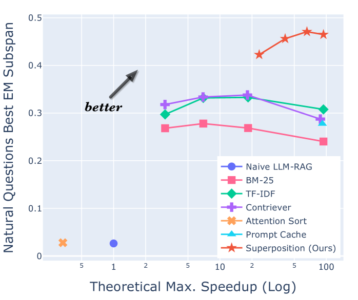

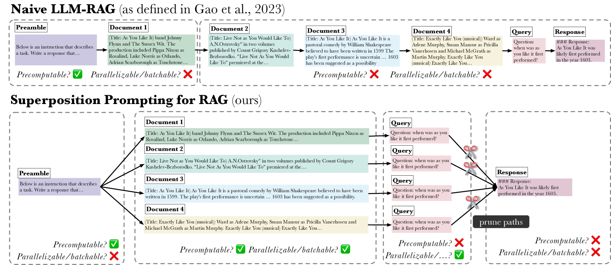

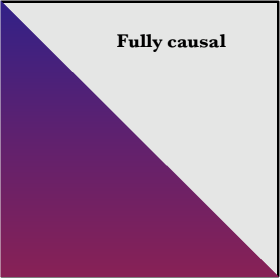

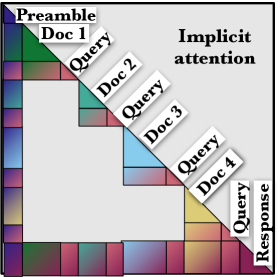

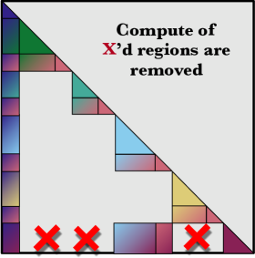

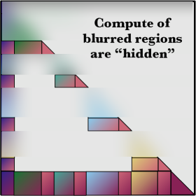

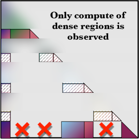

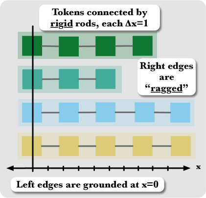

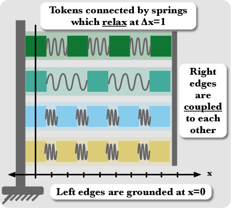

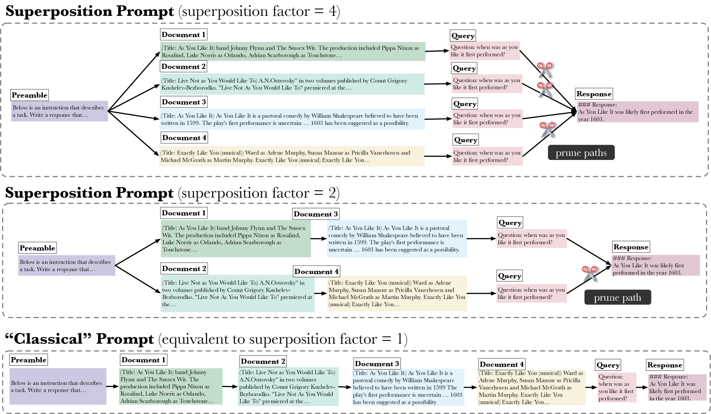

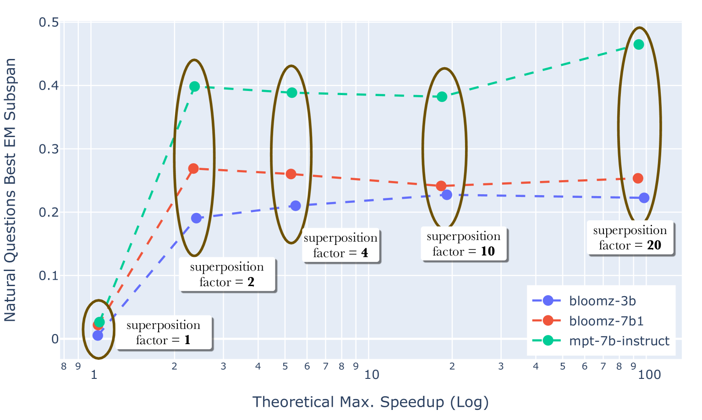

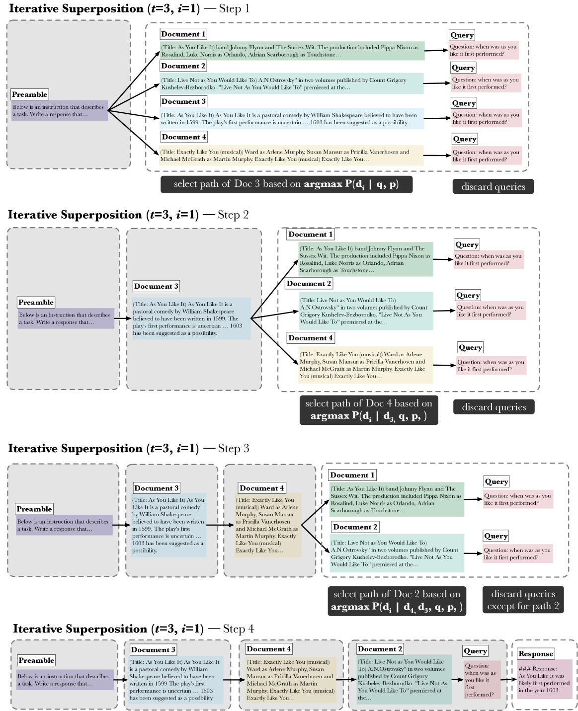

[Arxiv](https://arxiv.org/abs/2404.06910)