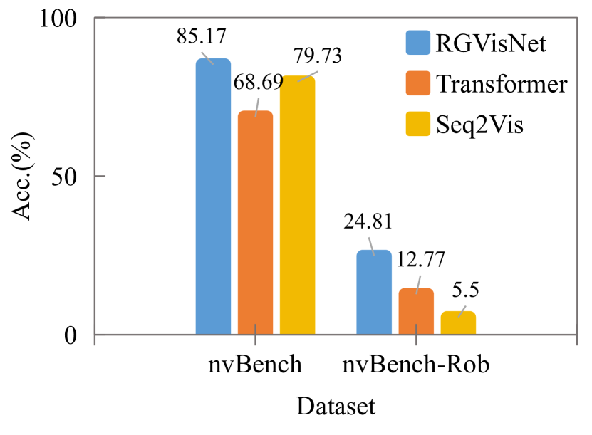
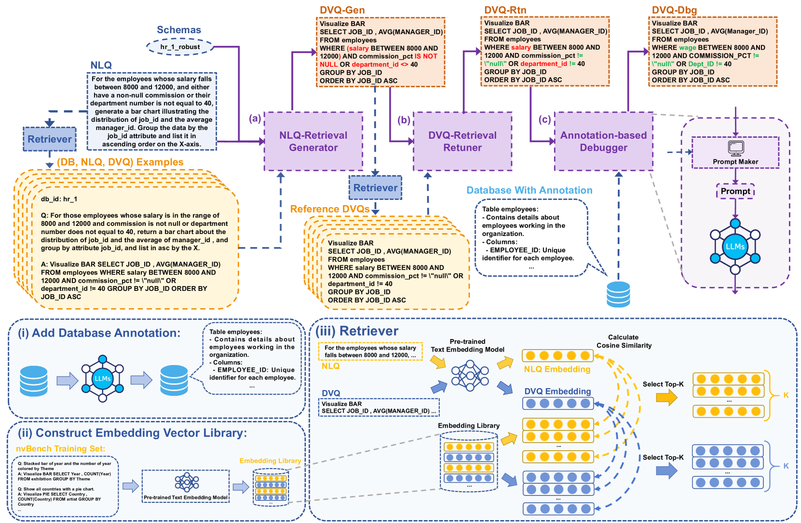
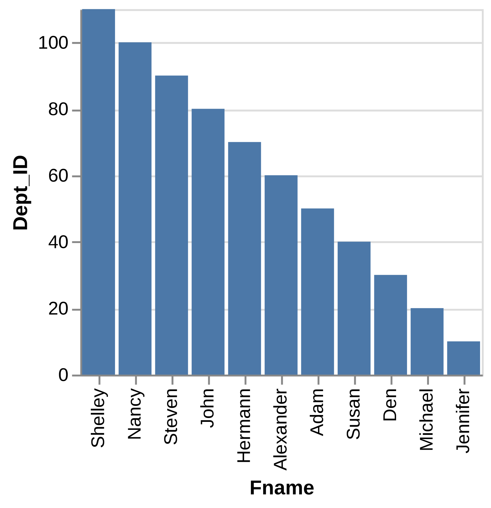
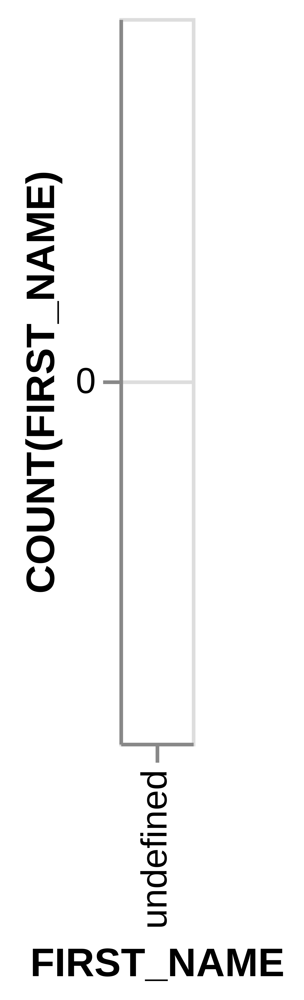
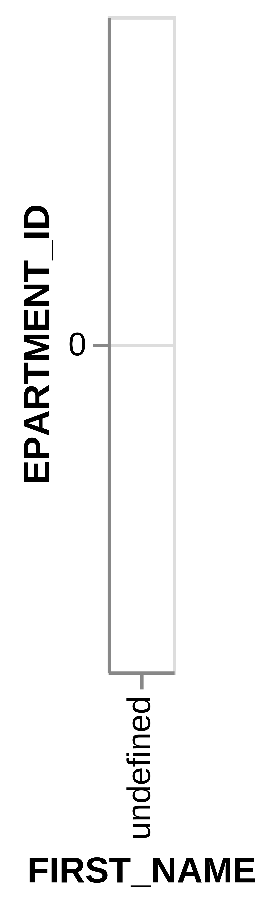
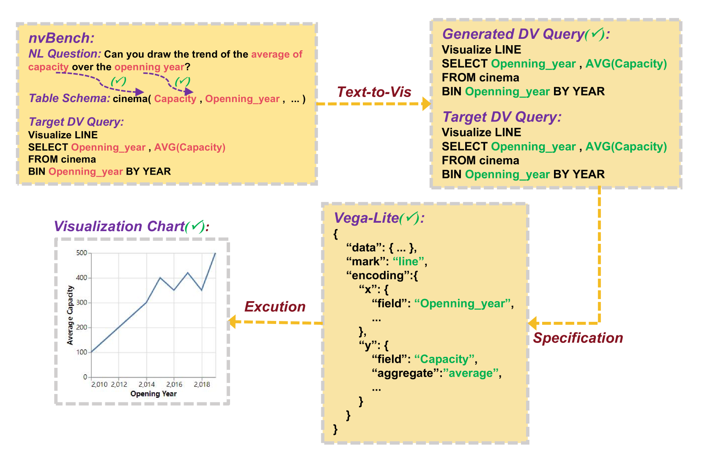
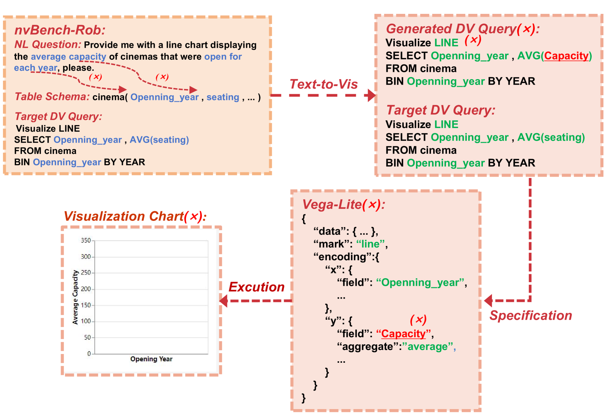

# 为提升文本至可视化翻译的稳定性，本研究致力于应对词汇与短语多样性所带来的挑战。

发布时间：2024年04月10日

`LLM应用` `数据可视化`

> Towards Robustness of Text-to-Visualization Translation against Lexical and Phrasal Variability

# 摘要

> 文本到可视化任务致力于将自然语言问题转换成直观的数据图表，这是自然语言处理界的新星。然而，现有的模型过于依赖问题文字与数据模式之间的直接对应，这种依赖可能会削弱模型应对输入变化的能力。本研究首次深入探讨了文本到可视化模型的鲁棒性问题，并创建了nvBench-Rob数据集，包含了丰富的词汇和短语变化。实验发现，传统模型在这一新数据集上的表现大幅下滑，暴露出其鲁棒性的不足。为此，我们推出了GRED框架，它利用检索增强生成技术，针对自然语言的多样性、编程风格的差异及数据模式的变化进行了专门优化。实验证明，相较于领域内的顶尖模型RGVisNet，RGDR在鲁棒性方面取得了显著进步，其在nvBench-Rob数据集上的准确率提升了三成以上。

> Text-to-Vis is an emerging task in the natural language processing (NLP) area that aims to automatically generate data visualizations from natural language questions (NLQs). Despite their progress, existing text-to-vis models often heavily rely on lexical matching between words in the questions and tokens in data schemas. This overreliance on lexical matching may lead to a diminished level of model robustness against input variations. In this study, we thoroughly examine the robustness of current text-to-vis models, an area that has not previously been explored. In particular, we construct the first robustness dataset nvBench-Rob, which contains diverse lexical and phrasal variations based on the original text-to-vis benchmark nvBench. Then, we found that the performance of existing text-to-vis models on this new dataset dramatically drops, implying that these methods exhibit inadequate robustness overall. Finally, we propose a novel framework based on Retrieval-Augmented Generation (RAG) technique, named GRED, specifically designed to address input perturbations in these two variants. The framework consists of three parts: NLQ-Retrieval Generator, Visualization Query-Retrieval Retuner and Annotation-based Debugger, which are used to tackle the challenges posed by natural language variants, programming style differences and data schema variants, respectively. Extensive experimental evaluations show that, compared to the state-of-the-art model RGVisNet in the Text-to-Vis field, RGDR performs better in terms of model robustness, with a 32% increase in accuracy on the proposed nvBench-Rob dataset.

[Arxiv](https://arxiv.org/abs/2404.07135)