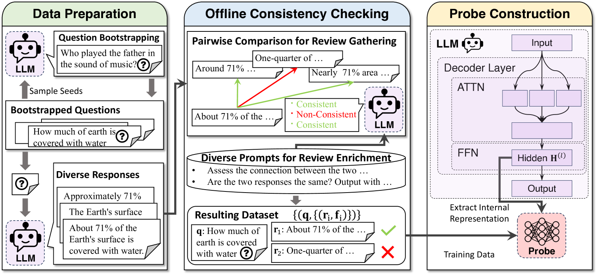
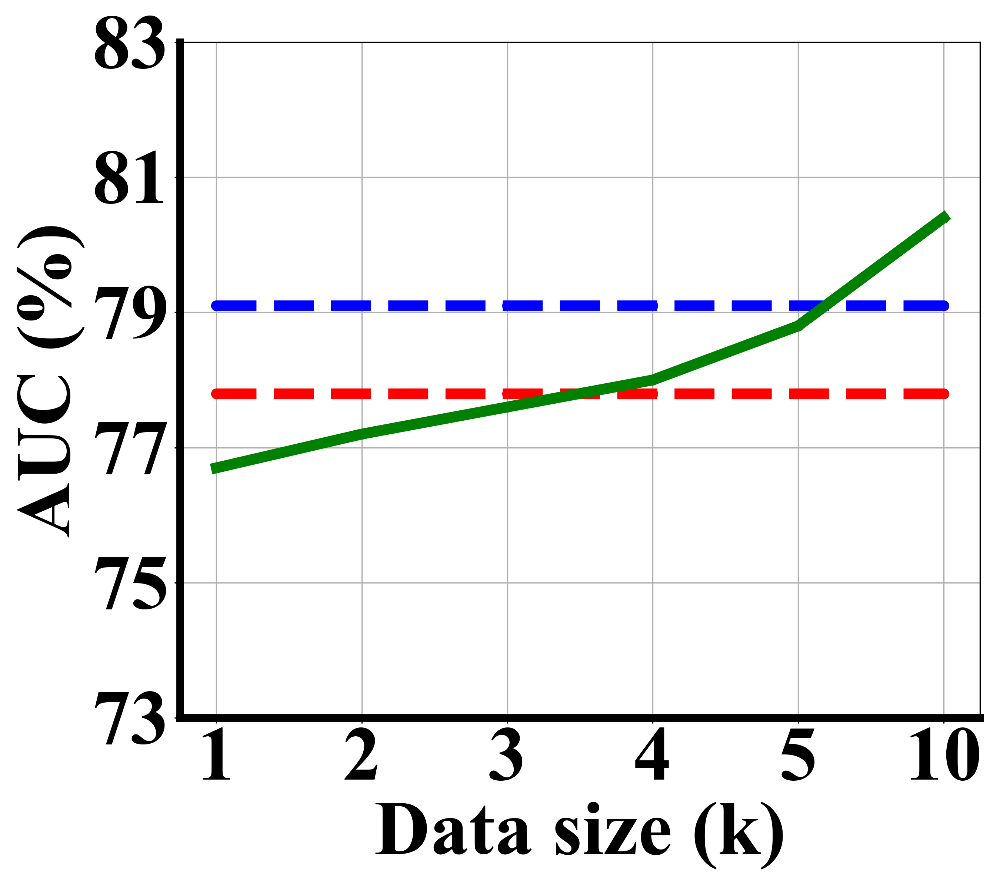
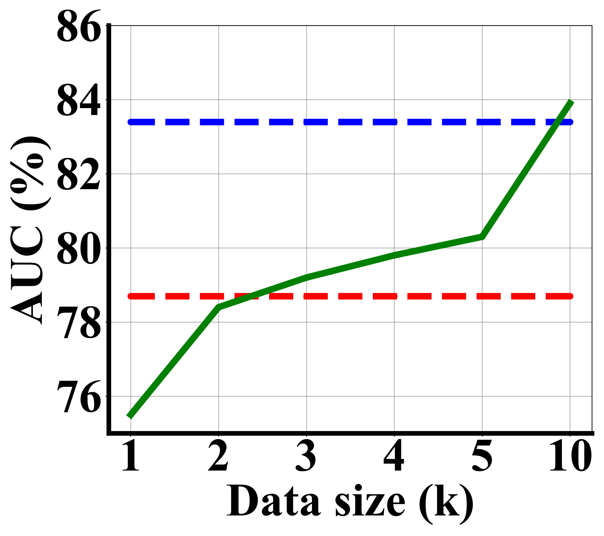
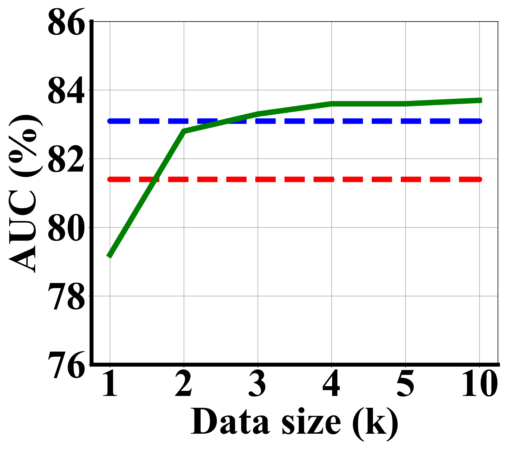
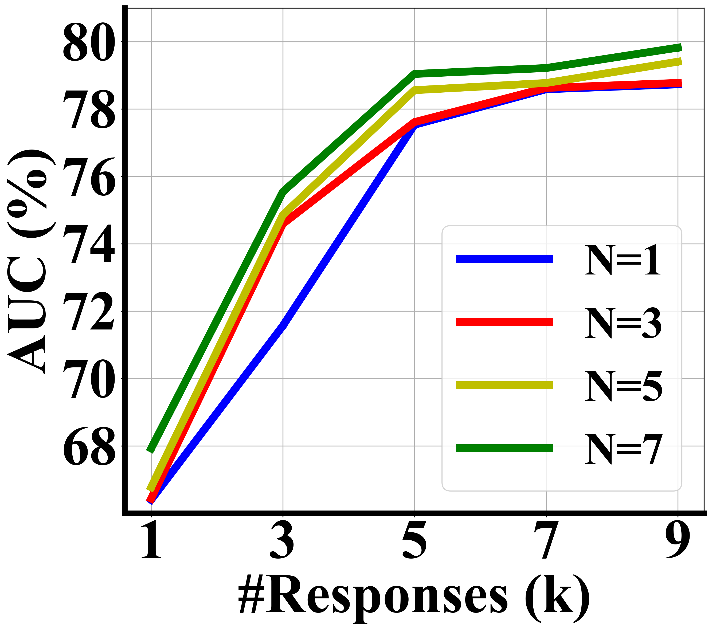
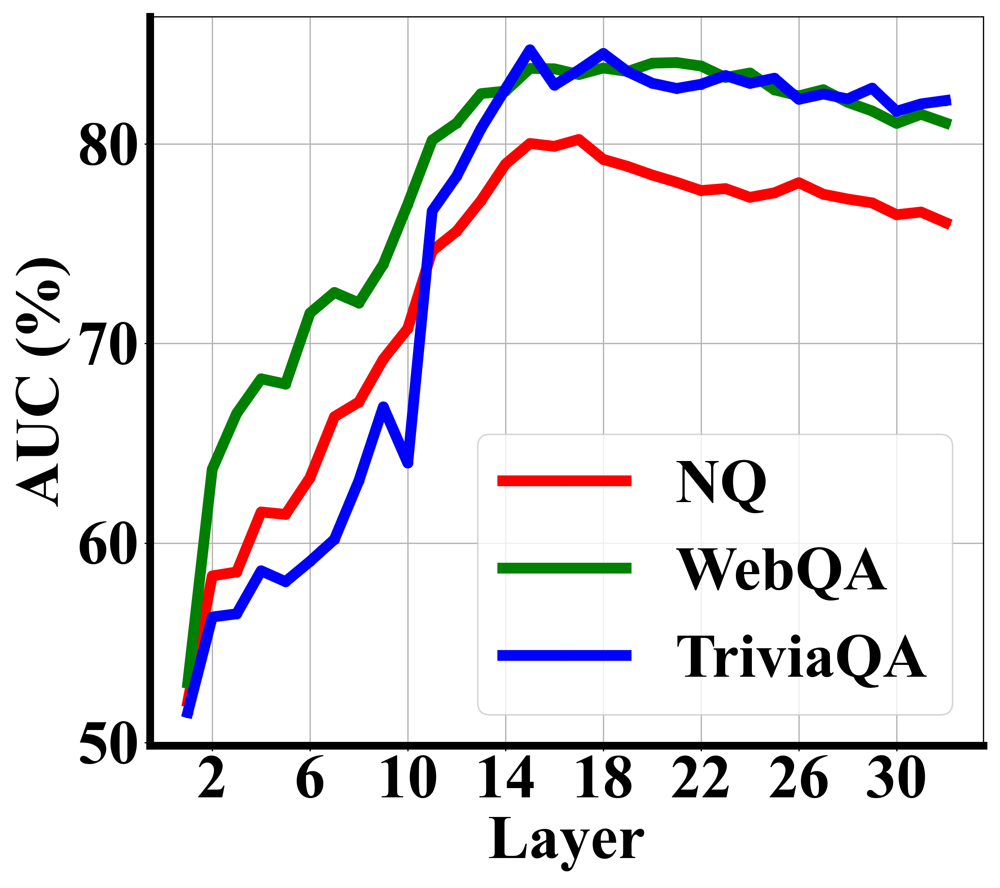

# 本研究通过探针训练结合离线一致性检查，提出了一种可迁移且高效的非事实内容检测方法。

发布时间：2024年04月10日

`LLM应用` `事实性检测` `问答系统`

> Transferable and Efficient Non-Factual Content Detection via Probe Training with Offline Consistency Checking

# 摘要

> 为了增强大型语言模型生成内容的可信度，检测非事实内容一直是研究的重点。现有基于人工标注的事实性探测方法，在面对新领域内容时迁移能力受限，同时在线自我一致性检查也因需产生多个输出而带来沉重的计算负担。本研究提出了PINOSE，一种新型探测模型，它通过离线自我一致性检查结果进行训练，摆脱了对人工标注的依赖，并能在不同数据集间实现有效迁移。PINOSE的离线检查机制大幅降低了在线验证生成多个响应所需的计算成本。同时，它对解码前内部状态的多方面进行检查，提升了对事实错误的检测效率。实验显示，PINOSE在事实性检测和问答任务上的表现均超越了现有技术。相关代码和数据集已在匿名库公开，供大家使用。

> Detecting non-factual content is a longstanding goal to increase the trustworthiness of large language models (LLMs) generations. Current factuality probes, trained using humanannotated labels, exhibit limited transferability to out-of-distribution content, while online selfconsistency checking imposes extensive computation burden due to the necessity of generating multiple outputs. This paper proposes PINOSE, which trains a probing model on offline self-consistency checking results, thereby circumventing the need for human-annotated data and achieving transferability across diverse data distributions. As the consistency check process is offline, PINOSE reduces the computational burden of generating multiple responses by online consistency verification. Additionally, it examines various aspects of internal states prior to response decoding, contributing to more effective detection of factual inaccuracies. Experiment results on both factuality detection and question answering benchmarks show that PINOSE achieves surpassing results than existing factuality detection methods. Our code and datasets are publicly available on this anonymized repository.

[Arxiv](https://arxiv.org/abs/2404.06742)