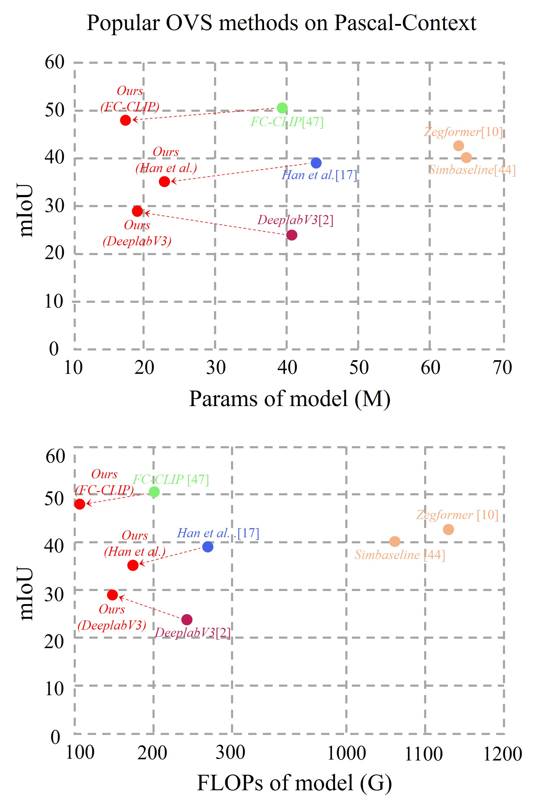
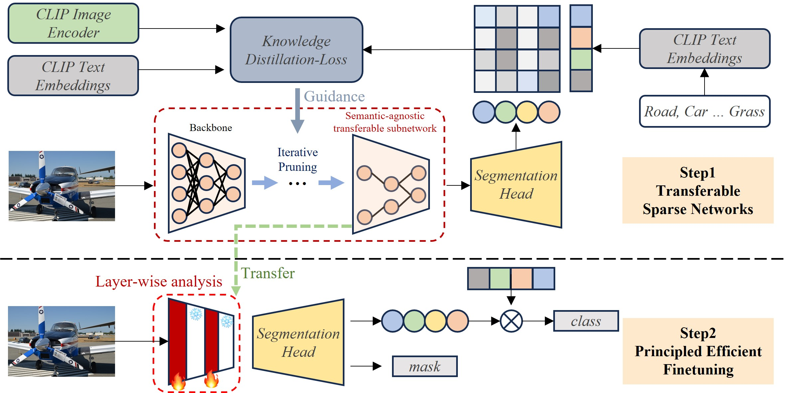
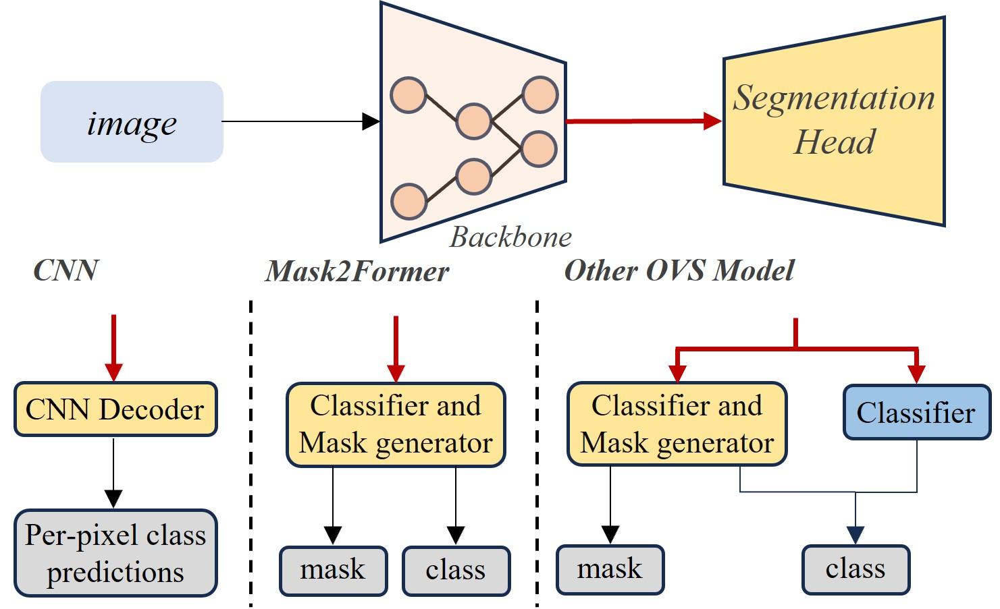
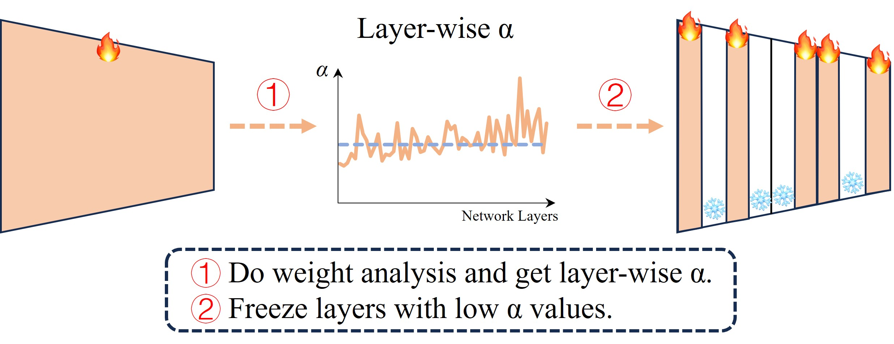
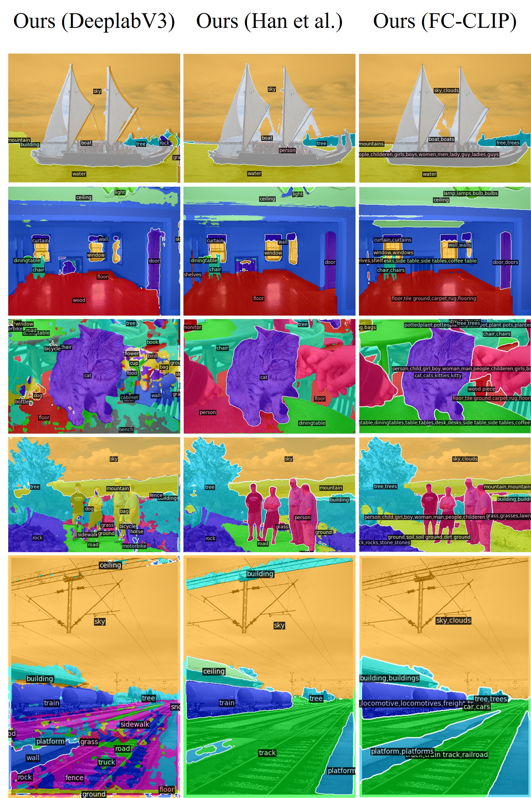
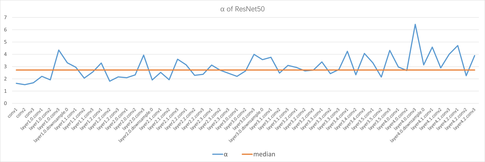
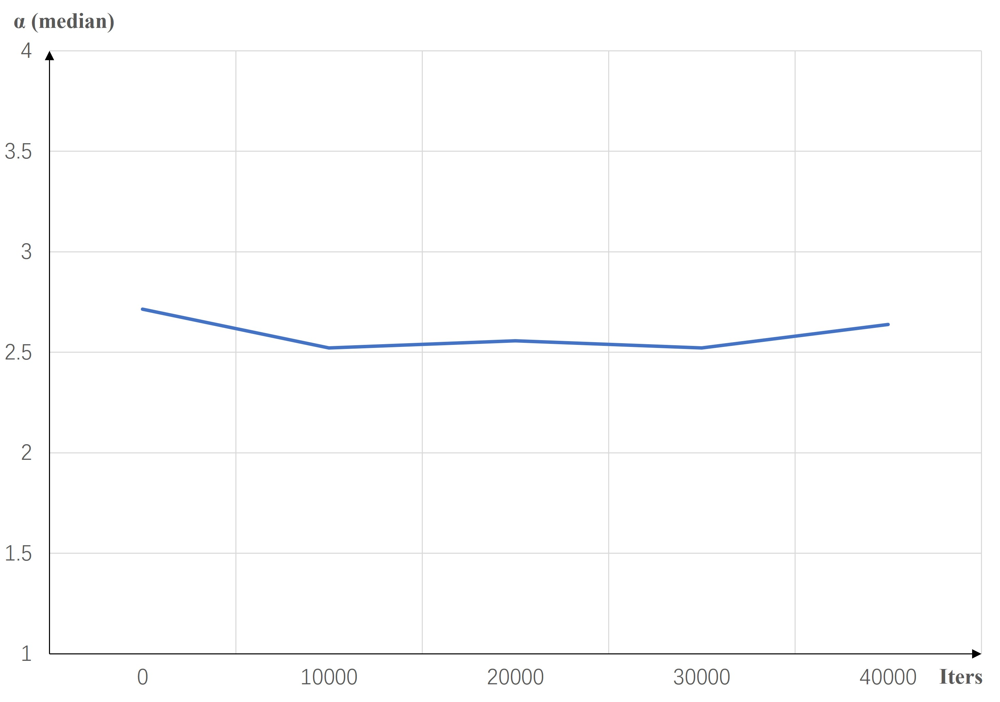
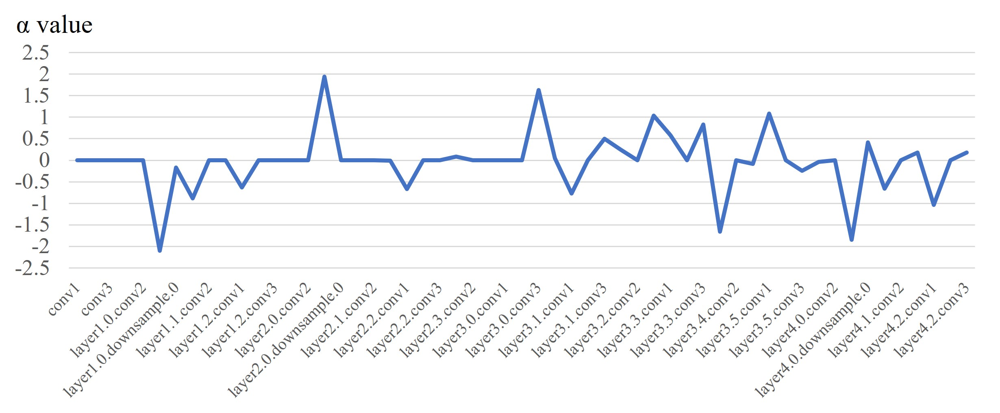

# 开放词汇分割的通用与高效原则

发布时间：2024年04月10日

`LLM应用` `计算机视觉`

> Transferable and Principled Efficiency for Open-Vocabulary Segmentation

# 摘要

> 预训练视觉-语言基础模型的最新突破让开放词汇分割（OVS）变得触手可及。然而，这种技术虽展现潜力，却因庞大的模型规模和微调过程中的高昂成本而面临挑战，限制了其在实际应用中的普及和可行性。尽管传统技术如模型压缩和高效微调提供了解决方案，但它们往往基于经验法则，难以直接应用于不同的模型，且重新训练代价不菲。我们追求的是在保持与大型视觉-语言模型相媲美或更优的性能的同时，采用更小规模的模型，以降低训练成本。关键在于我们的原则化效率策略，使得这一成果能够轻松迁移至其他OVS框架，无需额外定制。通过在多个OVS基准上的广泛实验，我们展示了在分割精度与计算成本之间取得的卓越平衡，超越了以往的成果。相关代码已在 https://github.com/Xujxyang/OpenTrans 上发布。

> Recent success of pre-trained foundation vision-language models makes Open-Vocabulary Segmentation (OVS) possible. Despite the promising performance, this approach introduces heavy computational overheads for two challenges: 1) large model sizes of the backbone; 2) expensive costs during the fine-tuning. These challenges hinder this OVS strategy from being widely applicable and affordable in real-world scenarios. Although traditional methods such as model compression and efficient fine-tuning can address these challenges, they often rely on heuristics. This means that their solutions cannot be easily transferred and necessitate re-training on different models, which comes at a cost. In the context of efficient OVS, we target achieving performance that is comparable to or even better than prior OVS works based on large vision-language foundation models, by utilizing smaller models that incur lower training costs. The core strategy is to make our efficiency principled and thus seamlessly transferable from one OVS framework to others without further customization. Comprehensive experiments on diverse OVS benchmarks demonstrate our superior trade-off between segmentation accuracy and computation costs over previous works. Our code is available on https://github.com/Xujxyang/OpenTrans

[Arxiv](https://arxiv.org/abs/2404.07448)