# UMBRAE：一种整合多种模式的脑信号解读技术

发布时间：2024年04月10日

`LLM应用` `脑科学` `神经信号处理`

> UMBRAE: Unified Multimodal Decoding of Brain Signals

# 摘要

> 我们针对脑动力研究中的难题提出了创新解决方案，这些难题包括文献难以精确捕捉空间信息和对特定主题模型的需求。我们提出了UMBRAE，一种新颖的多模态脑信号解码技术。首先，我们设计了一个高效的通用大脑编码器，用以从神经信号中提取具体的概念和空间细节，并借助多模态大型语言模型（MLLM）在不同层次上恢复对象描述。接着，我们开发了一种跨主题训练策略，将个体特征整合到共享特征空间中，使得模型能够在不同个体间通用，且在资源消耗不变的情况下，取得比特定模型更出色的成果。此外，我们展示了UMBRAE在新主题上的弱监督适应能力，仅需极小部分的训练数据即可。实验验证了UMBRAE在新任务上的卓越表现，并在传统任务上也展现出超越现有方法的实力。为了更好地评估和共享我们的方法，我们创建了BrainHub这一全面的脑科学基准，并公开了相关代码和资源，可通过https://weihaox.github.io/UMBRAE访问。

> We address prevailing challenges of the brain-powered research, departing from the observation that the literature hardly recover accurate spatial information and require subject-specific models. To address these challenges, we propose UMBRAE, a unified multimodal decoding of brain signals. First, to extract instance-level conceptual and spatial details from neural signals, we introduce an efficient universal brain encoder for multimodal-brain alignment and recover object descriptions at multiple levels of granularity from subsequent multimodal large language model (MLLM). Second, we introduce a cross-subject training strategy mapping subject-specific features to a common feature space. This allows a model to be trained on multiple subjects without extra resources, even yielding superior results compared to subject-specific models. Further, we demonstrate this supports weakly-supervised adaptation to new subjects, with only a fraction of the total training data. Experiments demonstrate that UMBRAE not only achieves superior results in the newly introduced tasks but also outperforms methods in well established tasks. To assess our method, we construct and share with the community a comprehensive brain understanding benchmark BrainHub. Our code and benchmark are available at https://weihaox.github.io/UMBRAE.

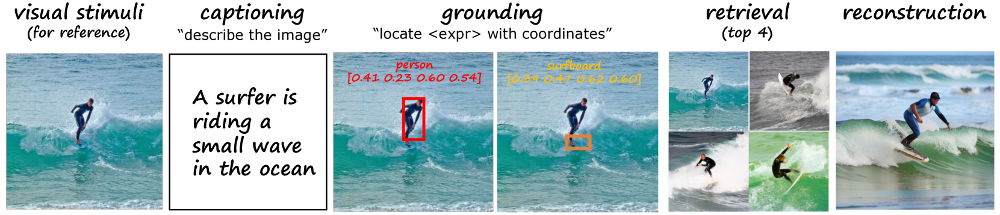

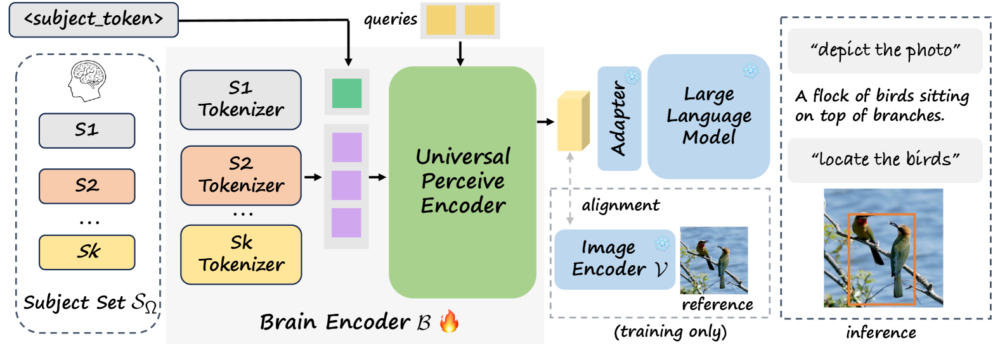

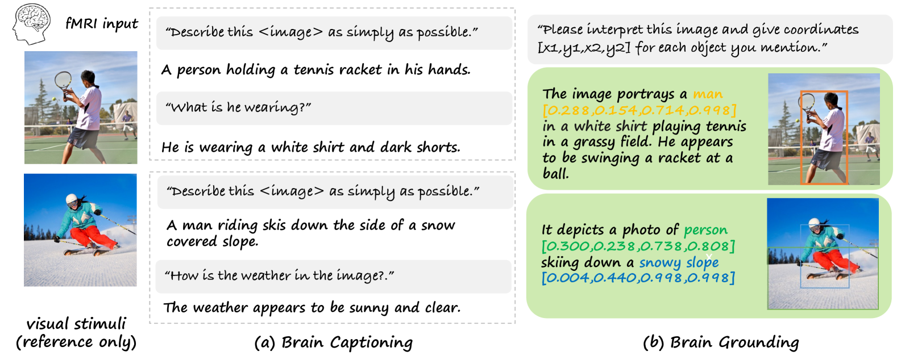

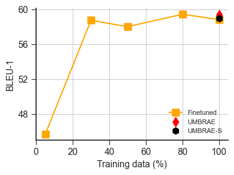

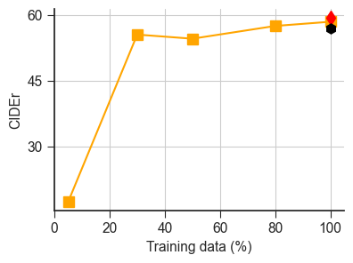

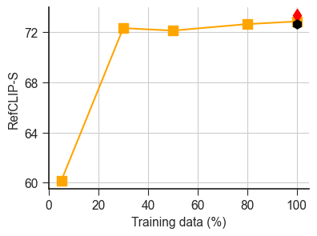

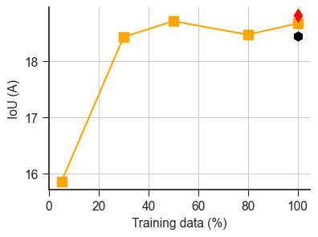

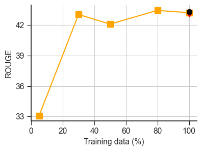

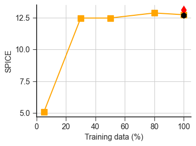

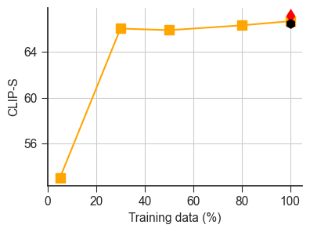

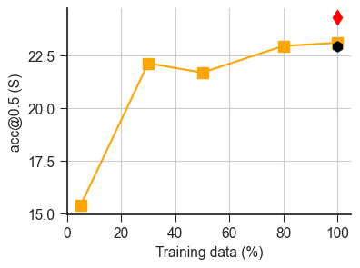

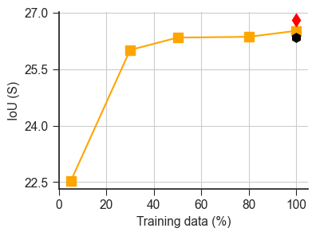

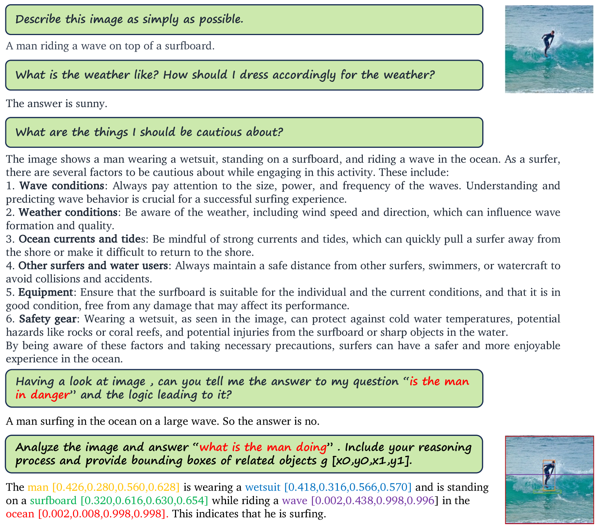

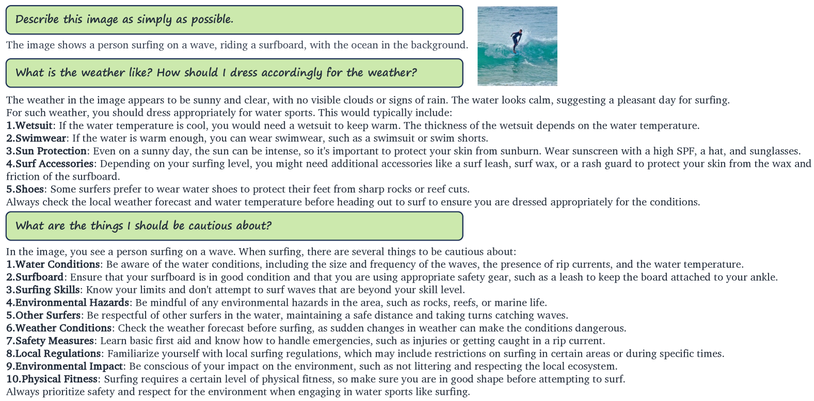

[Arxiv](https://arxiv.org/abs/2404.07202)