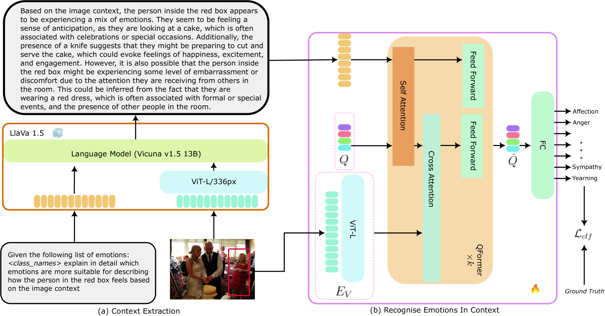
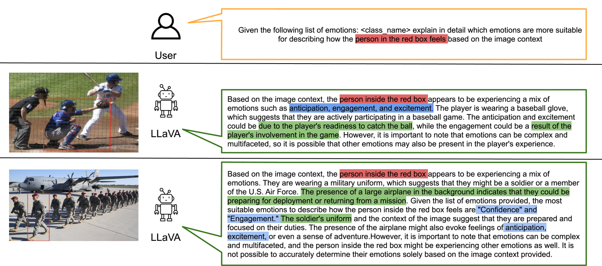
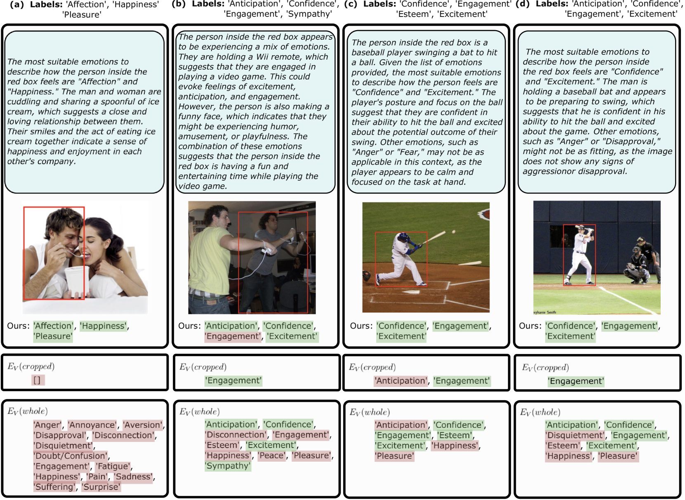
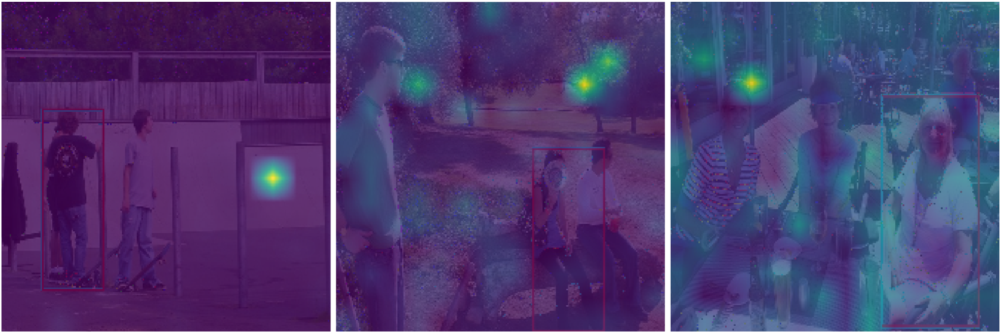
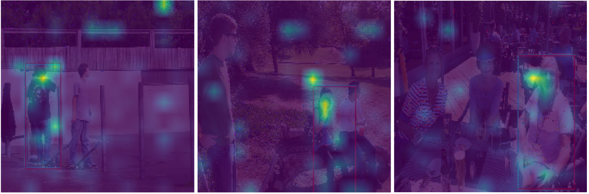

# 借助常识推理，超大型语言模型（VLLMs）能够更精准地把握情感理解的脉络。

发布时间：2024年04月10日

`LLM应用` `情感分析` `计算机视觉`

> VLLMs Provide Better Context for Emotion Understanding Through Common Sense Reasoning

# 摘要

> 要在情境中识别情绪，就要洞察个体的情感表现，并结合周围环境的情境线索。以往的研究多通过设计专门的情境编码架构或加入场景相关信息（如图片说明）来应对这一挑战，但这些方法往往局限于有限的情境信息或依赖复杂的训练流程。本研究利用视觉与大型语言模型（VLLMs）的创新潜力，在不增加训练复杂度的前提下，通过两阶段策略提升情境情绪分类的精度。首先，我们引导VLLMs根据视觉情境生成关于主体情绪的自然语言描述。接着，在第二阶段，将这些描述作为情境信息，结合图像输入，训练一个融合文本与视觉特征的变换器架构，以完成最终的分类任务。实验结果显示，文本与图像特征互为补充，我们的融合架构在无需复杂训练手段的情况下，表现远超单一模态。我们在三个数据集EMOTIC、CAER-S和BoLD上进行了评估，与更为复杂的方法相比，取得了同等或更优的准确率。相关代码将在github公开：https://github.com/NickyFot/EmoCommonSense.git。

> Recognising emotions in context involves identifying the apparent emotions of an individual, taking into account contextual cues from the surrounding scene. Previous approaches to this task have involved the design of explicit scene-encoding architectures or the incorporation of external scene-related information, such as captions. However, these methods often utilise limited contextual information or rely on intricate training pipelines. In this work, we leverage the groundbreaking capabilities of Vision-and-Large-Language Models (VLLMs) to enhance in-context emotion classification without introducing complexity to the training process in a two-stage approach. In the first stage, we propose prompting VLLMs to generate descriptions in natural language of the subject's apparent emotion relative to the visual context. In the second stage, the descriptions are used as contextual information and, along with the image input, are used to train a transformer-based architecture that fuses text and visual features before the final classification task. Our experimental results show that the text and image features have complementary information, and our fused architecture significantly outperforms the individual modalities without any complex training methods. We evaluate our approach on three different datasets, namely, EMOTIC, CAER-S, and BoLD, and achieve state-of-the-art or comparable accuracy across all datasets and metrics compared to much more complex approaches. The code will be made publicly available on github: https://github.com/NickyFot/EmoCommonSense.git

[Arxiv](https://arxiv.org/abs/2404.07078)