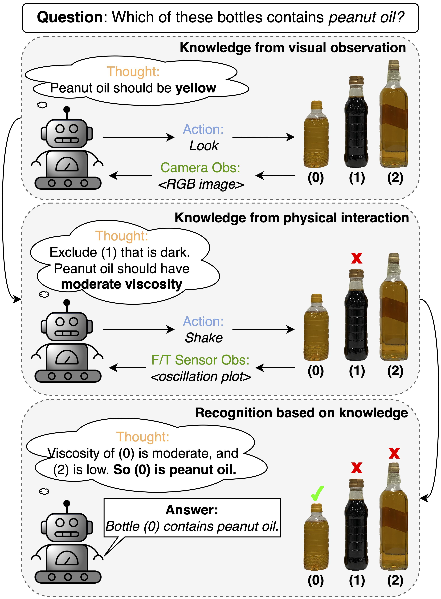
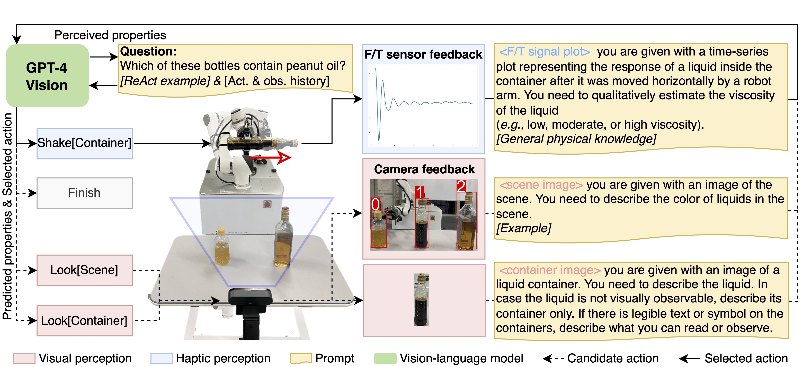
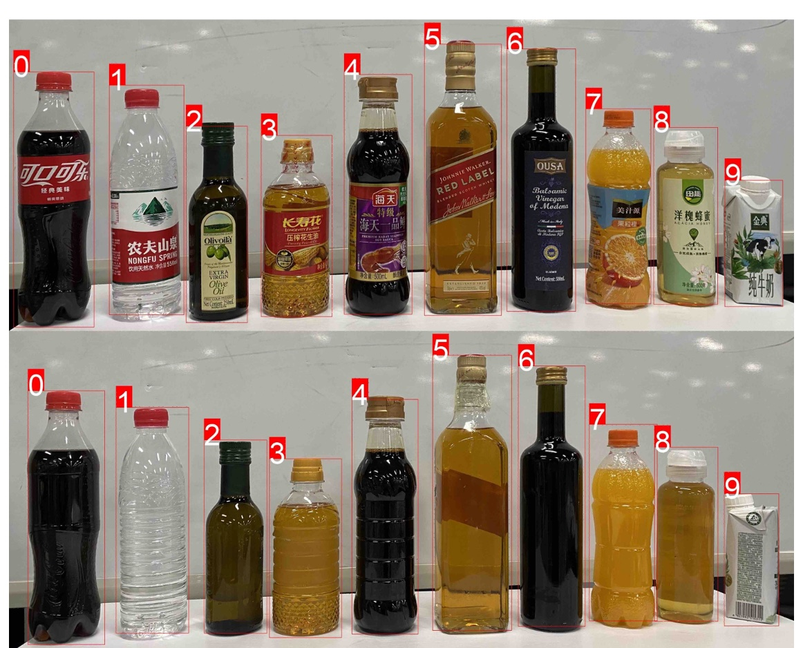
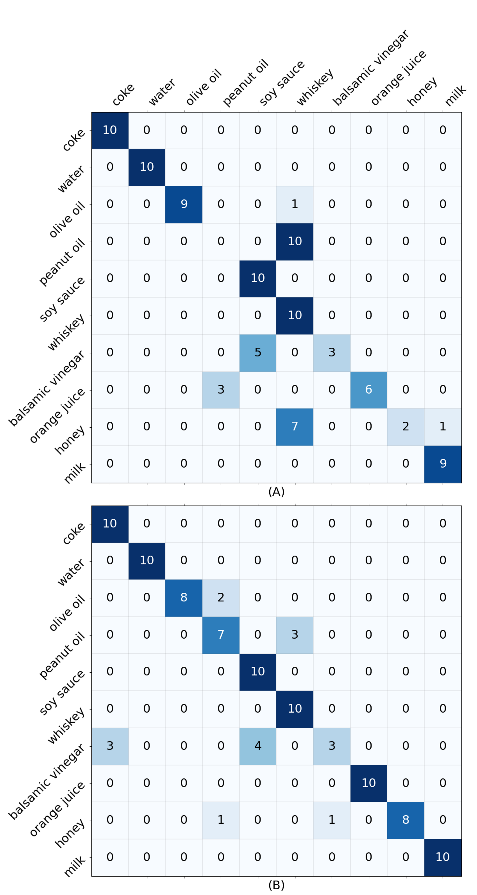
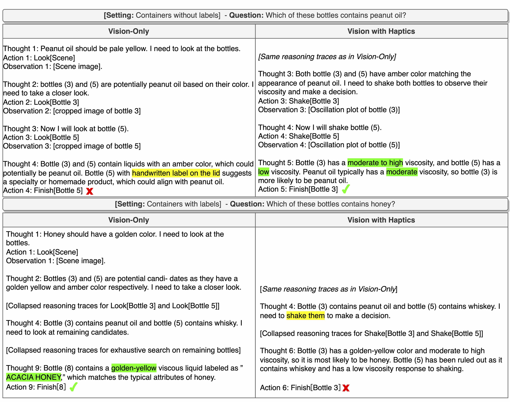

# 利用视觉-语言模型，实现机器人对液体的物理识别与推理。

发布时间：2024年04月10日

`LLM应用` `机器人` `多模态感知`

> Vision-Language Model-based Physical Reasoning for Robot Liquid Perception

# 摘要

> 大型语言模型（LLMs）在机器人任务中的应用日益受到关注，因为它们通过大量数据训练，掌握了出色的推理能力和丰富的知识。然而，由于LLMs仅能处理文本，如何将它们与物理世界相结合仍是一个挑战。最近，大型视觉-语言模型（LVLMs）的发展让我们能够通过视觉输入更全面地理解物理世界，弥补了仅靠语言的不足。本研究提出了一种创新方法，利用OpenAI的尖端LVLM GPT-4V(ision)，让机器人通过图像反馈感知液体。我们的方法通过GPT-4V的物理理解能力，将非视觉反馈（如力/扭矩传感器数据）转化为视觉表示（如时间序列图），用图像作为桥梁，实现超越视觉和语言的多模态感知。我们选用10种常见液体及其不同形状和材质的容器进行测试。在无需训练或调整的情况下，我们的方法使机器人能够间接感知液体的物理特性并评估其粘度。此外，通过结合视觉和物理属性的交互学习，我们的方法在缺乏明显视觉提示时（如清晰的容器标签文本或符号），仍能识别液体，将识别准确率从仅使用视觉的最高69.0%提升至86.0%。

> There is a growing interest in applying large language models (LLMs) in robotic tasks, due to their remarkable reasoning ability and extensive knowledge learned from vast training corpora. Grounding LLMs in the physical world remains an open challenge as they can only process textual input. Recent advancements in large vision-language models (LVLMs) have enabled a more comprehensive understanding of the physical world by incorporating visual input, which provides richer contextual information than language alone. In this work, we proposed a novel paradigm that leveraged GPT-4V(ision), the state-of-the-art LVLM by OpenAI, to enable embodied agents to perceive liquid objects via image-based environmental feedback. Specifically, we exploited the physical understanding of GPT-4V to interpret the visual representation (e.g., time-series plot) of non-visual feedback (e.g., F/T sensor data), indirectly enabling multimodal perception beyond vision and language using images as proxies. We evaluated our method using 10 common household liquids with containers of various geometry and material. Without any training or fine-tuning, we demonstrated that our method can enable the robot to indirectly perceive the physical response of liquids and estimate their viscosity. We also showed that by jointly reasoning over the visual and physical attributes learned through interactions, our method could recognize liquid objects in the absence of strong visual cues (e.g., container labels with legible text or symbols), increasing the accuracy from 69.0% -- achieved by the best-performing vision-only variant -- to 86.0%.

[Arxiv](https://arxiv.org/abs/2404.06904)