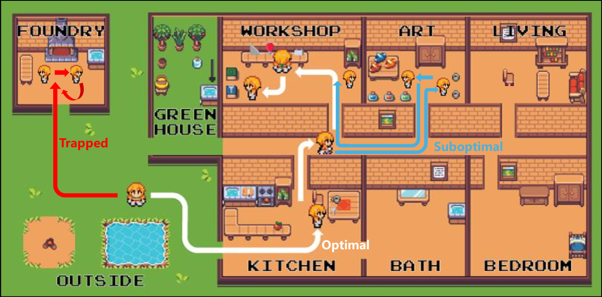
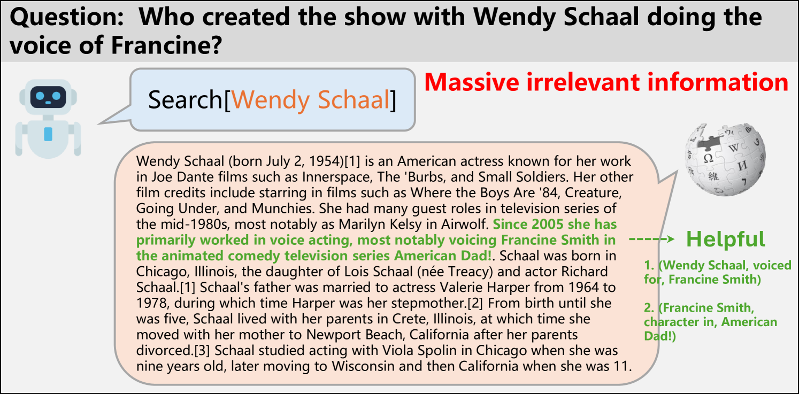
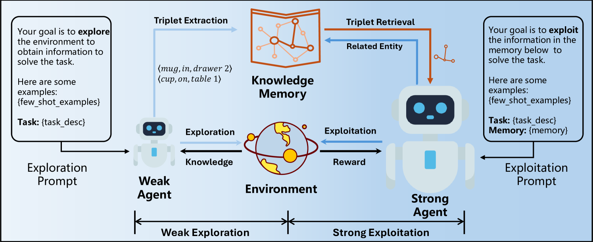
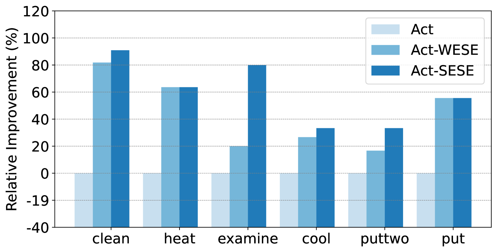
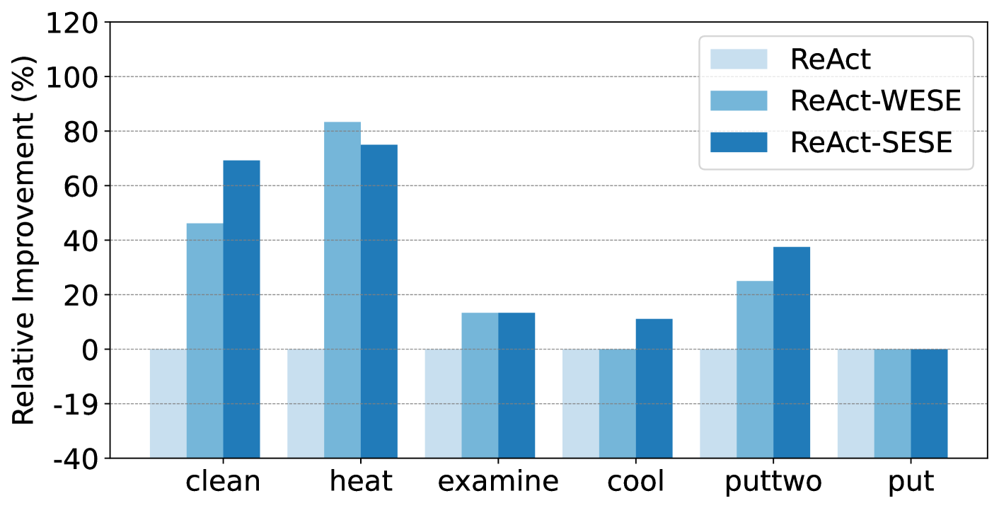

# WESE：从初步探索到深度利用——为大型语言模型代理量身定制的策略

发布时间：2024年04月10日

`Agent` `智能代理` `知识图谱`

> WESE: Weak Exploration to Strong Exploitation for LLM Agents

# 摘要

> 近期，大型语言模型（LLMs）在智能代理领域展现出巨大潜力。但研究多聚焦于通过精准的提示设计或任务定制化微调来提升代理的逻辑推理与决策制定能力，而忽略了探索与开发的过程。面对开放世界互动环境中的复杂任务，这些传统方法存在局限。一方面，对环境全局信息的缺失导致短视决策，产生不理想的解决方案；另一方面，从环境中收集的无关信息不仅带来干扰，还增加了额外的开销。本论文提出了一种创新方法——从弱探索到强利用（WESE），旨在提升LLM代理处理开放世界互动任务的能力。具体而言，WESE通过分离探索与开发流程，利用成本效益高的弱代理进行全局知识的探索任务。随后，引入基于知识图谱的策略，存储所获知识并提炼出与任务相关的信息，以此提升强代理在执行开发任务时的成功率和效率。该方法设计灵活，能够适应多样化任务，并在四个互动基准测试中显著提高了成功率和操作效率。

> Recently, large language models (LLMs) have demonstrated remarkable potential as an intelligent agent. However, existing researches mainly focus on enhancing the agent's reasoning or decision-making abilities through well-designed prompt engineering or task-specific fine-tuning, ignoring the procedure of exploration and exploitation. When addressing complex tasks within open-world interactive environments, these methods exhibit limitations. Firstly, the lack of global information of environments leads to greedy decisions, resulting in sub-optimal solutions. On the other hand, irrelevant information acquired from the environment not only adversely introduces noise, but also incurs additional cost. This paper proposes a novel approach, Weak Exploration to Strong Exploitation (WESE), to enhance LLM agents in solving open-world interactive tasks. Concretely, WESE involves decoupling the exploration and exploitation process, employing a cost-effective weak agent to perform exploration tasks for global knowledge. A knowledge graph-based strategy is then introduced to store the acquired knowledge and extract task-relevant knowledge, enhancing the stronger agent in success rate and efficiency for the exploitation task. Our approach is flexible enough to incorporate diverse tasks, and obtains significant improvements in both success rates and efficiency across four interactive benchmarks.

[Arxiv](https://arxiv.org/abs/2404.07456)