# 要让感应头部发挥作用，需要哪些关键因素？本文通过机械性研究，深入探讨了上下文学习电路及其形成过程。

发布时间：2024年04月10日

`LLM理论` `变换模型`

> What needs to go right for an induction head? A mechanistic study of in-context learning circuits and their formation

# 摘要

> 在变换模型中，上下文学习展现出一种强大的新能力。先前的研究指出，感应头（IH）是上下文学习的关键，它负责匹配和复制操作。在自然语言数据处理中，大型变换器训练时IH的出现与损失函数显著变化的阶段同步。尽管IH的存在和与阶段变化的巧合引起了广泛关注，但其多样性和形成机制仍鲜为人知。为何存在多个IH？它们之间如何相互依存？IH为何会突然形成？背后的子电路又是哪些？通过对合成数据进行训练，我们研究了IH的形成动态，并提出了一种新颖的光遗传学启发式因果框架，用以调整训练过程中的激活。这一框架揭示了IH的多样性和累积效应。我们通过在训练中固定激活的子集，识别出三个相互作用的子电路，它们共同促成了IH的形成和阶段变化。这些子电路还阐明了数据依赖性属性，如阶段变化的时机，为我们深入理解这些关键子电路提供了新的视角。

> In-context learning is a powerful emergent ability in transformer models. Prior work in mechanistic interpretability has identified a circuit element that may be critical for in-context learning -- the induction head (IH), which performs a match-and-copy operation. During training of large transformers on natural language data, IHs emerge around the same time as a notable phase change in the loss. Despite the robust evidence for IHs and this interesting coincidence with the phase change, relatively little is known about the diversity and emergence dynamics of IHs. Why is there more than one IH, and how are they dependent on each other? Why do IHs appear all of a sudden, and what are the subcircuits that enable them to emerge? We answer these questions by studying IH emergence dynamics in a controlled setting by training on synthetic data. In doing so, we develop and share a novel optogenetics-inspired causal framework for modifying activations throughout training. Using this framework, we delineate the diverse and additive nature of IHs. By clamping subsets of activations throughout training, we then identify three underlying subcircuits that interact to drive IH formation, yielding the phase change. Furthermore, these subcircuits shed light on data-dependent properties of formation, such as phase change timing, already showing the promise of this more in-depth understanding of subcircuits that need to "go right" for an induction head.

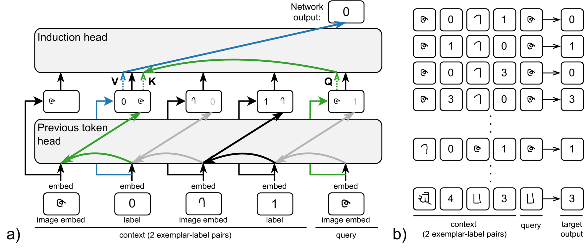

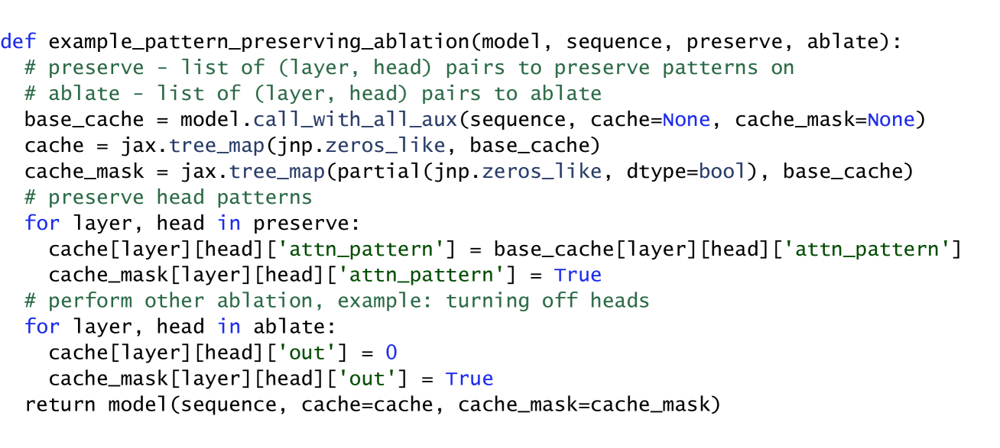

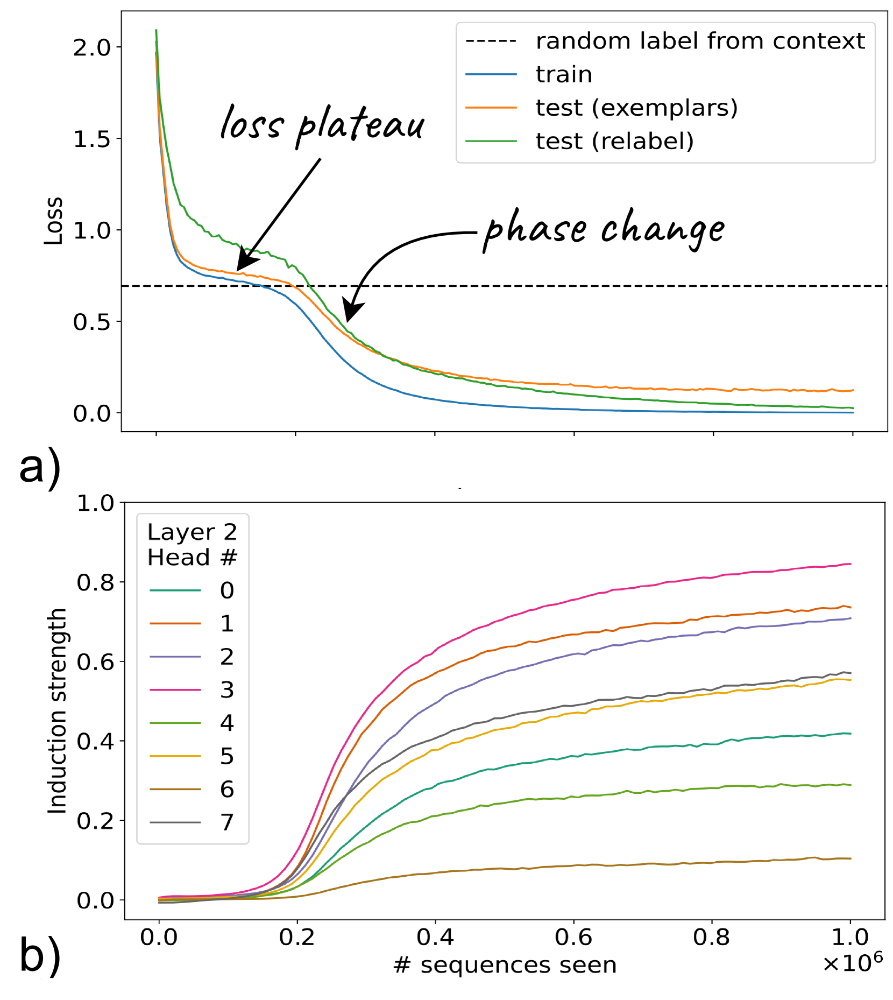

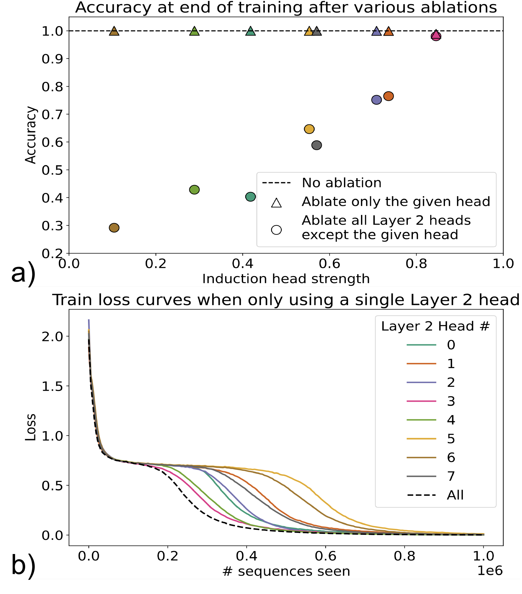

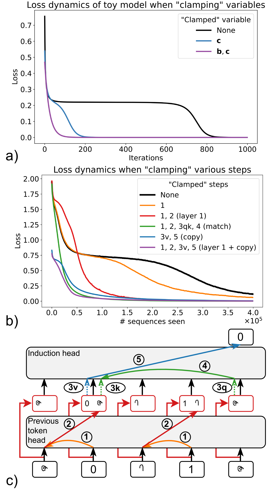

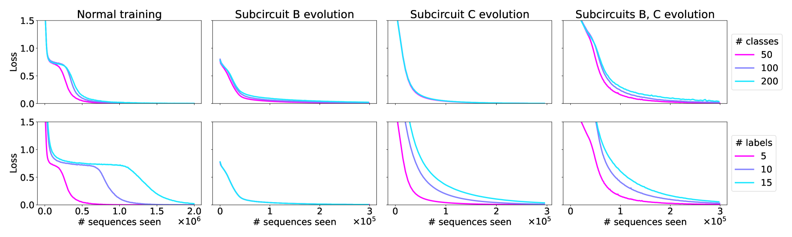

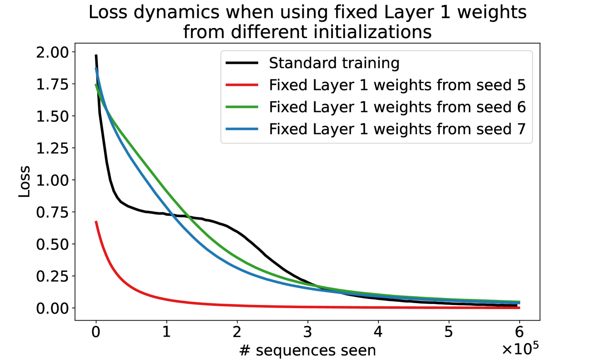

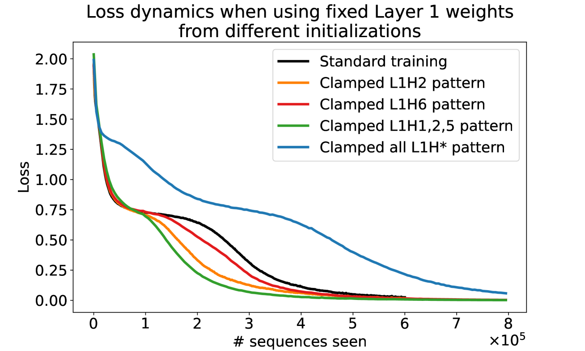

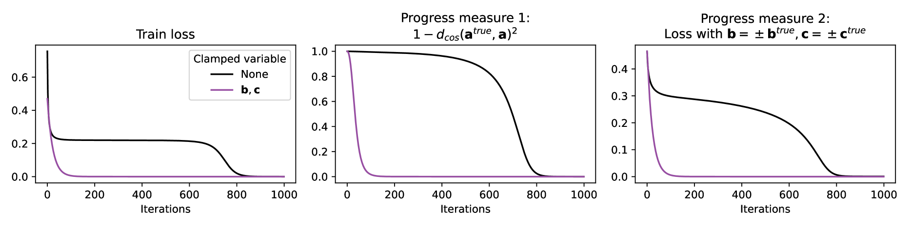

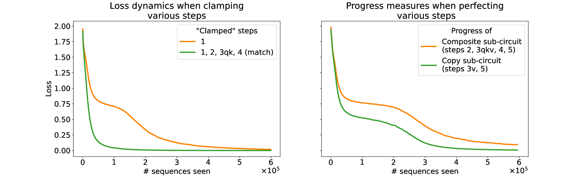

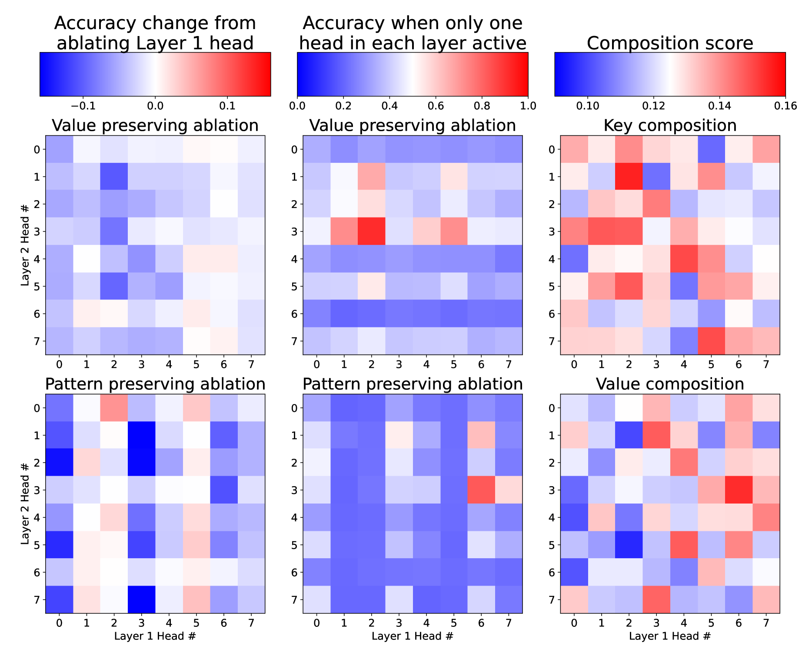

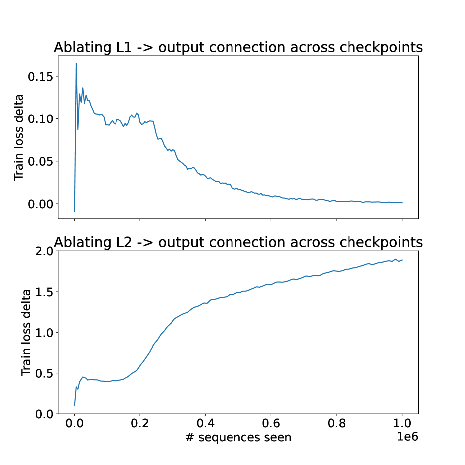

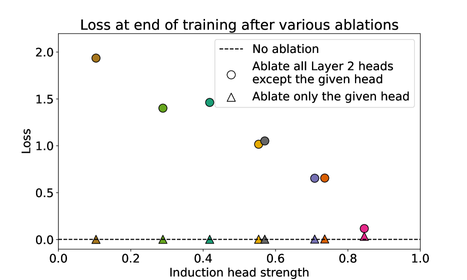

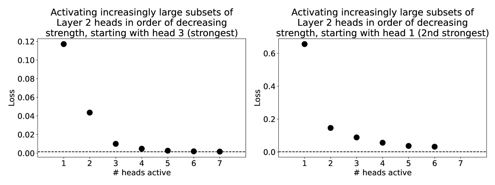

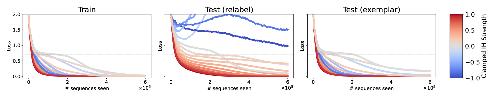

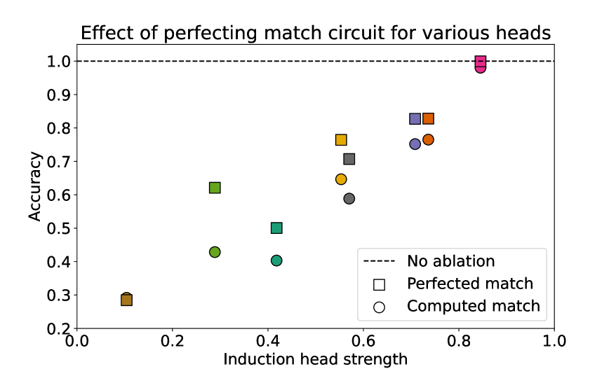

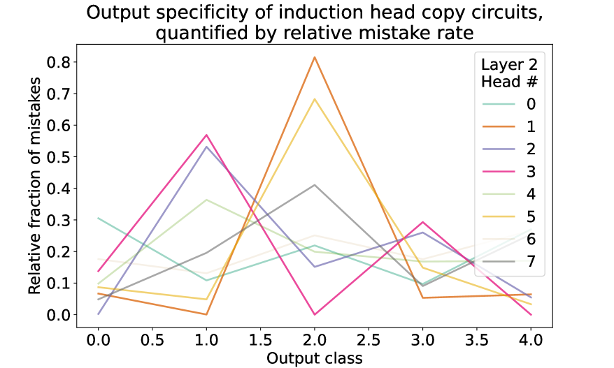

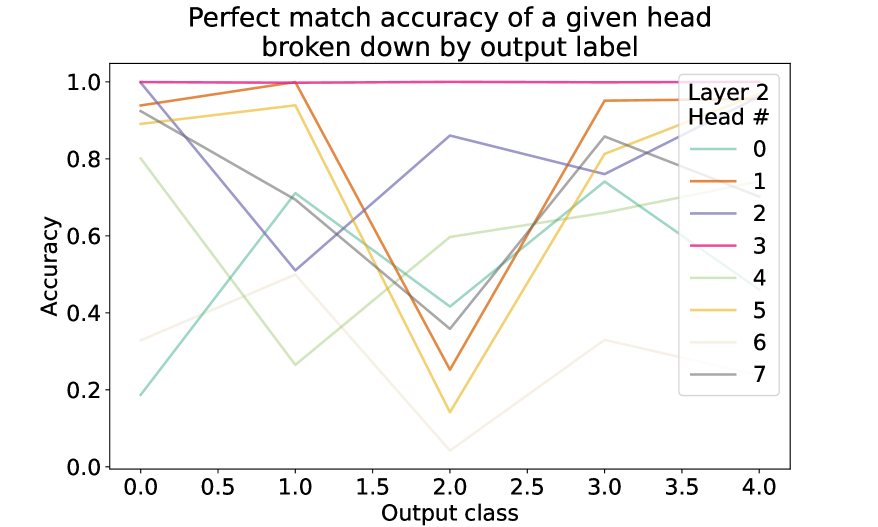

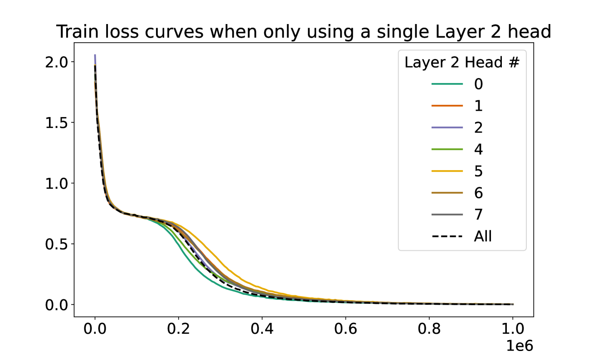

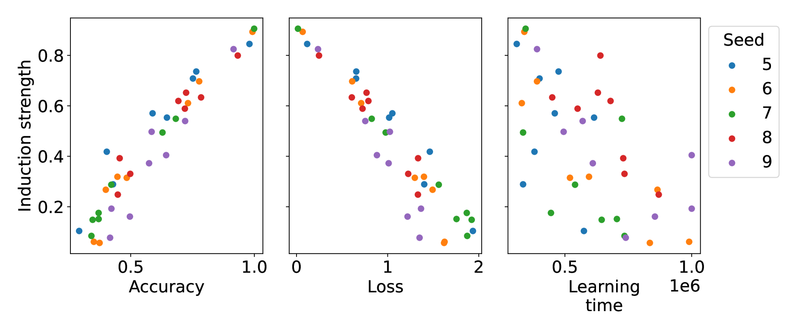

[Arxiv](https://arxiv.org/abs/2404.07129)