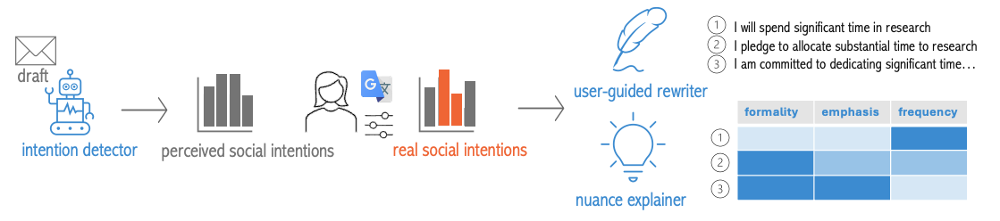
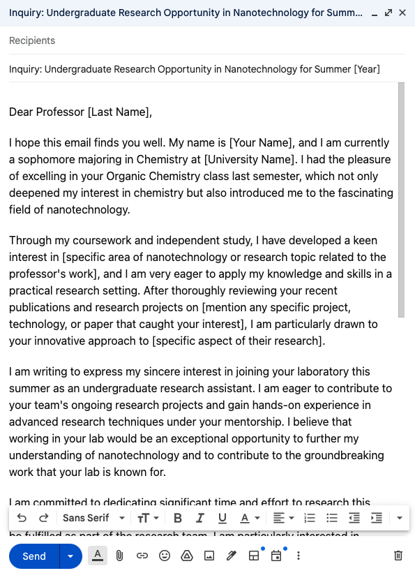

# WordDecipher：借助可解释AI技术，提升非英语母语者在数字工作空间的沟通体验

发布时间：2024年04月10日

`LLM应用` `数字办公` `写作辅助`

> WordDecipher: Enhancing Digital Workspace Communication with Explainable AI for Non-native English Speakers

# 摘要

> 在数字办公环境中，非英语母语者（NNES）经常遭遇交流难题，比如在撰写电子邮件或发送Slack消息时，他们可能会不经意地将母语表达直译，导致表达不当或错误。尽管现有的AI写作辅助工具能够提供流畅性增强和改写建议，但NNES在理解不同表达方式的微妙差异上仍感吃力，难以选出准确传达自己意图的表达。在缺乏肢体语言等非语言线索的文本沟通中，这种难题尤为突出。借助于大型语言模型（LLM）和词嵌入技术的最近进展，我们推出了WordDecipher——一款可解释的AI写作助手，旨在提升NNES在数字工作空间的沟通效果。WordDecipher不仅能识别出用户写作中的社交意图，还能根据用户写作中的信息，生成与用户意图相符的改写建议，无论是通过数值分析还是从用户的母语写作中推断。此外，WordDecipher还提供了关于语言细微差别的概览，协助NNES做出更恰当的选择。通过一个实际使用场景，我们展示了WordDecipher如何显著提升NNES表达请求的能力，彰显了其改变非英语母语者工作空间沟通的巨大潜力。

> Non-native English speakers (NNES) face challenges in digital workspace communication (e.g., emails, Slack messages), often inadvertently translating expressions from their native languages, which can lead to awkward or incorrect usage. Current AI-assisted writing tools are equipped with fluency enhancement and rewriting suggestions; however, NNES may struggle to grasp the subtleties among various expressions, making it challenging to choose the one that accurately reflects their intent. Such challenges are exacerbated in high-stake text-based communications, where the absence of non-verbal cues heightens the risk of misinterpretation. By leveraging the latest advancements in large language models (LLM) and word embeddings, we propose WordDecipher, an explainable AI-assisted writing tool to enhance digital workspace communication for NNES. WordDecipher not only identifies the perceived social intentions detected in users' writing, but also generates rewriting suggestions aligned with users' intended messages, either numerically or by inferring from users' writing in their native language. Then, WordDecipher provides an overview of nuances to help NNES make selections. Through a usage scenario, we demonstrate how WordDecipher can significantly enhance an NNES's ability to communicate her request, showcasing its potential to transform workspace communication for NNES.

[Arxiv](https://arxiv.org/abs/2404.07005)