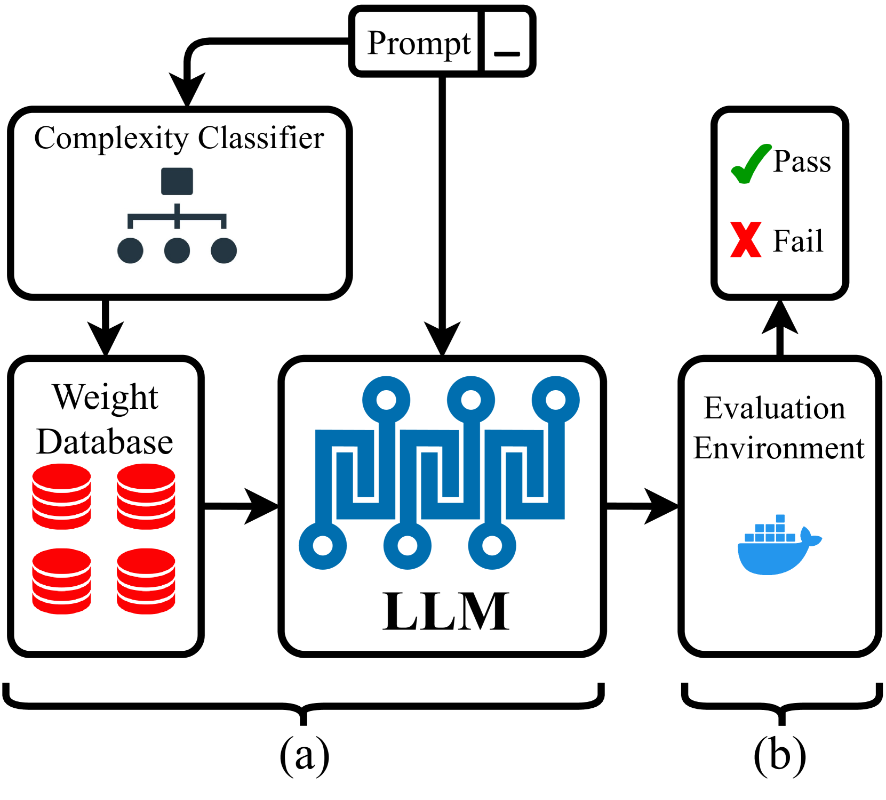

# 本文介绍了一种面向 Verilog 代码生成的多专家大型语言模型架构。

发布时间：2024年04月11日

`LLM应用` `硬件设计` `机器学习`

> A Multi-Expert Large Language Model Architecture for Verilog Code Generation

# 摘要

> 近期，利用大型语言模型（LLM）进行Verilog代码生成的研究备受关注。然而，现有技术在产出代码的质量上仍有不足。为突破这一瓶颈，本文提出了一种新颖的多专家LLM架构——MEV-LLM，专为Verilog代码生成而设计。该架构将多个针对不同设计复杂度分类数据集微调过的LLM巧妙融合，实现精准学习，有效应对各类Verilog代码生成的挑战。实验结果显示，生成的Verilog代码在语法和功能正确性上有了显著提升。这一成果不仅证实了我们方法的高效性，也为机器学习在自动化硬件设计领域的进步开辟了新天地。

> Recently, there has been a surging interest in using large language models (LLMs) for Verilog code generation. However, the existing approaches are limited in terms of the quality of the generated Verilog code. To address such limitations, this paper introduces an innovative multi-expert LLM architecture for Verilog code generation (MEV-LLM). Our architecture uniquely integrates multiple LLMs, each specifically fine-tuned with a dataset that is categorized with respect to a distinct level of design complexity. It allows more targeted learning, directly addressing the nuances of generating Verilog code for each category. Empirical evidence from experiments highlights notable improvements in terms of the percentage of generated Verilog outputs that are syntactically and functionally correct. These findings underscore the efficacy of our approach, promising a forward leap in the field of automated hardware design through machine learning.

[Arxiv](https://arxiv.org/abs/2404.08029)