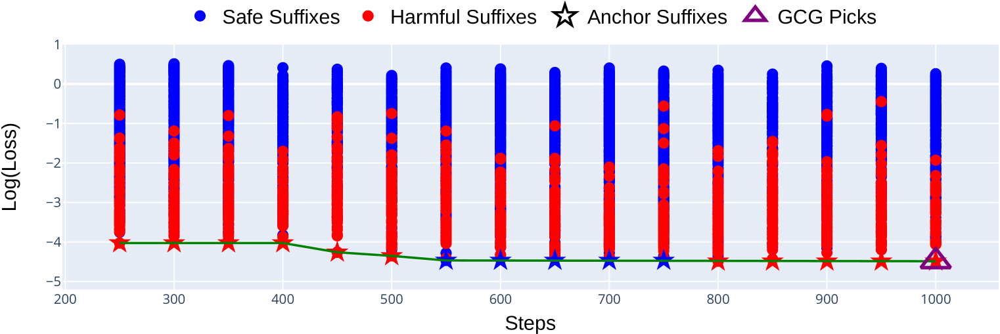

# AmpleGCG 致力于开发一种普适且具备迁移能力的对抗性后缀生成模型，旨在解放开放与封闭的大型语言模型（LLM）的潜能。

发布时间：2024年04月11日

`LLM应用` `安全性` `对抗性生成模型`

> AmpleGCG: Learning a Universal and Transferable Generative Model of Adversarial Suffixes for Jailbreaking Both Open and Closed LLMs

# 摘要

> 随着大型语言模型（LLMs）在自动化系统的广泛应用，确保其安全性显得尤为重要。尽管在安全对齐方面取得了显著进展，但最新研究GCG~\citep{zou2023universal}提出了一种新颖的离散标记优化算法，通过选取损失最小的单一后缀，成功破解了经过对齐的LLMs。本研究首先指出，在GCG优化过程中仅挑选损失最低的后缀进行破解的不足，并发现了在中间步骤中未被注意到的成功后缀。我们进一步利用这些成功样本作为训练数据，开发出一个名为AmpleGCG的生成模型，它能准确捕捉到有害查询对应的对抗性后缀分布，并能迅速生成大量对抗性后缀。AmpleGCG在两个经过对齐的LLMs（Llama-2-7B-chat和Vicuna-7B）上达到了近100%的攻击成功率（ASR），超越了所有已知的攻击方法。更引人注目的是，AmpleGCG还能轻松适应并攻击不同类型的模型，包括闭源LLMs，对最新版的GPT-3.5实现了99%的ASR。简而言之，我们的工作通过培养一个通用的、能应对任何有害查询并可从开源LLMs转移到闭源LLMs的对抗性后缀生成模型，显著提升了GCG的攻击效果。此外，该模型能在短短4秒钟内为单一有害查询生成200个对抗性后缀，大大增加了防御的难度。

> As large language models (LLMs) become increasingly prevalent and integrated into autonomous systems, ensuring their safety is imperative. Despite significant strides toward safety alignment, recent work GCG~\citep{zou2023universal} proposes a discrete token optimization algorithm and selects the single suffix with the lowest loss to successfully jailbreak aligned LLMs. In this work, we first discuss the drawbacks of solely picking the suffix with the lowest loss during GCG optimization for jailbreaking and uncover the missed successful suffixes during the intermediate steps. Moreover, we utilize those successful suffixes as training data to learn a generative model, named AmpleGCG, which captures the distribution of adversarial suffixes given a harmful query and enables the rapid generation of hundreds of suffixes for any harmful queries in seconds. AmpleGCG achieves near 100\% attack success rate (ASR) on two aligned LLMs (Llama-2-7B-chat and Vicuna-7B), surpassing two strongest attack baselines. More interestingly, AmpleGCG also transfers seamlessly to attack different models, including closed-source LLMs, achieving a 99\% ASR on the latest GPT-3.5. To summarize, our work amplifies the impact of GCG by training a generative model of adversarial suffixes that is universal to any harmful queries and transferable from attacking open-source LLMs to closed-source LLMs. In addition, it can generate 200 adversarial suffixes for one harmful query in only 4 seconds, rendering it more challenging to defend.

[Arxiv](https://arxiv.org/abs/2404.07921)