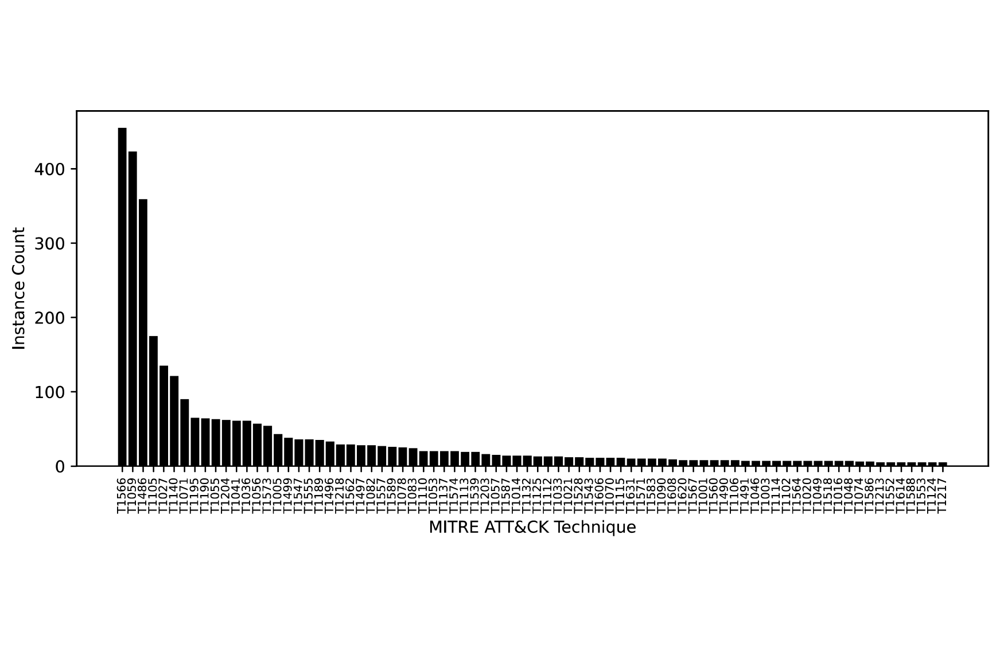

# AnnoCTR：网络威胁报告中实体、策略与技术检测与关联的数据集

发布时间：2024年04月11日

`LLM应用` `网络安全` `威胁情报
</example>`

> AnnoCTR: A Dataset for Detecting and Linking Entities, Tactics, and Techniques in Cyber Threat Reports

# 摘要

> 对网络安全专家而言，时刻关注威胁态势，防范实际或潜在的网络攻击极为关键。网络威胁情报通常通过自然语言报告传播，然而，自然语言处理在处理这些海量非结构化数据方面的潜力尚未被充分挖掘。本文提出了AnnoCTR，一个全新的CC-BY-SA许可的网络威胁情报数据集。这些情报报告经过领域专家精心注释，涵盖了命名实体、时间表达以及特定于网络安全的概念，包括隐含的技术和策略。这些实体和概念与维基百科和MITRE ATT&CK知识库相链接，后者是分类攻击类型时最广泛采用的体系。与以往仅提供单一标签或脱离上下文注释句子的数据集不同，我们的数据集以更为精细的方式对整个文档进行注释。通过实验研究，我们利用最先进的神经网络模型对数据集中的注释进行建模。在少量样本的情境下，我们发现，对于识别文本中明确或隐含提及的MITRE ATT&CK概念，MITRE ATT&CK的概念描述是训练数据增强的有效资源。

> Monitoring the threat landscape to be aware of actual or potential attacks is of utmost importance to cybersecurity professionals. Information about cyber threats is typically distributed using natural language reports. Natural language processing can help with managing this large amount of unstructured information, yet to date, the topic has received little attention. With this paper, we present AnnoCTR, a new CC-BY-SA-licensed dataset of cyber threat reports. The reports have been annotated by a domain expert with named entities, temporal expressions, and cybersecurity-specific concepts including implicitly mentioned techniques and tactics. Entities and concepts are linked to Wikipedia and the MITRE ATT&CK knowledge base, the most widely-used taxonomy for classifying types of attacks. Prior datasets linking to MITRE ATT&CK either provide a single label per document or annotate sentences out-of-context; our dataset annotates entire documents in a much finer-grained way. In an experimental study, we model the annotations of our dataset using state-of-the-art neural models. In our few-shot scenario, we find that for identifying the MITRE ATT&CK concepts that are mentioned explicitly or implicitly in a text, concept descriptions from MITRE ATT&CK are an effective source for training data augmentation.

[Arxiv](https://arxiv.org/abs/2404.07765)