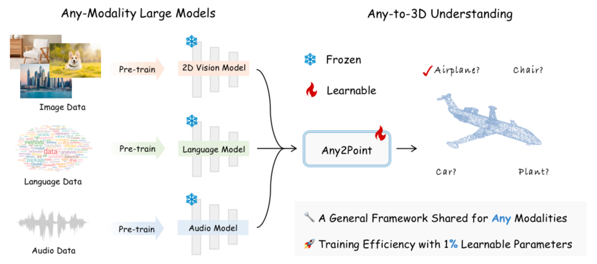
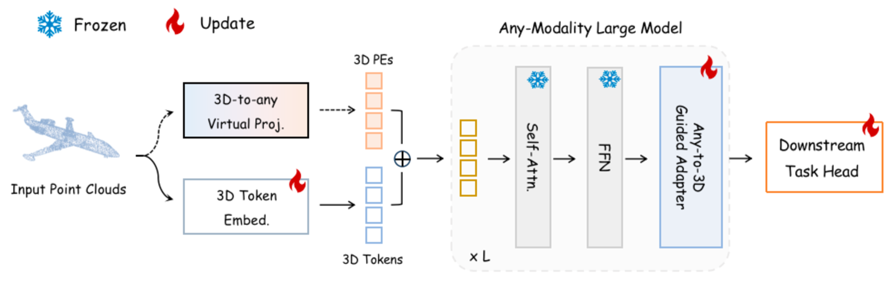
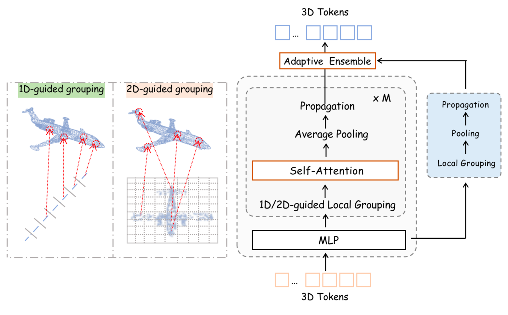
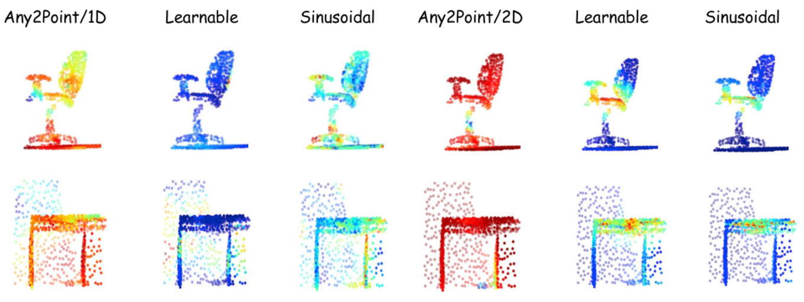
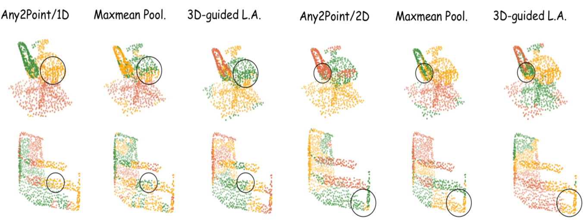

# Any2Point：激活各类大型模型，实现精准高效的三维理解

发布时间：2024年04月11日

`LLM理论` `三维建模` `多模态学习`

> Any2Point: Empowering Any-modality Large Models for Efficient 3D Understanding

# 摘要

> 近期，大型基础模型因其在众多场景中的卓越表现而备受瞩目。面对三维数据的匮乏，众多研究致力于将预训练的视觉模型适配至三维领域。然而，这类二维转三维的方法存在局限，如空间几何信息的潜在损失和高昂的计算成本。关键的是，这些框架主要针对二维模型，缺少一个普适的多模态到三维的转换范式。本文提出了Any2Point，一种高效的参数方法，旨在让各类大型模型（包括视觉、语言和音频）具备三维理解能力。通过一个来自任意源模态的固定变换器，我们设计了一种三维到一维或二维的虚拟投影策略，将输入的三维点与源模态中的原始位置相匹配。这一机制允许我们为每个三维标记赋予一个与预训练模型兼容的位置编码，有效避免了真实投影导致的三维几何信息损失，并更有效地利用一维/二维位置先验促进变换器的三维学习。进一步地，在每个变换器模块中，我们引入了一个多模态到三维的引导适配器，实现参数高效的微调。该适配器融合了源模态的空间知识，引导三维标记的局部特征整合，促使多模态变换器进行语义适配。我们通过大量实验验证了方法的有效性和效率，并在 https://github.com/Ivan-Tang-3D/Any2Point 上提供了代码和模型。

> Large foundation models have recently emerged as a prominent focus of interest, attaining superior performance in widespread scenarios. Due to the scarcity of 3D data, many efforts have been made to adapt pre-trained transformers from vision to 3D domains. However, such 2D-to-3D approaches are still limited, due to the potential loss of spatial geometries and high computation cost. More importantly, their frameworks are mainly designed for 2D models, lacking a general any-to-3D paradigm. In this paper, we introduce Any2Point, a parameter-efficient method to empower any-modality large models (vision, language, audio) for 3D understanding. Given a frozen transformer from any source modality, we propose a 3D-to-any (1D or 2D) virtual projection strategy that correlates the input 3D points to the original 1D or 2D positions within the source modality. This mechanism enables us to assign each 3D token with a positional encoding paired with the pre-trained model, which avoids 3D geometry loss caused by the true projection and better motivates the transformer for 3D learning with 1D/2D positional priors. Then, within each transformer block, we insert an any-to-3D guided adapter module for parameter-efficient fine-tuning. The adapter incorporates prior spatial knowledge from the source modality to guide the local feature aggregation of 3D tokens, compelling the semantic adaption of any-modality transformers. We conduct extensive experiments to showcase the effectiveness and efficiency of our method. Code and models are released at https://github.com/Ivan-Tang-3D/Any2Point.

[Arxiv](https://arxiv.org/abs/2404.07989)