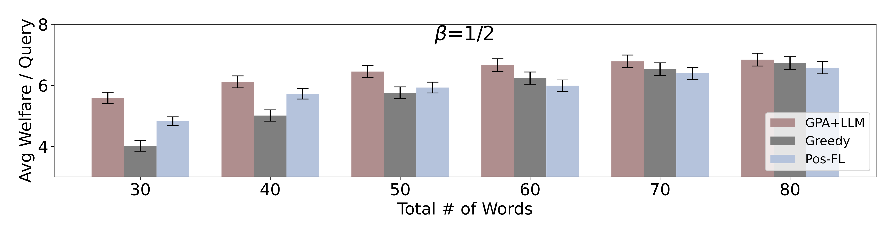
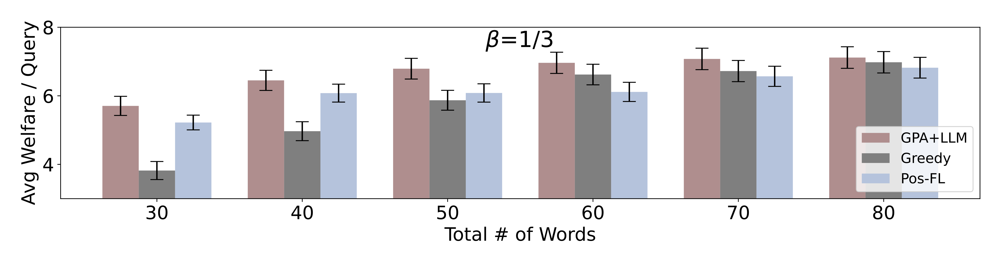
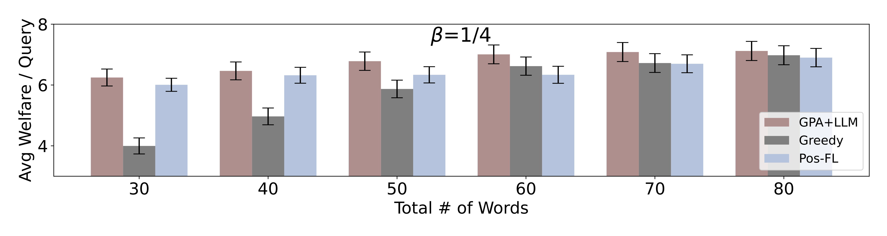

# 在拍卖中，利用大型语言模型（LLM）提供的摘要可以为参与者提供更丰富、直观的信息，从而提高拍卖的透明度和效率。

发布时间：2024年04月11日

`RAG`

> Auctions with LLM Summaries

# 摘要

> 在这项研究中，我们探索了一个拍卖场景，竞拍者争取让自己的内容在大型语言模型（LLM）生成的摘要中占有一席之地，就像在广告拍卖中，展示的是一个综合了多个广告内容的摘要段落。这种设置拓宽了传统广告位拍卖的范畴，适用于LLM创造的各种展示形式。我们设计了一个创新的分解式架构，拍卖和LLM两大模块通过预测模型联动，以激励兼容的方式，打造出能够最大化整体福利的摘要输出。我们对该架构进行了理论剖析，并通过模拟实验验证了其可行性与有效性，并对比了不同福利结果。

> We study an auction setting in which bidders bid for placement of their content within a summary generated by a large language model (LLM), e.g., an ad auction in which the display is a summary paragraph of multiple ads. This generalizes the classic ad settings such as position auctions to an LLM generated setting, which allows us to handle general display formats. We propose a novel factorized framework in which an auction module and an LLM module work together via a prediction model to provide welfare maximizing summary outputs in an incentive compatible manner. We provide a theoretical analysis of this framework and synthetic experiments to demonstrate the feasibility and validity of the system together with welfare comparisons.

[Arxiv](https://arxiv.org/abs/2404.08126)