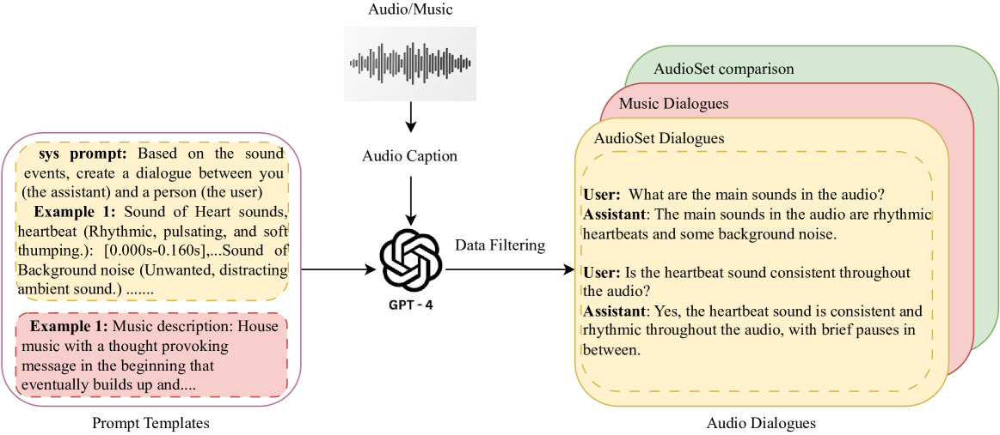
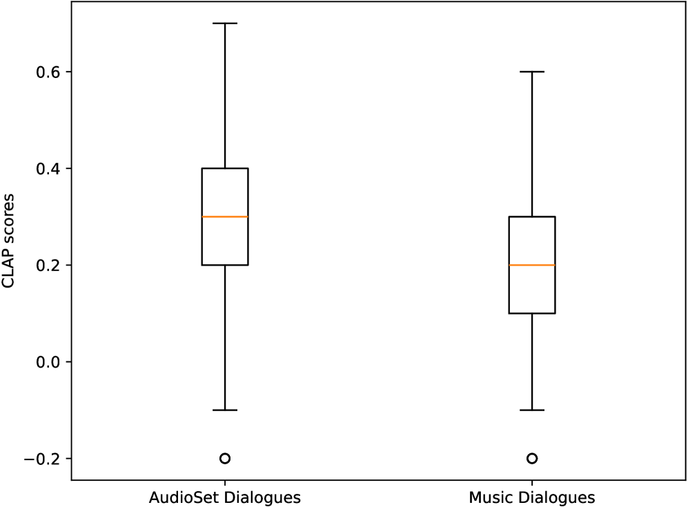

# 音频对话集：为深入理解和分析音频及音乐而打造的对话数据集。

发布时间：2024年04月11日

`LLM应用` `音频处理` `对话系统`

> Audio Dialogues: Dialogues dataset for audio and music understanding

# 摘要

> 目前针对音频理解的数据集多集中于单轮交互场景，如音频描述和问答，这限制了我们通过对话交互来理解音频。为填补这一空白，我们推出了音频对话数据集：一个包含16.38万个样本的多轮对话集，涵盖各种音频和音乐。该数据集不仅包含对话内容，还有问答配对，以便综合理解多个音频输入。通过运用提示性方法和现有数据集的字幕注释，音频对话利用大型语言模型（LLM）创造出多轮对话。我们对现有的音频增强型LLM在这一新数据集上的表现进行了评估，证明了音频对话的复杂性和实用性。相关代码将开放获取，更多详细的提示和生成的对话示例，请访问演示网站 https://audiodialogues.github.io/。

> Existing datasets for audio understanding primarily focus on single-turn interactions (i.e. audio captioning, audio question answering) for describing audio in natural language, thus limiting understanding audio via interactive dialogue. To address this gap, we introduce Audio Dialogues: a multi-turn dialogue dataset containing 163.8k samples for general audio sounds and music. In addition to dialogues, Audio Dialogues also has question-answer pairs to understand and compare multiple input audios together. Audio Dialogues leverages a prompting-based approach and caption annotations from existing datasets to generate multi-turn dialogues using a Large Language Model (LLM). We evaluate existing audio-augmented large language models on our proposed dataset to demonstrate the complexity and applicability of Audio Dialogues. Our code for generating the dataset will be made publicly available. Detailed prompts and generated dialogues can be found on the demo website https://audiodialogues.github.io/.

[Arxiv](https://arxiv.org/abs/2404.07616)