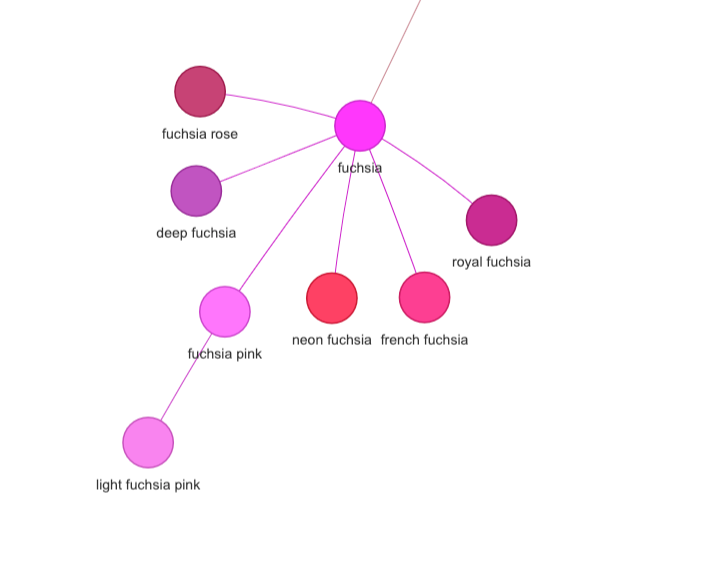
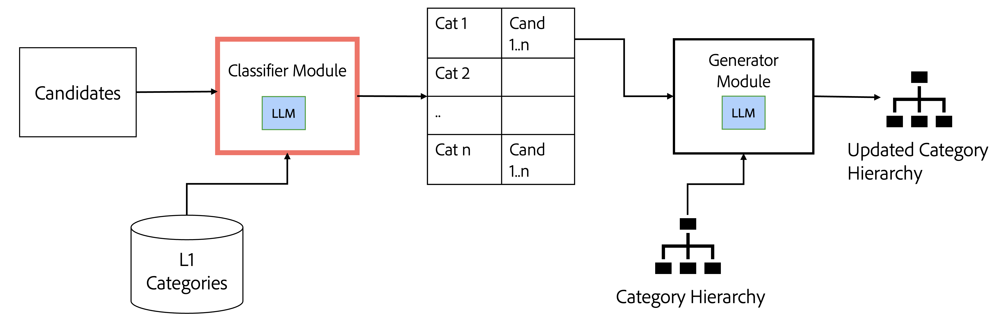
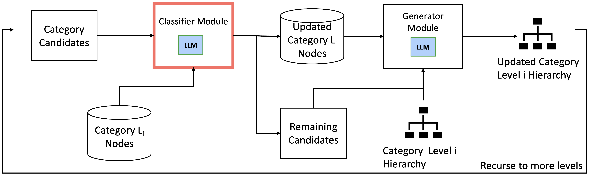
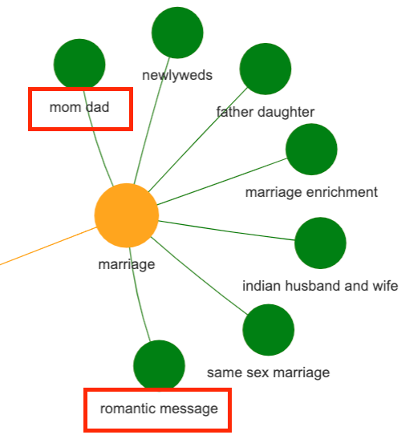
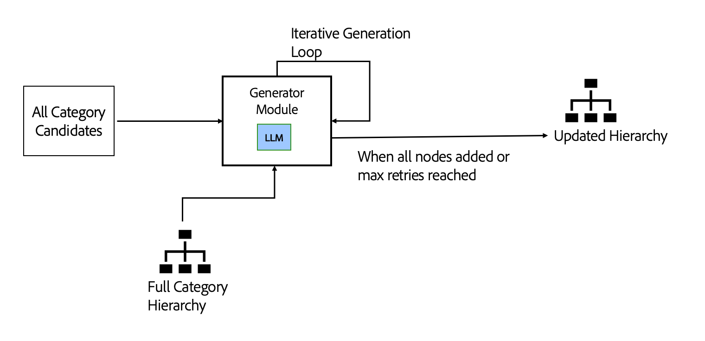
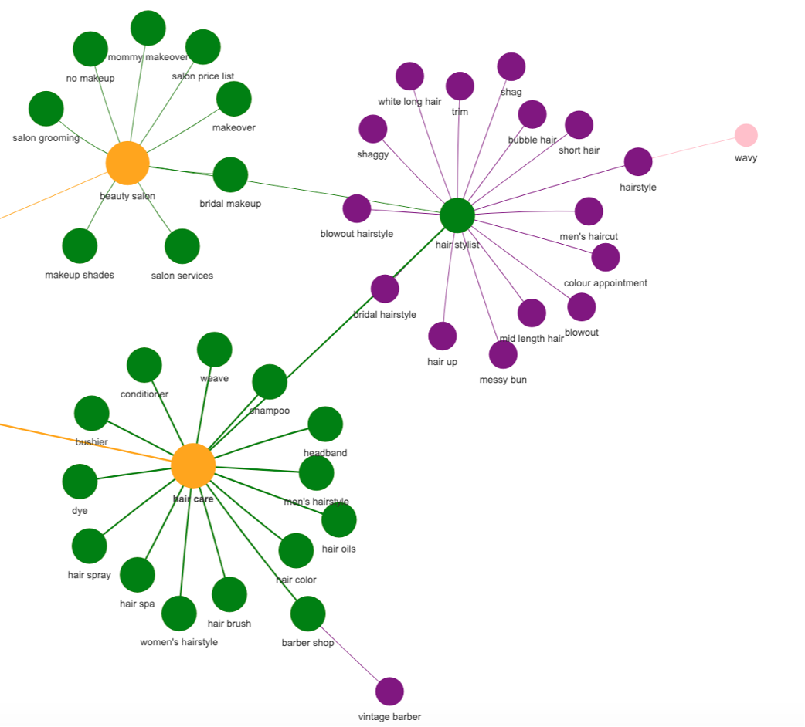
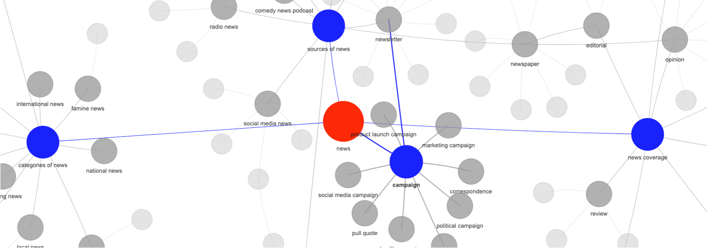

# 通过神经变换器技术，我们能够提升知识图谱的层级结构。

发布时间：2024年04月11日

`LLM应用` `知识图谱` `数据整理`

> Augmenting Knowledge Graph Hierarchies Using Neural Transformers

# 摘要

> 知识图谱作为整理、推荐和分类数据的有效工具，其层次结构对于深化数据理解和信息分隔至关重要。本研究运用大型语言模型，对现有知识图谱的层次结构进行生成与扩展。在处理小规模（不超过100,000个节点）的特定领域知识图谱时，我们发现结合少量样本引导和单次生成的方法效果显著；对于更大规模的知识图谱，则可能需要采用循环生成策略。我们展示了一些增强层次结构的技巧，使得知识图谱中意图的覆盖率提升了98%，颜色的覆盖率提升了99%。

> Knowledge graphs are useful tools to organize, recommend and sort data. Hierarchies in knowledge graphs provide significant benefit in improving understanding and compartmentalization of the data within a knowledge graph. This work leverages large language models to generate and augment hierarchies in an existing knowledge graph. For small (<100,000 node) domain-specific KGs, we find that a combination of few-shot prompting with one-shot generation works well, while larger KG may require cyclical generation. We present techniques for augmenting hierarchies, which led to coverage increase by 98% for intents and 99% for colors in our knowledge graph.

[Arxiv](https://arxiv.org/abs/2404.08020)