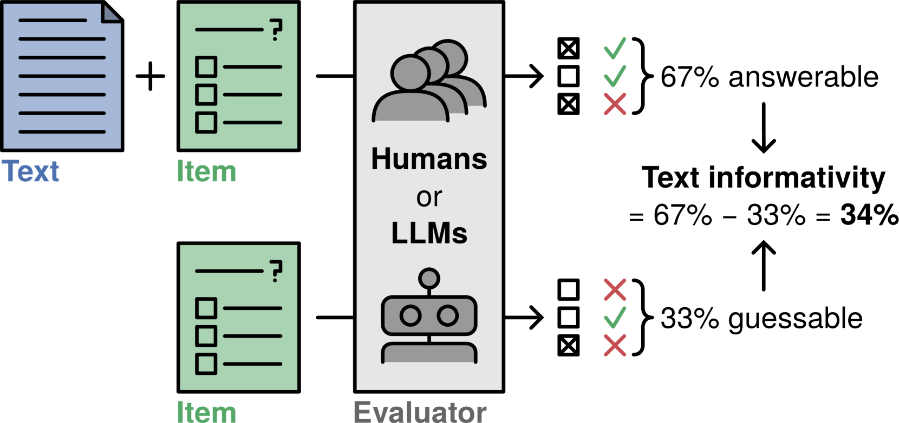
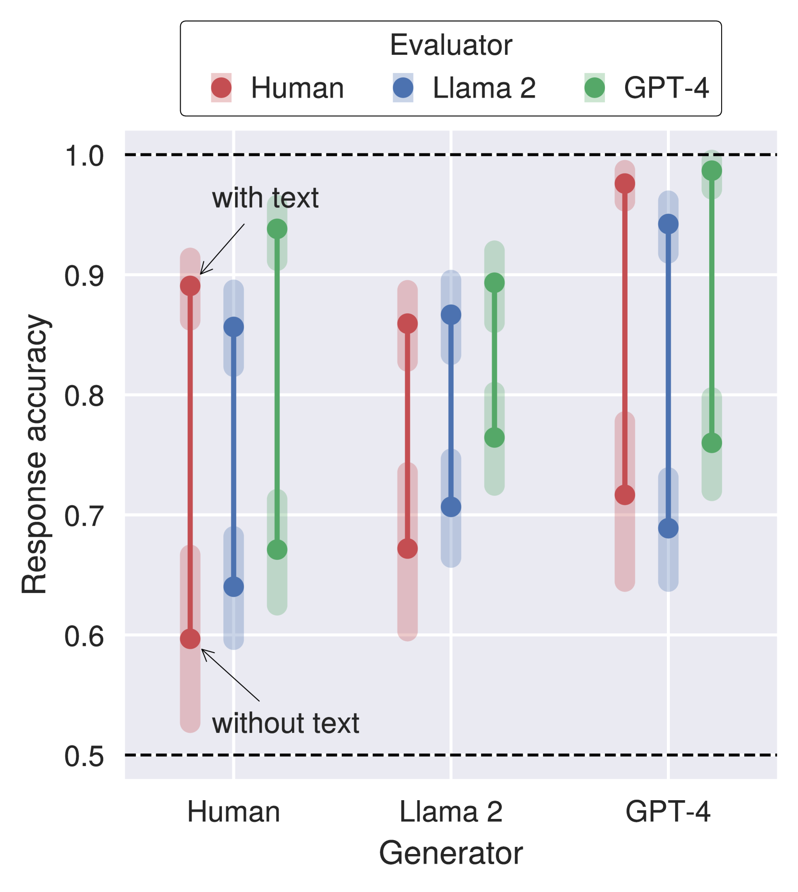
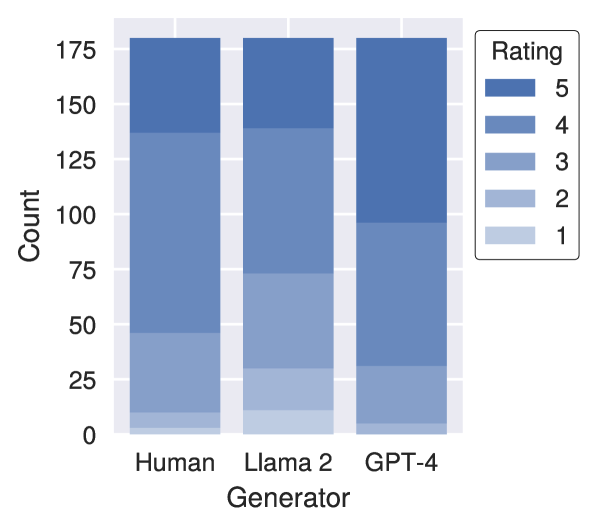
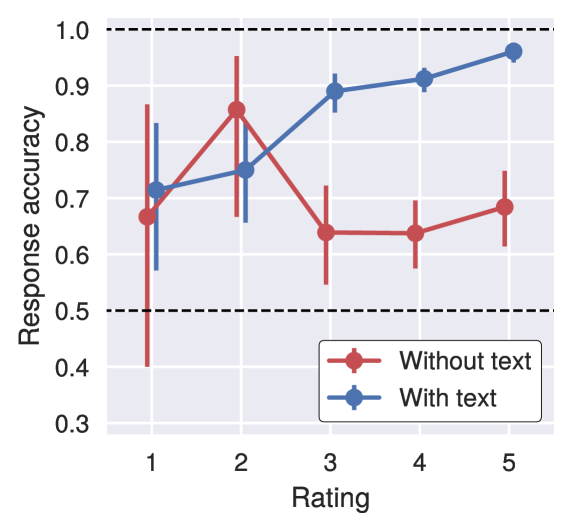
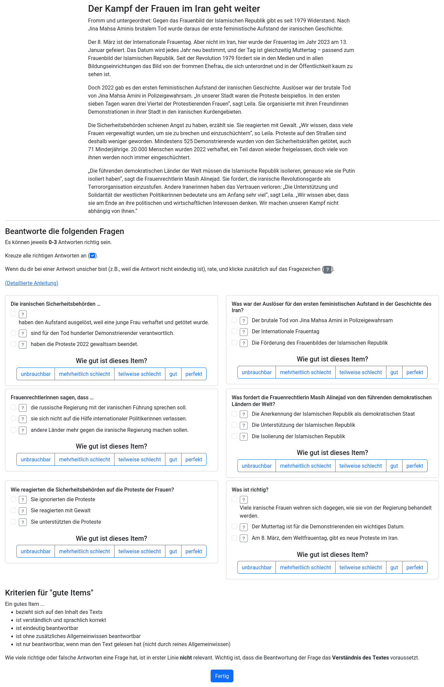

# 借助大型语言模型，实现阅读理解试题的自动生成与评估

发布时间：2024年04月11日

`LLM应用` `自动评估`

> Automatic Generation and Evaluation of Reading Comprehension Test Items with Large Language Models

# 摘要

> 阅读理解测验广泛应用于教育和评估文本简化程度等领域。然而，手工制作这些测验并保证其品质既困难又费时。本文探讨了如何利用大型语言模型（LLMs）自动生成及评价选择题式的阅读理解题。为此，我们汇集了一套德语阅读理解题库，并制定了一套新的评估标准，包括一种基于猜测和回答难度的文本信息量指标。利用这些标准，我们评估了Llama 2和GPT-4生成题目的质量。结果显示，尽管两种模型都能在无先验知识的情况下生成质量尚可的题目，但GPT-4的表现明显超越了Llama 2。我们还发现，LLMs能够通过提取题目反应来进行自动评估，其中GPT-4的评估结果与人类评价者最为接近。总体而言，利用LLMs进行零-shot生成，为生成和评估阅读理解题提供了一种充满潜力的方法，尤其适用于数据稀缺的语言。

> Reading comprehension tests are used in a variety of applications, reaching from education to assessing the comprehensibility of simplified texts. However, creating such tests manually and ensuring their quality is difficult and time-consuming. In this paper, we explore how large language models (LLMs) can be used to generate and evaluate multiple-choice reading comprehension items. To this end, we compiled a dataset of German reading comprehension items and developed a new protocol for human and automatic evaluation, including a metric we call text informativity, which is based on guessability and answerability. We then used this protocol and the dataset to evaluate the quality of items generated by Llama 2 and GPT-4. Our results suggest that both models are capable of generating items of acceptable quality in a zero-shot setting, but GPT-4 clearly outperforms Llama 2. We also show that LLMs can be used for automatic evaluation by eliciting item reponses from them. In this scenario, evaluation results with GPT-4 were the most similar to human annotators. Overall, zero-shot generation with LLMs is a promising approach for generating and evaluating reading comprehension test items, in particular for languages without large amounts of available data.

[Arxiv](https://arxiv.org/abs/2404.07720)