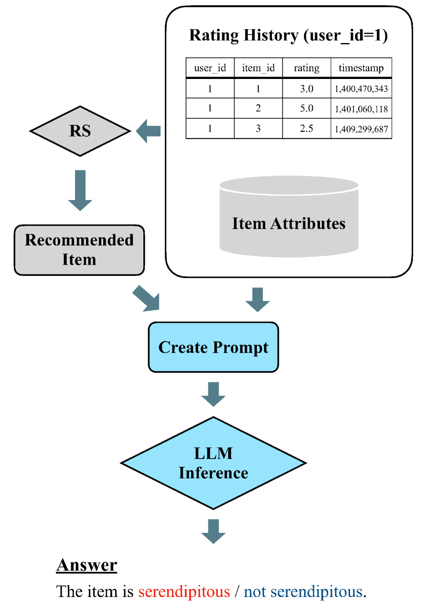
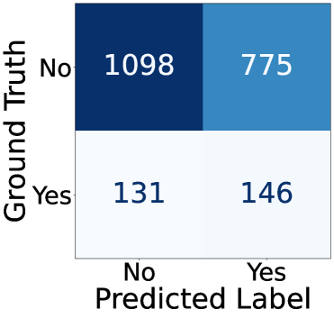
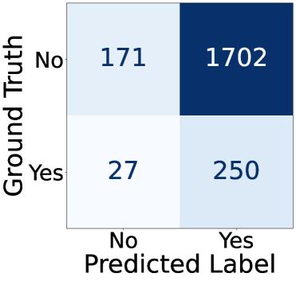
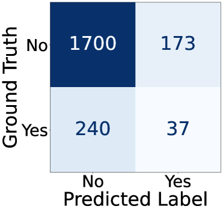
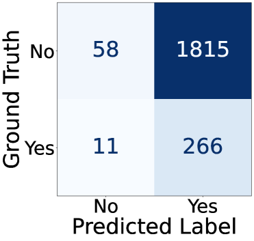
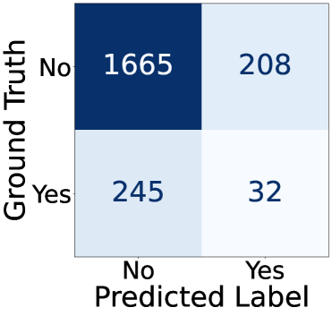
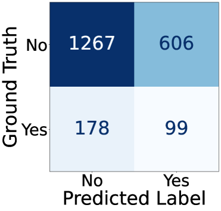
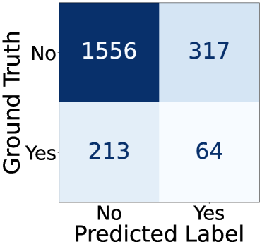

# 大型语言模型能否对推荐系统里的惊喜元素进行评价？

发布时间：2024年04月11日

`LLM应用` `推荐系统` `用户行为分析`

> Can Large Language Models Assess Serendipity in Recommender Systems?

# 摘要

> 偶然发现导向的推荐系统致力于减少用户偏好的过度集中。但由于偶然发现本质上的主观情感因素，评估用户对推荐内容的意外反应并非易事。本研究利用大型语言模型（LLMs）的广泛知识库，探索了LLMs与人类在评估偶然发现时的一致性。研究中，LLMs接受了二元分类任务，预测用户是否会认为某个推荐项目具有偶然性。在一个由人类评定偶然发现基准的数据集上，我们对三个LLMs的预测表现进行了衡量。研究发现，LLM的评估结果与人类的评估并不完全吻合，但至少与基线方法持平甚至更优。进一步的验证显示，向LLM提供的 用户评价历史数量需要精心挑选，以免信息过少或过多。同时，表现出色的LLM的输出结果也难以解读。

> Serendipity-oriented recommender systems aim to counteract over-specialization in user preferences. However, evaluating a user's serendipitous response towards a recommended item can be challenging because of its emotional nature. In this study, we address this issue by leveraging the rich knowledge of large language models (LLMs), which can perform a variety of tasks. First, this study explored the alignment between serendipitous evaluations made by LLMs and those made by humans. In this investigation, a binary classification task was given to the LLMs to predict whether a user would find the recommended item serendipitously. The predictive performances of three LLMs on a benchmark dataset in which humans assigned the ground truth of serendipitous items were measured. The experimental findings reveal that LLM-based assessment methods did not have a very high agreement rate with human assessments. However, they performed as well as or better than the baseline methods. Further validation results indicate that the number of user rating histories provided to LLM prompts should be carefully chosen to avoid both insufficient and excessive inputs and that the output of LLMs that show high classification performance is difficult to interpret.

[Arxiv](https://arxiv.org/abs/2404.07499)