# 车辆运动规划能否适应现实世界中的长尾情景？

发布时间：2024年04月11日

`Agent` `自动驾驶` `交通规划`

> Can Vehicle Motion Planning Generalize to Realistic Long-tail Scenarios?

# 摘要

> 在真实世界的自动驾驶系统中，规划器必须能够在面对稀有和多变的交通情形时做出稳妥的安全决策。目前，最先进的规划器通常在如nuScenes（开环）或nuPlan（闭环）的真实世界数据集上进行评估。然而，nuPlan虽然基于真实数据和闭环控制，覆盖的大多是基础驾驶场景，这限制了对规划器泛化到罕见情形能力的评估。为此，我们提出了一个新的闭环基准测试interPlan，它包含了多个边缘案例和充满挑战的驾驶场景。我们对现有的先进规划器进行了基准测试，结果表明无论是基于规则的还是基于学习的规划器，都无法在interPlan场景中安全导航。随着基础模型如大型语言模型（LLM）在处理泛化问题上的不断进步，我们对一个纯LLM的规划器进行了评估，并创新性地结合了LLM行为规划器和规则运动规划器，推出了一款混合型规划器，它在我们的基准测试中展现出了最先进的性能。

> Real-world autonomous driving systems must make safe decisions in the face of rare and diverse traffic scenarios. Current state-of-the-art planners are mostly evaluated on real-world datasets like nuScenes (open-loop) or nuPlan (closed-loop). In particular, nuPlan seems to be an expressive evaluation method since it is based on real-world data and closed-loop, yet it mostly covers basic driving scenarios. This makes it difficult to judge a planner's capabilities to generalize to rarely-seen situations. Therefore, we propose a novel closed-loop benchmark interPlan containing several edge cases and challenging driving scenarios. We assess existing state-of-the-art planners on our benchmark and show that neither rule-based nor learning-based planners can safely navigate the interPlan scenarios.
  A recently evolving direction is the usage of foundation models like large language models (LLM) to handle generalization. We evaluate an LLM-only planner and introduce a novel hybrid planner that combines an LLM-based behavior planner with a rule-based motion planner that achieves state-of-the-art performance on our benchmark.

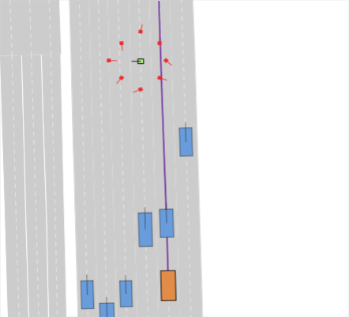

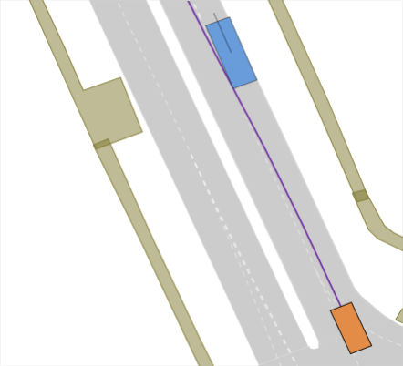

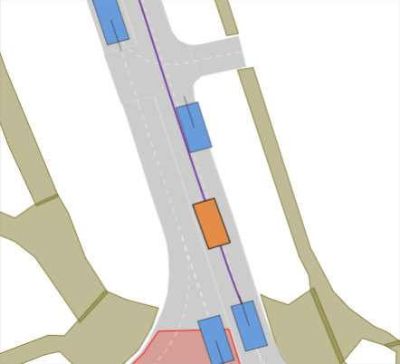

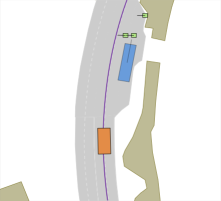

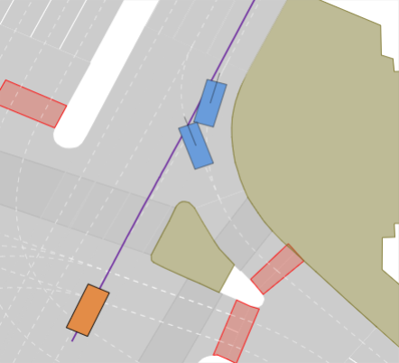

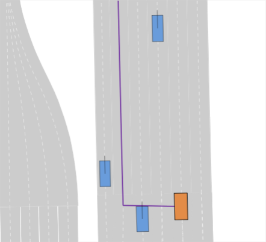

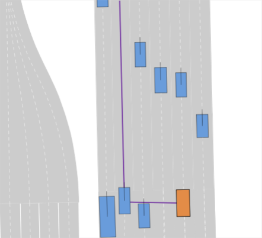

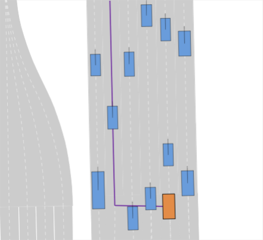

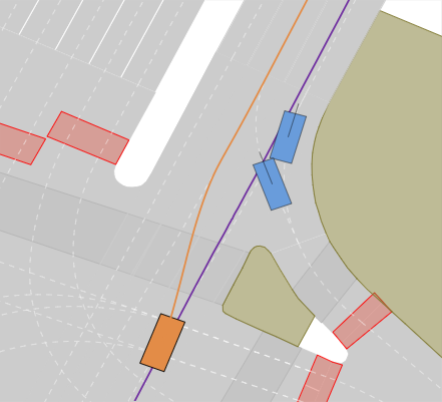

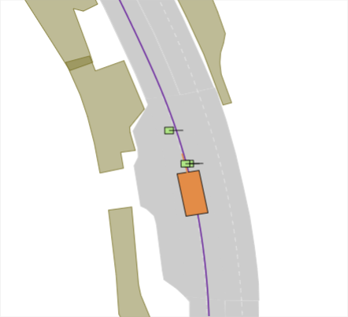

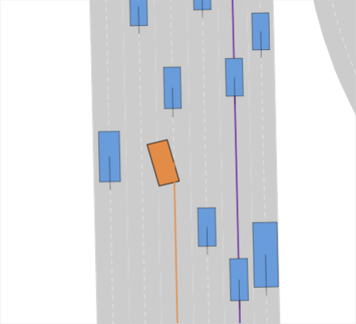

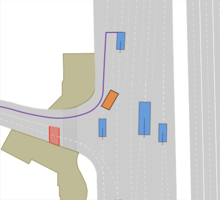

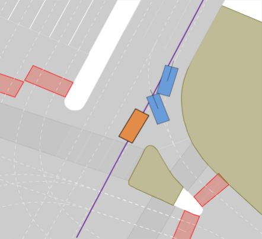

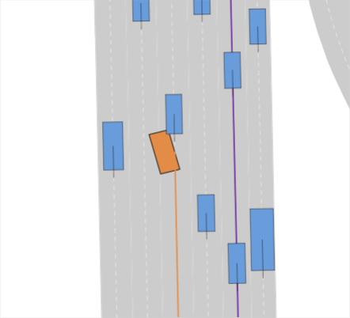

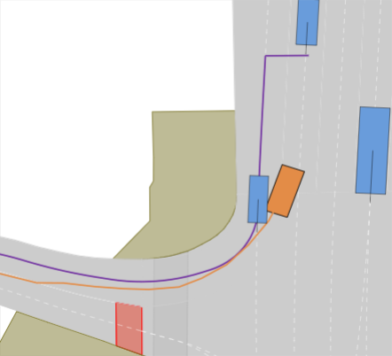

[Arxiv](https://arxiv.org/abs/2404.07569)