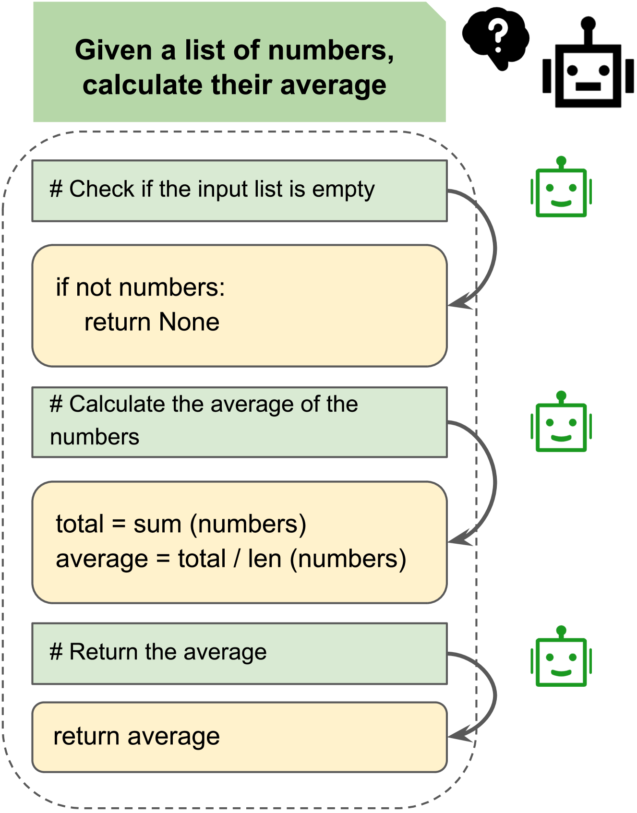
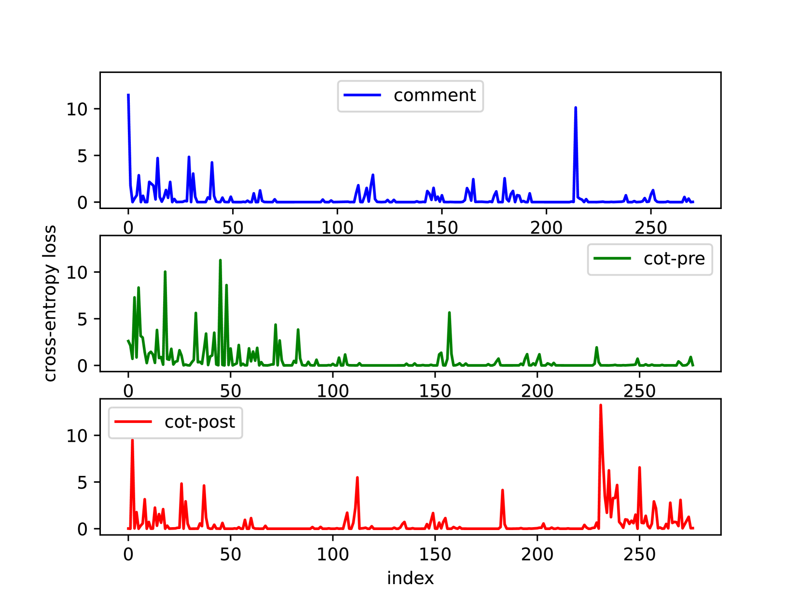

# 将评论视作自然逻辑的转换点，以此来提升代码生成的效果。

发布时间：2024年04月11日

`LLM应用` `软件开发` `人工智能`

> Comments as Natural Logic Pivots: Improve Code Generation via Comment Perspective

# 摘要

> 代码生成致力于解析问题描述并编织出相应的代码片段，传统研究通常通过提示策略将这类复杂任务分解成一系列中间步骤，例如思维链及其衍生方法。虽然这些方法取得了一定成果，但其效能却严重依赖于像GPT-4这样的先进大型语言模型，尤其是在API调用方面，这极大地限制了它们的实际应用范围。因此，探索如何提升中小型代码生成模型的能力，同时又不大幅增加训练成本，成为了一个引人注目的挑战。我们认为，代码注释自然地连接了自然语言与代码语言，建议利用注释来增强代码模型的生成力。我们提出了MANGO（注释作为自然逻辑枢纽），它包含一种注释对比训练法和对应的逻辑注释解码法。实验在HumanEval和MBPP上展开，以StarCoder和WizardCoder为支撑模型，覆盖从3B到7B的模型参数规模。结果显示，MANGO在强大的基线基础上显著提升了代码通过率，逻辑注释解码策略的稳定性也远超思维链提示方法。相关代码已在\url{https://github.com/pppa2019/Mango}上公开。

> Code generation aims to understand the problem description and generate corresponding code snippets, where existing works generally decompose such complex tasks into intermediate steps by prompting strategies, such as Chain-of-Thought and its variants. While these studies have achieved some success, their effectiveness is highly dependent on the capabilities of advanced Large Language Models (LLMs) such as GPT-4, particularly in terms of API calls, which significantly limits their practical applicability. Consequently, how to enhance the code generation capabilities of small and medium-scale code LLMs without significantly increasing training costs is an appealing challenge. In this paper, we suggest that code comments are the natural logic pivot between natural language and code language and propose using comments to boost the code generation ability of code LLMs. Concretely, we propose MANGO (comMents As Natural loGic pivOts), including a comment contrastive training strategy and a corresponding logical comment decoding strategy. Experiments are performed on HumanEval and MBPP, utilizing StarCoder and WizardCoder as backbone models, and encompassing model parameter sizes between 3B and 7B. The results indicate that MANGO significantly improves the code pass rate based on the strong baselines. Meanwhile, the robustness of the logical comment decoding strategy is notably higher than the Chain-of-thoughts prompting. The code is publicly available at \url{https://github.com/pppa2019/Mango}.

[Arxiv](https://arxiv.org/abs/2404.07549)