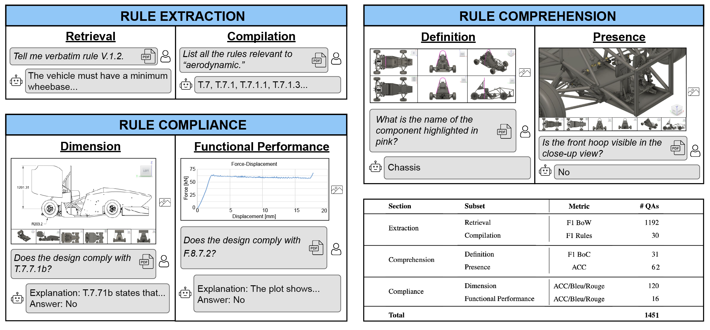
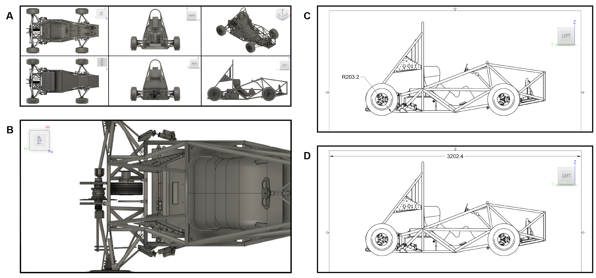
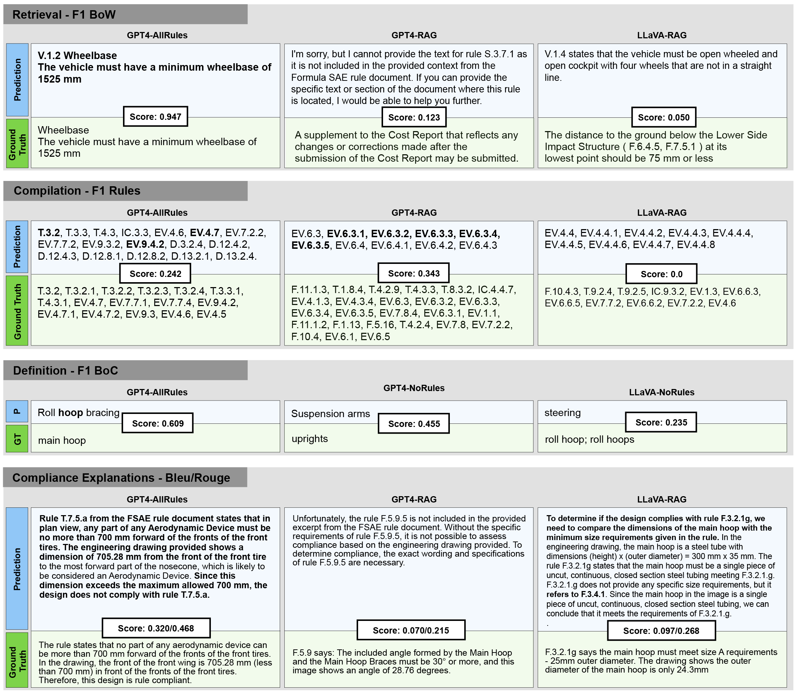

# DesignQA：一个多模态基准，用于评测大型语言模型对工程文档的理解力。

发布时间：2024年04月11日

`LLM应用` `工程设计` `自动评估`

> DesignQA: A Multimodal Benchmark for Evaluating Large Language Models' Understanding of Engineering Documentation

# 摘要

> 本研究提出了DesignQA，这是一个创新的评估标准，用以衡量多模态大型语言模型（MLLMs）在解读和应用技术文档中的工程规范的能力。该基准测试紧扣实际工程难题，独创性地融合了多种数据——文本形式的设计规范、CAD图像以及源自Formula SAE学生竞赛的工程图纸。与众多现行MLLM评估标准不同，DesignQA包含了源出不同的视觉问题，即输入的图像与文档并非同根同源。它具备自动评估机制，并依据工程师在按规范设计时所执行的任务，划分为规则理解、规则遵循和规则提取三个部分。我们对GPT4、LLaVA等尖端模型进行了基准测试，发现MLLMs在解读复杂工程文件方面虽具潜力，但在精确抽取及应用具体规范于工程设计上仍面临重大挑战。此基准测试为AI助力的工程设计流程的未来进展打下了坚实基础。DesignQA的资源已公开，可通过以下链接获取：https://github.com/anniedoris/design_qa/。

> This research introduces DesignQA, a novel benchmark aimed at evaluating the proficiency of multimodal large language models (MLLMs) in comprehending and applying engineering requirements in technical documentation. Developed with a focus on real-world engineering challenges, DesignQA uniquely combines multimodal data-including textual design requirements, CAD images, and engineering drawings-derived from the Formula SAE student competition. Different from many existing MLLM benchmarks, DesignQA contains document-grounded visual questions where the input image and input document come from different sources. The benchmark features automatic evaluation metrics and is divided into segments-Rule Comprehension, Rule Compliance, and Rule Extraction-based on tasks that engineers perform when designing according to requirements. We evaluate state-of-the-art models like GPT4 and LLaVA against the benchmark, and our study uncovers the existing gaps in MLLMs' abilities to interpret complex engineering documentation. Key findings suggest that while MLLMs demonstrate potential in navigating technical documents, substantial limitations exist, particularly in accurately extracting and applying detailed requirements to engineering designs. This benchmark sets a foundation for future advancements in AI-supported engineering design processes. DesignQA is publicly available at: https://github.com/anniedoris/design_qa/.

[Arxiv](https://arxiv.org/abs/2404.07917)