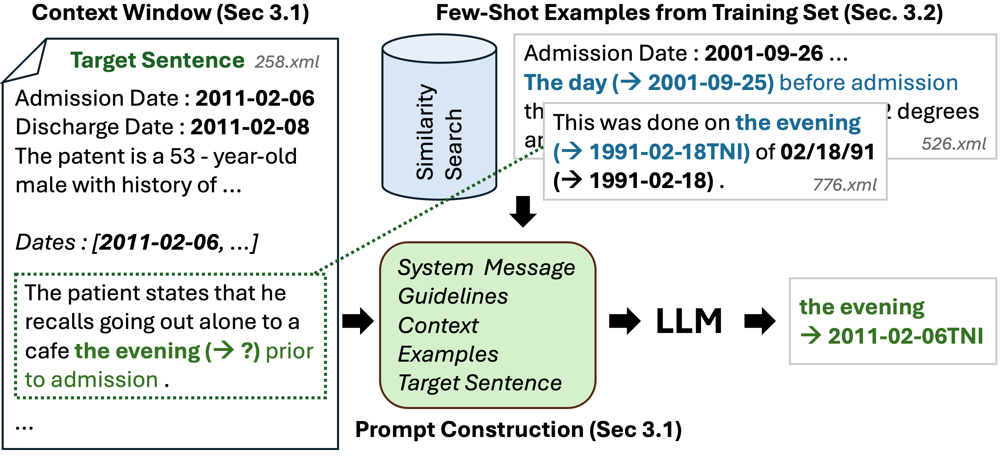
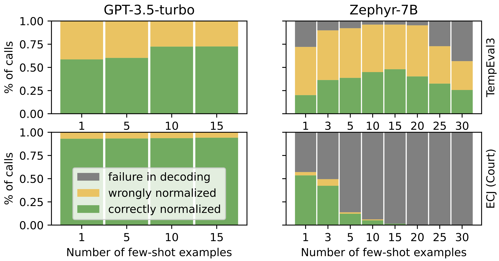
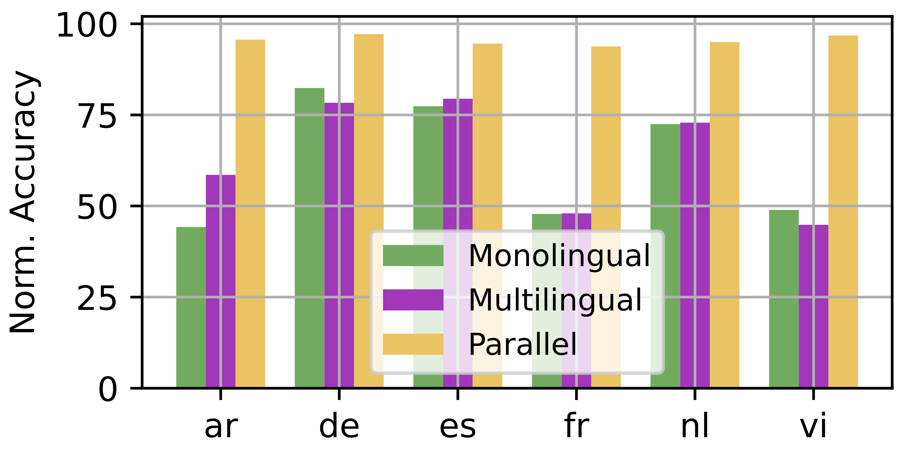
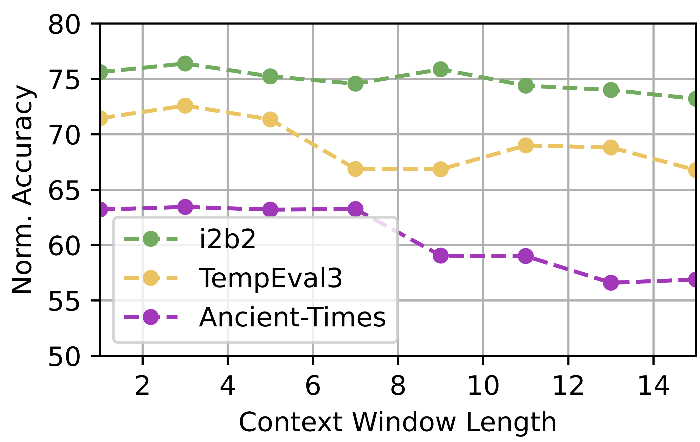

# 在时间表达归一化任务中，采用话语感知的上下文学习方法，以提高处理效果。

发布时间：2024年04月11日

`LLM应用` `时间表达式处理`

> Discourse-Aware In-Context Learning for Temporal Expression Normalization

# 摘要

> 时间表达式（TE）的规范化问题已广受关注。但主流的基于规则的系统受限于特定环境，新兴的机器学习技术则苦于缺乏标注数据。本研究尝试利用专有和开源的大型语言模型（LLMs）进行TE规范化，通过上下文学习向模型注入任务、文档和示例信息。我们尝试了多种样本选择策略，以获取最相关的示例集。采用基于窗口的提示设计方法，我们能够在不同句子间进行TE规范化，无需训练模型即可利用LLM的知识。实验结果显示，我们的方法与专为该任务设计的模型相比，取得了可与之匹敌的成绩。特别是在非标准环境下，通过推理过程中动态引入相关示例，我们的方法实现了显著的性能提升。

> Temporal expression (TE) normalization is a well-studied problem. However, the predominately used rule-based systems are highly restricted to specific settings, and upcoming machine learning approaches suffer from a lack of labeled data. In this work, we explore the feasibility of proprietary and open-source large language models (LLMs) for TE normalization using in-context learning to inject task, document, and example information into the model. We explore various sample selection strategies to retrieve the most relevant set of examples. By using a window-based prompt design approach, we can perform TE normalization across sentences, while leveraging the LLM knowledge without training the model. Our experiments show competitive results to models designed for this task. In particular, our method achieves large performance improvements for non-standard settings by dynamically including relevant examples during inference.

[Arxiv](https://arxiv.org/abs/2404.07775)