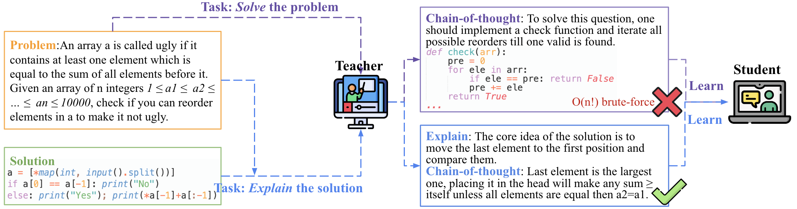
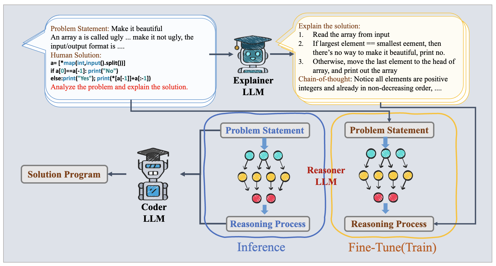
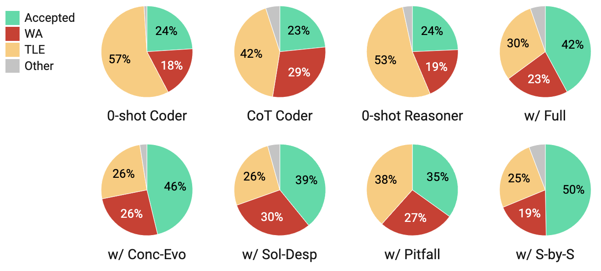
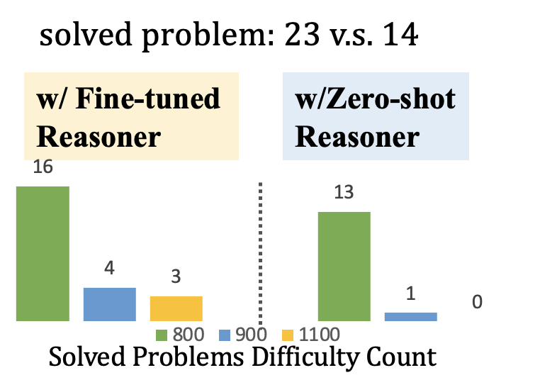

# 通过解析解题程序，从大型语言模型 (LLM) 中提取算法推理能力。

发布时间：2024年04月11日

`LLM应用` `人工智能`

> Distilling Algorithmic Reasoning from LLMs via Explaining Solution Programs

# 摘要

> 通过明确梳理思维推理路径，有效提升了大型语言模型在众多任务上的推理能力。然而，面对挑战性极强的复杂任务，这种方法往往难以形成通向正确答案的有效思考链条。本研究提出了一种创新途径，借助大型语言模型解释解决方案的能力，提炼其推理技能，并将其应用于高水平编程挑战的解决。具体来说，我们让模型为一系列问题与程序解决方案对生成解释，再利用这些问题与解释对，对一个小型语言模型——推理器进行精细调整，使其学会算法推理，为未知问题提供解题提示。实验证明，与强大的传统推理方法相比，从解释中学习使推理器在指导编程实现方面更为高效，显著提高了解决率。此外，其表现也超过了直接学习问题与程序解决方案对的模型。我们还特别为CodeContests格式编制了一份新增测试集，涵盖了模型知识更新截止后新发布的246个问题。

> Distilling explicit chain-of-thought reasoning paths has emerged as an effective method for improving the reasoning abilities of large language models (LLMs) across various tasks. However, when tackling complex tasks that pose significant challenges for state-of-the-art models, this technique often struggles to produce effective chains of thought that lead to correct answers. In this work, we propose a novel approach to distill reasoning abilities from LLMs by leveraging their capacity to explain solutions. We apply our method to solving competitive-level programming challenges. More specifically, we employ an LLM to generate explanations for a set of <problem, solution-program> pairs, then use <problem, explanation> pairs to fine-tune a smaller language model, which we refer to as the Reasoner, to learn algorithmic reasoning that can generate "how-to-solve" hints for unseen problems. Our experiments demonstrate that learning from explanations enables the Reasoner to more effectively guide program implementation by a Coder, resulting in higher solve rates than strong chain-of-thought baselines on competitive-level programming problems. It also outperforms models that learn directly from <problem, solution-program> pairs. We curated an additional test set in the CodeContests format, which includes 246 more recent problems posted after the models' knowledge cutoff.

[Arxiv](https://arxiv.org/abs/2404.08148)