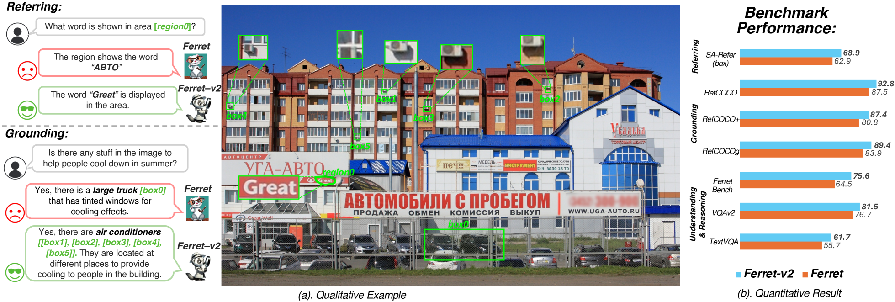
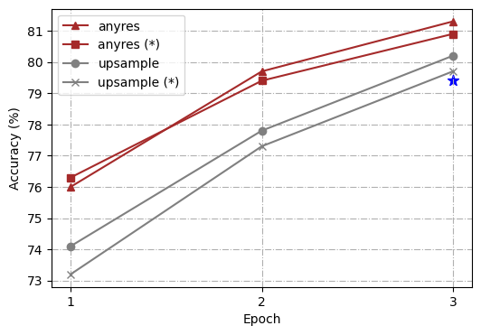
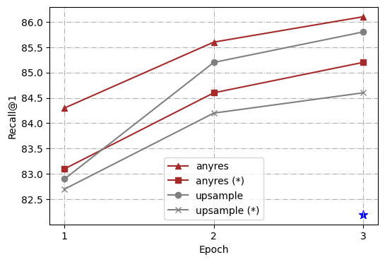
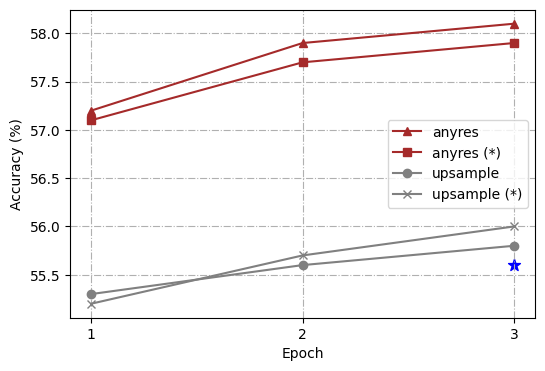
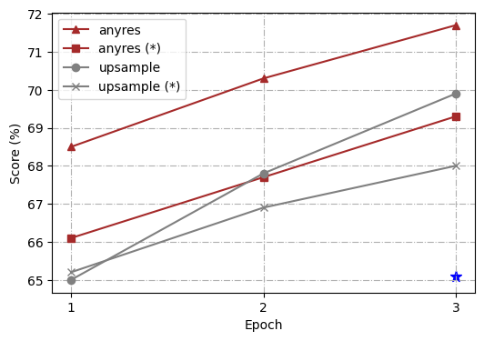
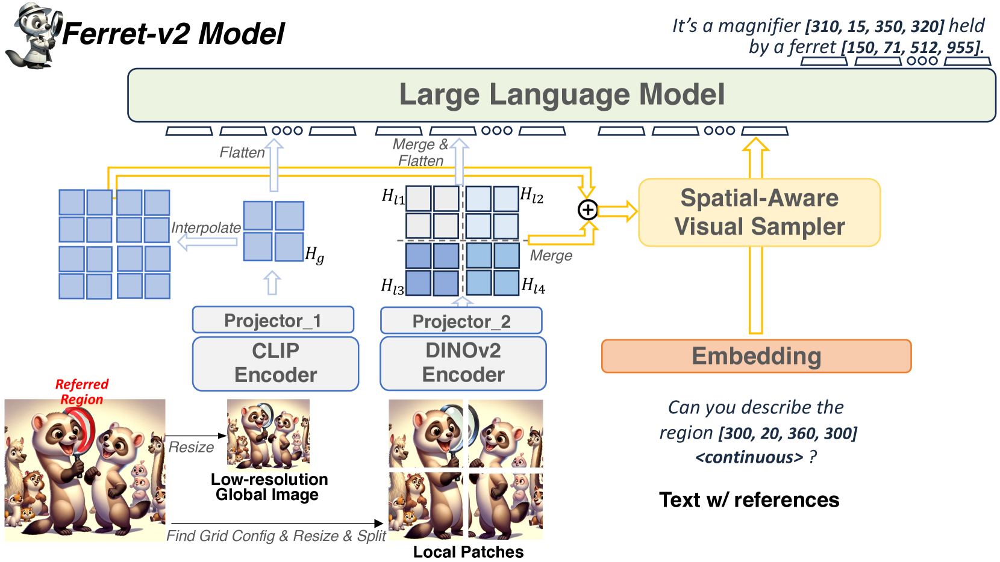
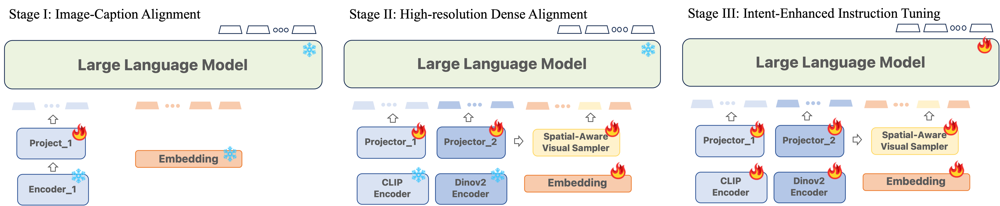

# Ferret-v2：提升大型语言模型指代解析与实体定位的进阶基准。

发布时间：2024年04月11日

`RAG` `计算机视觉` `图像处理`

> Ferret-v2: An Improved Baseline for Referring and Grounding with Large Language Models

# 摘要

> 雪貂-v2，作为雪貂的升级版，不仅打破了预训练视觉编码器的限制，还能轻松应对更高分辨率的图像，让模型在理解和处理图像方面更加得心应手。它引入了多粒度视觉编码，通过DINOv2编码器的加持，让模型对视觉信息的理解更加深入和全面。此外，其三阶段训练策略，在图像-标题对齐的基础上，增加了高分辨率密集对齐的阶段，进一步提升了模型的性能。实验结果显示，Ferret-v2在各项指标上均超越了原版雪貂和其他顶尖技术，这得益于其出色的高分辨率处理能力和对细节的精准捕捉。

> While Ferret seamlessly integrates regional understanding into the Large Language Model (LLM) to facilitate its referring and grounding capability, it poses certain limitations: constrained by the pre-trained fixed visual encoder and failed to perform well on broader tasks. In this work, we unveil Ferret-v2, a significant upgrade to Ferret, with three key designs. (1) Any resolution grounding and referring: A flexible approach that effortlessly handles higher image resolution, improving the model's ability to process and understand images in greater detail. (2) Multi-granularity visual encoding: By integrating the additional DINOv2 encoder, the model learns better and diverse underlying contexts for global and fine-grained visual information. (3) A three-stage training paradigm: Besides image-caption alignment, an additional stage is proposed for high-resolution dense alignment before the final instruction tuning. Experiments show that Ferret-v2 provides substantial improvements over Ferret and other state-of-the-art methods, thanks to its high-resolution scaling and fine-grained visual processing.

[Arxiv](https://arxiv.org/abs/2404.07973)