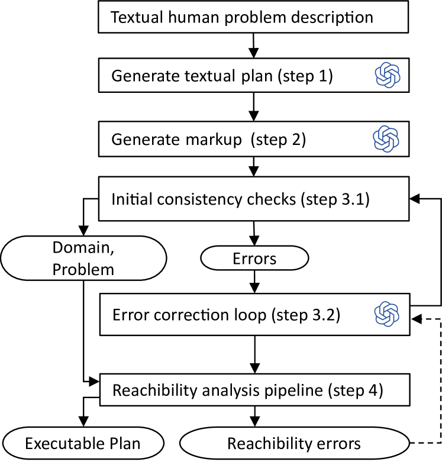
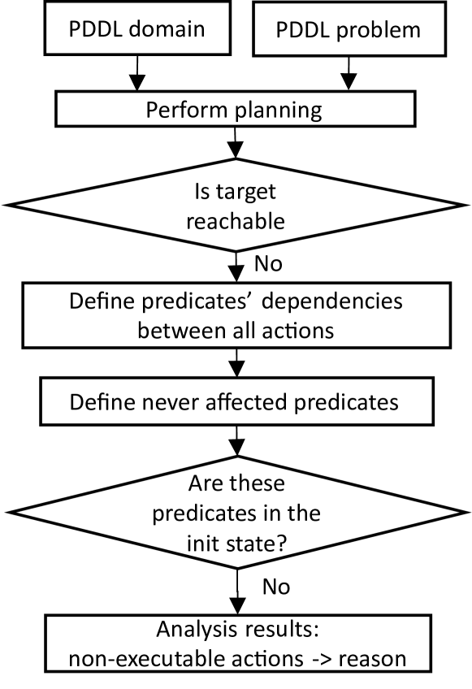

# 借助大型语言模型，打造统一的PDDL领域

发布时间：2024年04月11日

`LLM应用` `人工智能` `规划领域`

> Generating consistent PDDL domains with Large Language Models

# 摘要

> 大型语言模型（LLM）擅长将自然语言描述转换为看似合理的PDDL格式。但要确保各领域内行动的一致性，依然挑战重重。本文介绍了一种创新概念，通过在模型生成过程中自动进行一致性检查，大幅提升LLM生成的PDDL模型品质。虽然这些一致性检查策略尚不能确保模型的完全正确，却能提供宝贵的反馈，减轻人工修正的负担。我们在多个经典和定制规划领域（如物流、机械臂、轮胎世界、家庭场景、披萨制作）验证了我们错误检测方法的有效性。

> Large Language Models (LLMs) are capable of transforming natural language domain descriptions into plausibly looking PDDL markup. However, ensuring that actions are consistent within domains still remains a challenging task. In this paper we present a novel concept to significantly improve the quality of LLM-generated PDDL models by performing automated consistency checking during the generation process. Although the proposed consistency checking strategies still can't guarantee absolute correctness of generated models, they can serve as valuable source of feedback reducing the amount of correction efforts expected from a human in the loop. We demonstrate the capabilities of our error detection approach on a number of classical and custom planning domains (logistics, gripper, tyreworld, household, pizza).

[Arxiv](https://arxiv.org/abs/2404.07751)