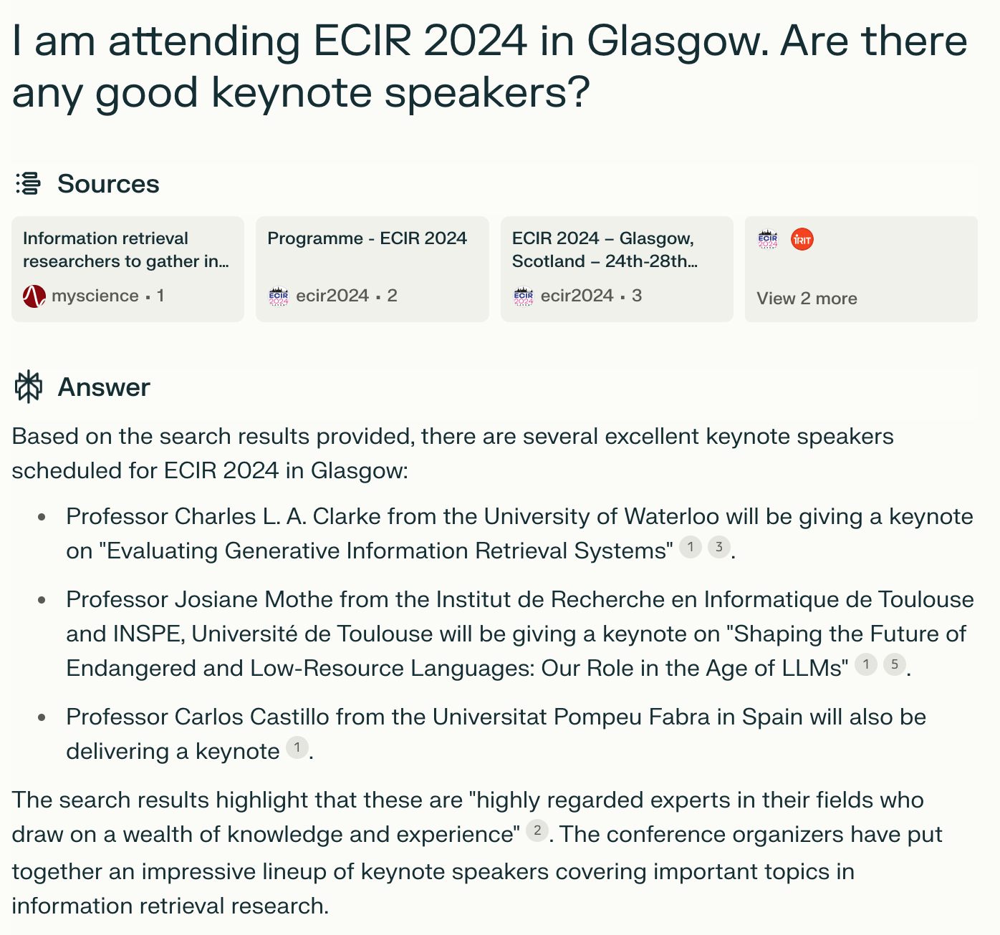
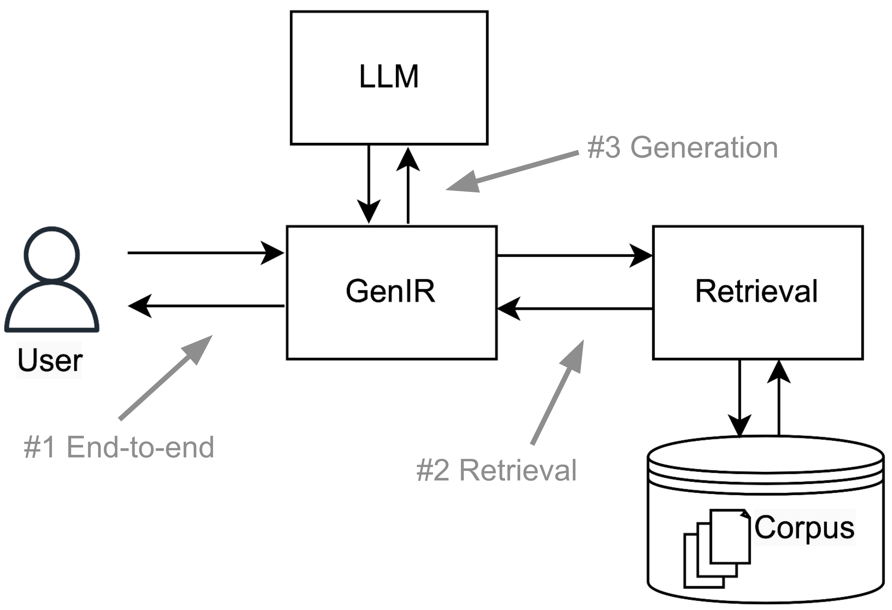

# 在生成式信息检索领域，评估方法的创新和优化是推动技术进步的关键。通过对检索结果的生成质量、相关性和实用性进行综合评估，我们可以更好地理解和提升系统的性能。

发布时间：2024年04月11日

`LLM应用` `信息检索` `评估系统`

> Generative Information Retrieval Evaluation

# 摘要

> 本章节探讨了生成性信息检索评估的两个维度：一是大型语言模型（LLMs）正逐步演变为评估工具，研究显示其在基础相关性判断任务上可能比众包工作者和专业评估者更胜一筹。我们回顾了相关研究，并讨论了如TREC等共享任务的未来趋势，以及人类评估的持续必要性。二是对基于LLM的新兴生成性信息检索（GenIR）系统，包括检索增强生成（RAG）系统的评估。我们关注了对GenIR系统的全面评估，以及作为RAG系统一部分的检索组件的评估。未来，GenIR系统的评估将部分依赖于LLM评估，形成了一种系统自我评估的循环性。我们通过两种方法解决这一问题：一是将LLM评估视作“慢速搜索”，利用慢速IR系统来评估和训练更高效的生产系统；二是认识到即便人类评估的方式需要改变，它仍然是评估过程中不可或缺的一环。

> In this chapter, we consider generative information retrieval evaluation from two distinct but interrelated perspectives. First, large language models (LLMs) themselves are rapidly becoming tools for evaluation, with current research indicating that LLMs may be superior to crowdsource workers and other paid assessors on basic relevance judgement tasks. We review past and ongoing related research, including speculation on the future of shared task initiatives, such as TREC, and a discussion on the continuing need for human assessments. Second, we consider the evaluation of emerging LLM-based generative information retrieval (GenIR) systems, including retrieval augmented generation (RAG) systems. We consider approaches that focus both on the end-to-end evaluation of GenIR systems and on the evaluation of a retrieval component as an element in a RAG system. Going forward, we expect the evaluation of GenIR systems to be at least partially based on LLM-based assessment, creating an apparent circularity, with a system seemingly evaluating its own output. We resolve this apparent circularity in two ways: 1) by viewing LLM-based assessment as a form of "slow search", where a slower IR system is used for evaluation and training of a faster production IR system; and 2) by recognizing a continuing need to ground evaluation in human assessment, even if the characteristics of that human assessment must change.

[Arxiv](https://arxiv.org/abs/2404.08137)