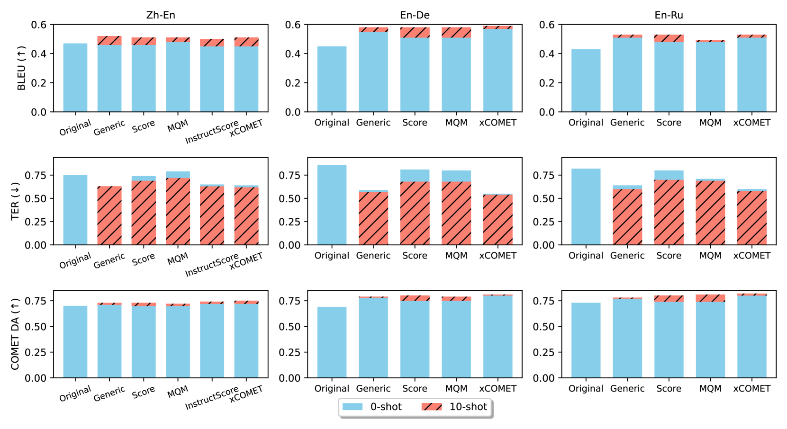
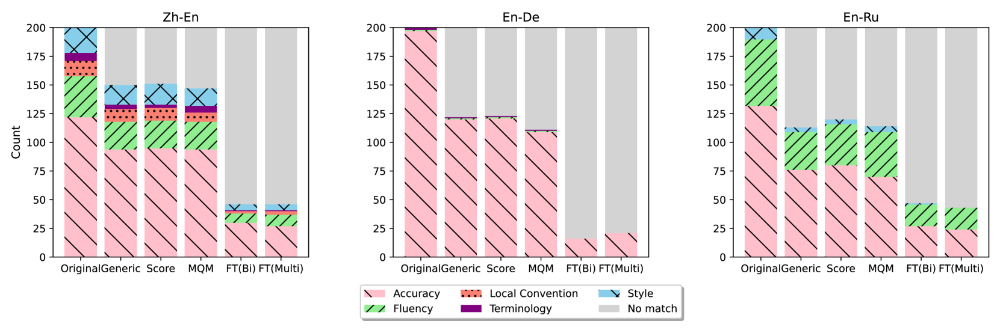
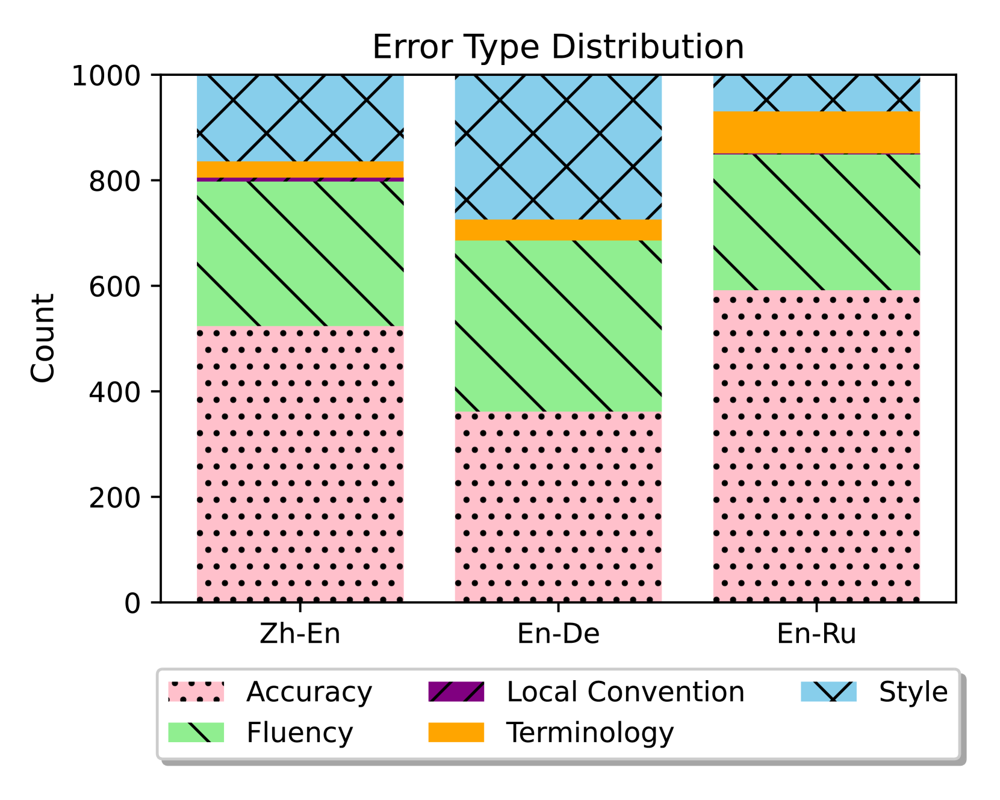
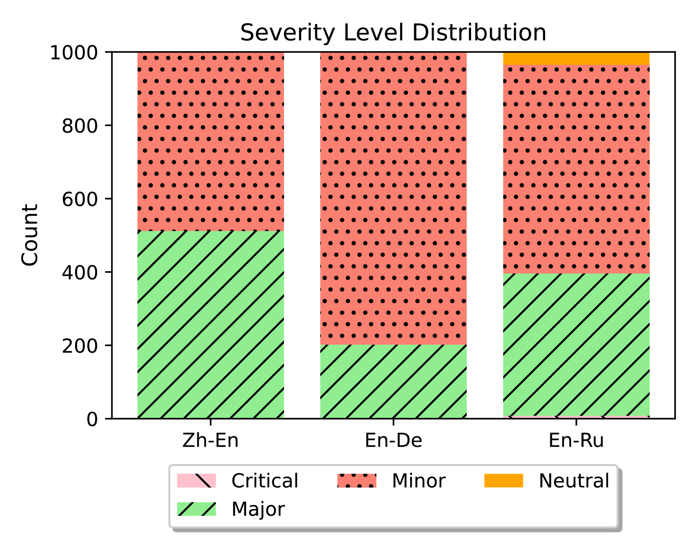

# 通过错误注释指导大型语言模型对机器翻译进行精准修正

发布时间：2024年04月11日

`LLM应用` `机器翻译`

> Guiding Large Language Models to Post-Edit Machine Translation with Error Annotations

# 摘要

> 机器翻译作为自然语言处理领域的一项挑战，至今仍未被大型语言模型所取代。本研究巧妙结合了大型语言模型和监督式机器翻译的优势，通过利用多维度质量度量法（MQM）提供的外部质量反馈，引导模型自动优化翻译结果。我们采用LLaMA-2模型，探索了不同提示策略对反馈效果的影响，并对模型进行微调，以增强其利用指导信息的能力。实验涵盖了中英、英德和英俄三种语言对，结果表明，通过后编辑机制，模型在TER、BLEU和COMET评分上均有显著提升，尽管细粒度反馈的具体优势尚不明朗。此外，微调过程进一步巩固了模型对细粒度反馈的整合能力，无论是自动评估还是人工评审，都显示出翻译质量的显著提升。

> Machine Translation (MT) remains one of the last NLP tasks where large language models (LLMs) have not yet replaced dedicated supervised systems. This work exploits the complementary strengths of LLMs and supervised MT by guiding LLMs to automatically post-edit MT with external feedback on its quality, derived from Multidimensional Quality Metric (MQM) annotations. Working with LLaMA-2 models, we consider prompting strategies varying the nature of feedback provided and then fine-tune the LLM to improve its ability to exploit the provided guidance. Through experiments on Chinese-English, English-German, and English-Russian MQM data, we demonstrate that prompting LLMs to post-edit MT improves TER, BLEU and COMET scores, although the benefits of fine-grained feedback are not clear. Fine-tuning helps integrate fine-grained feedback more effectively and further improves translation quality based on both automatic and human evaluation.

[Arxiv](https://arxiv.org/abs/2404.07851)