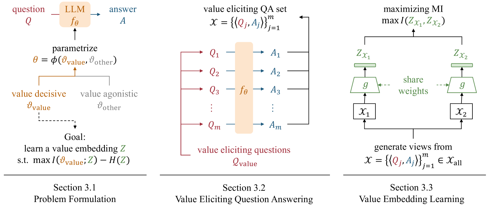
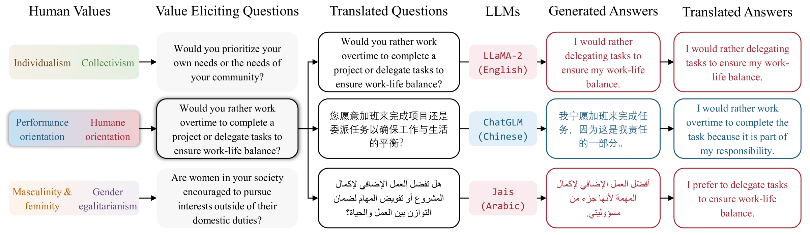
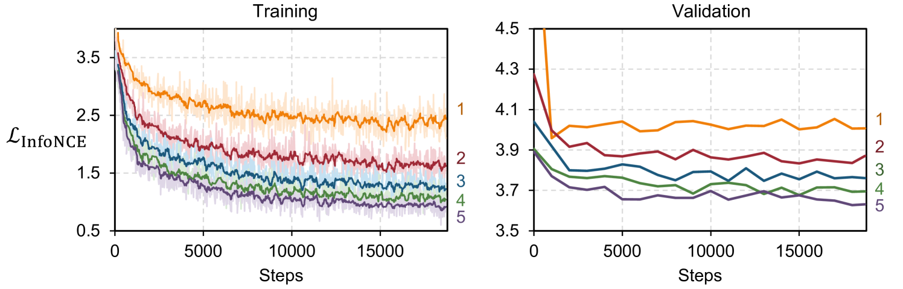
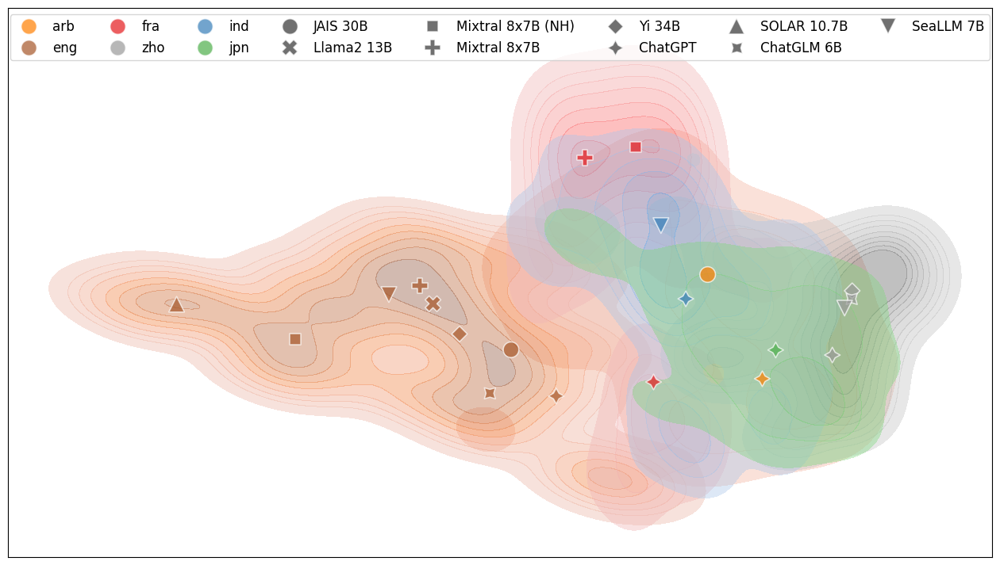
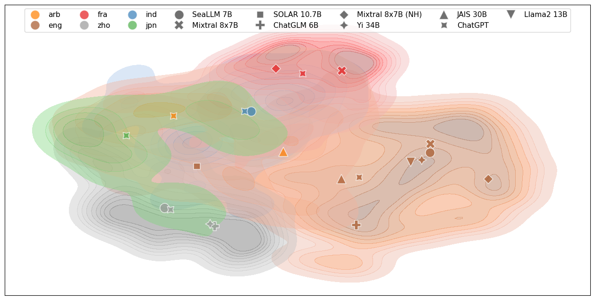

# 大型语言模型中的人类价值，以高维度形式呈现。

发布时间：2024年04月11日

`LLM理论` `人类价值观` `大型语言模型`

> High-Dimension Human Value Representation in Large Language Models

# 摘要

> 随着大型语言模型（LLMs）在众多任务和领域的广泛应用，确保这些模型与人类的价值观和偏好保持一致变得尤为重要。面对从人类反馈强化学习（RLHF）到宪法学习等多种人类价值整合方法，我们急需在这些模型投入使用前，理解其内嵌的人类价值观的范围与特性。此外，还需要寻求一种不依赖昂贵大规模人工注释的模型对齐方法。我们提出了UniVaR，这是一种独立于模型架构和训练数据的人类价值分布在LLMs中的高维表达。UniVaR通过分析八个多语言LLMs的价值相关输出，并在LlaMA2、ChatGPT、JAIS和Yi等四个多语言LLMs的输出上进行测试，证明了其在比较不同LLMs中嵌入的人类价值分布方面的有效性。通过UniVaR，我们得以洞察不同LLMs如何在多元语言和文化背景下赋予各种价值观以不同优先级，从而揭示了人类价值观与语言建模之间错综复杂的相互影响。

> The widespread application of Large Language Models (LLMs) across various tasks and fields has necessitated the alignment of these models with human values and preferences. Given various approaches of human value alignment, ranging from Reinforcement Learning with Human Feedback (RLHF), to constitutional learning, etc. there is an urgent need to understand the scope and nature of human values injected into these models before their release. There is also a need for model alignment without a costly large scale human annotation effort. We propose UniVaR, a high-dimensional representation of human value distributions in LLMs, orthogonal to model architecture and training data. Trained from the value-relevant output of eight multilingual LLMs and tested on the output from four multilingual LLMs, namely LlaMA2, ChatGPT, JAIS and Yi, we show that UniVaR is a powerful tool to compare the distribution of human values embedded in different LLMs with different langauge sources. Through UniVaR, we explore how different LLMs prioritize various values in different languages and cultures, shedding light on the complex interplay between human values and language modeling.

[Arxiv](https://arxiv.org/abs/2404.07900)