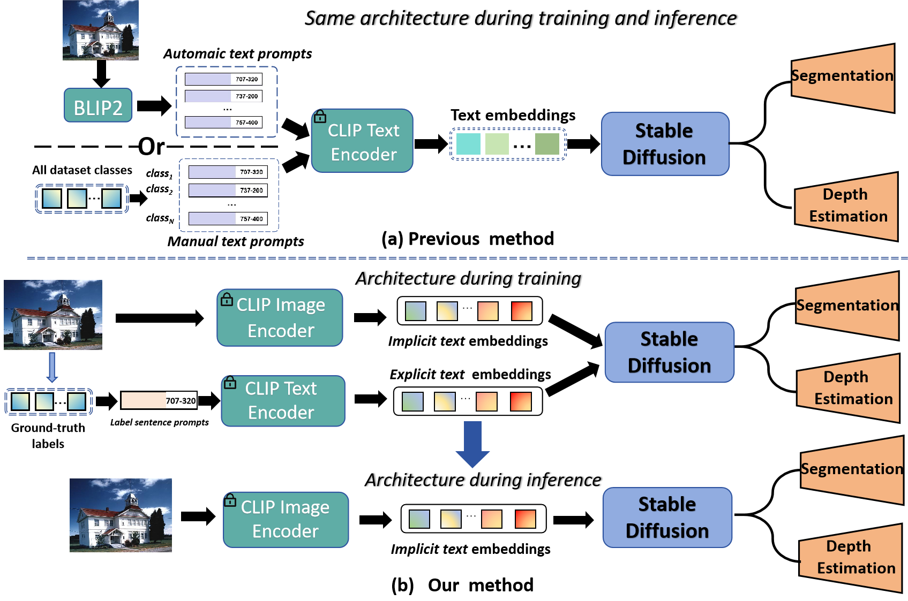
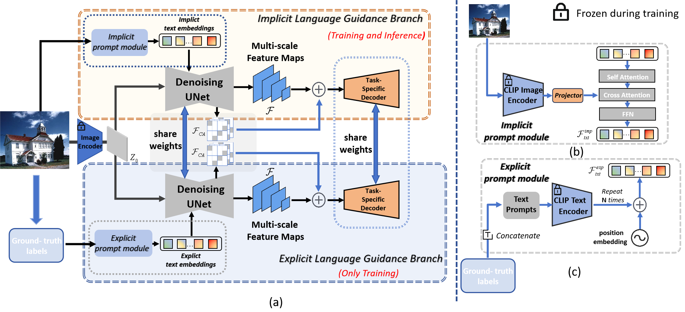
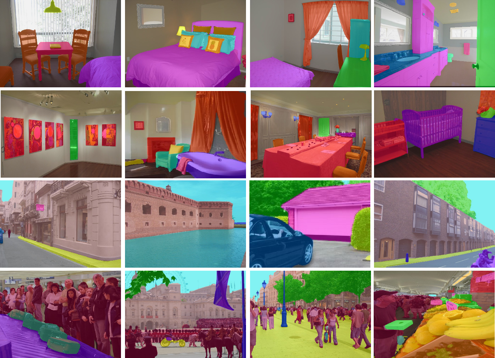
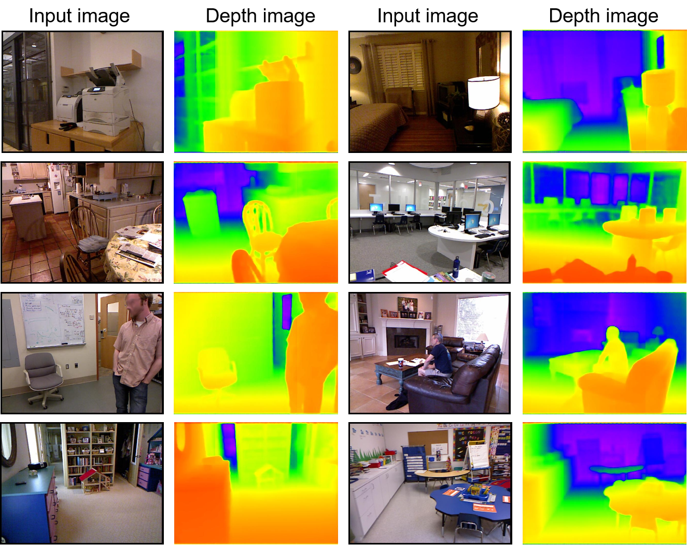

# 在基于扩散模型的视觉感知任务中，隐性与显性语言引导的结合运用

发布时间：2024年04月11日

`LLM应用` `计算机视觉` `图像处理`

> Implicit and Explicit Language Guidance for Diffusion-based Visual Perception

# 摘要

> 扩散模型在文本引导下展现出强大的图像合成能力。经过大规模预训练，这些模型能够依据文本提示生成细节丰富、结构合理的高质量图像。但如何将其应用于视觉感知领域，仍是一个挑战。本文提出了一种名为IEDP的新型框架，结合隐式和显式语言引导，以提升扩散模型的感知能力。IEDP包含两个分支：隐式分支直接生成文本嵌入，无需文本提示；显式分支则使用图像的真实标签作为提示。训练时，两个分支共享权重并共同训练；推理时，仅使用隐式分支，无需真实标签。在语义分割和深度估计两大感知任务上，IEDP均取得显著成果。在AD20K验证集上，IEDP的语义分割mIoU得分达到55.9%，超越基线方法VPD 2.2个百分点；在深度估计任务中，相对提升率达到10.2%。

> Text-to-image diffusion models have shown powerful ability on conditional image synthesis. With large-scale vision-language pre-training, diffusion models are able to generate high-quality images with rich texture and reasonable structure under different text prompts. However, it is an open problem to adapt the pre-trained diffusion model for visual perception. In this paper, we propose an implicit and explicit language guidance framework for diffusion-based perception, named IEDP. Our IEDP comprises of an implicit language guidance branch and an explicit language guidance branch. The implicit branch employs frozen CLIP image encoder to directly generate implicit text embeddings that are fed to diffusion model, without using explicit text prompts. The explicit branch utilizes the ground-truth labels of corresponding images as text prompts to condition feature extraction of diffusion model. During training, we jointly train diffusion model by sharing the model weights of these two branches. As a result, implicit and explicit branches can jointly guide feature learning. During inference, we only employ implicit branch for final prediction, which does not require any ground-truth labels. Experiments are performed on two typical perception tasks, including semantic segmentation and depth estimation. Our IEDP achieves promising performance on both tasks. For semantic segmentation, our IEDP has the mIoU score of 55.9% on AD20K validation set, which outperforms the baseline method VPD by 2.2%. For depth estimation, our IEDP outperforms the baseline method VPD with a relative gain of 10.2%.

[Arxiv](https://arxiv.org/abs/2404.07600)