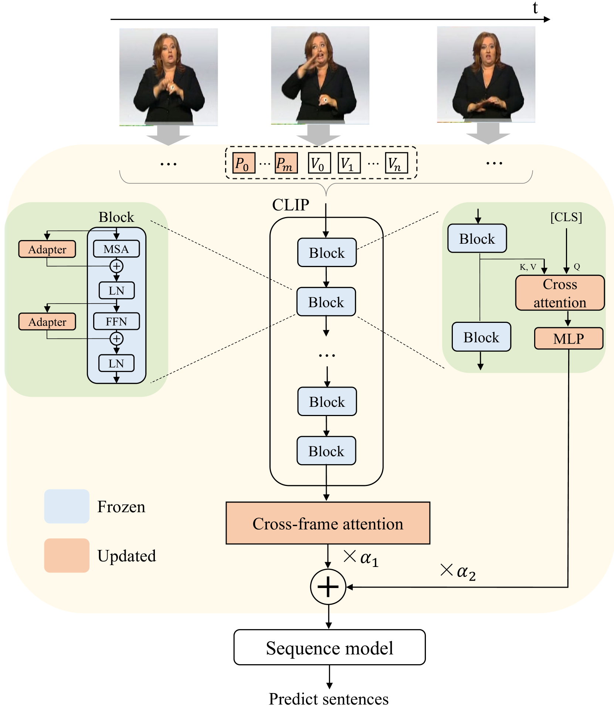
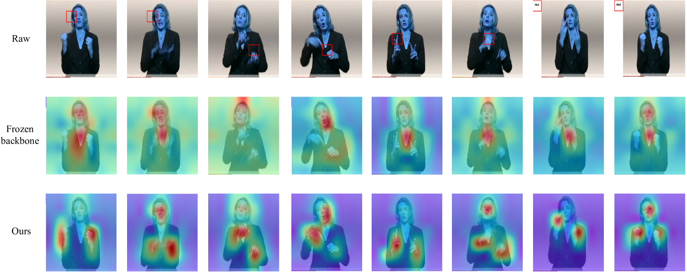

# 借助调整后的图像模型，提升连续手语识别的准确性

发布时间：2024年04月11日

`LLM应用` `手语识别` `视觉-语言模型`

> Improving Continuous Sign Language Recognition with Adapted Image Models

# 摘要

> 随着网络规模的弱标注图像-文本对数量的增加，推动了如CLIP等大规模视觉-语言模型的发展，并在众多下游任务中展现出卓越的泛化能力。然而，模型体积庞大和可用数据有限，限制了对整个模型进行微调的应用。而且，完全微调模型容易遗忘预训练阶段获得的通用知识，导致对下游数据的过拟合。为了在保持泛化能力的同时，高效地将这些大型视觉-语言模型（如CLIP）适配到连续手语识别（CSLR）任务中，我们提出了一种创新策略（AdaptSign）。CLIP作为视觉骨干，负责提取帧级特征，其参数保持固定，同时引入一系列轻量级的可学习模块，用以捕捉空间手语变化和时间手语运动。这些新增模块虽然只增加了3.2%的计算量，但效率极高，确保了预训练阶段的通用知识得到良好保留。大量实验显示，AdaptSign在PHOENIX14、PHOENIX14-T、CSL-Daily和CSL等多个CSLR基准测试中，均展现出超越现有方法的优异性能。通过可视化分析，我们发现AdaptSign能够学习动态聚焦于手语视频中富有信息的空间区域和跨帧轨迹。

> The increase of web-scale weakly labelled image-text pairs have greatly facilitated the development of large-scale vision-language models (e.g., CLIP), which have shown impressive generalization performance over a series of downstream tasks. However, the massive model size and scarcity of available data limit their applications to fine-tune the whole model in downstream tasks. Besides, fully fine-tuning the model easily forgets the generic essential knowledge acquired in the pretraining stage and overfits the downstream data. To enable high efficiency when adapting these large vision-language models (e.g., CLIP) to performing continuous sign language recognition (CSLR) while preserving their generalizability, we propose a novel strategy (AdaptSign). Especially, CLIP is adopted as the visual backbone to extract frame-wise features whose parameters are fixed, and a set of learnable modules are introduced to model spatial sign variations or capture temporal sign movements. The introduced additional modules are quite lightweight, only owning 3.2% extra computations with high efficiency. The generic knowledge acquired in the pretraining stage is well-preserved in the frozen CLIP backbone in this process. Extensive experiments show that despite being efficient, AdaptSign is able to demonstrate superior performance across a series of CSLR benchmarks including PHOENIX14, PHOENIX14-T, CSL-Daily and CSL compared to existing methods. Visualizations show that AdaptSign could learn to dynamically pay major attention to the informative spatial regions and cross-frame trajectories in sign videos.

[Arxiv](https://arxiv.org/abs/2404.08226)