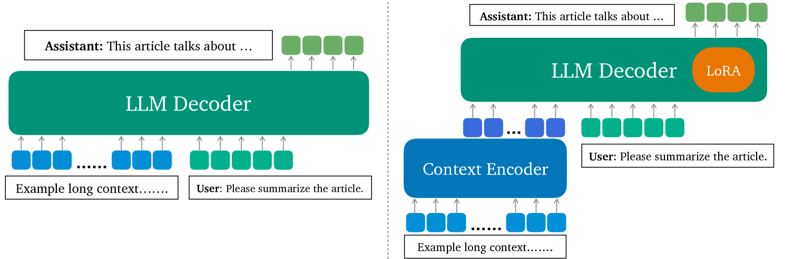
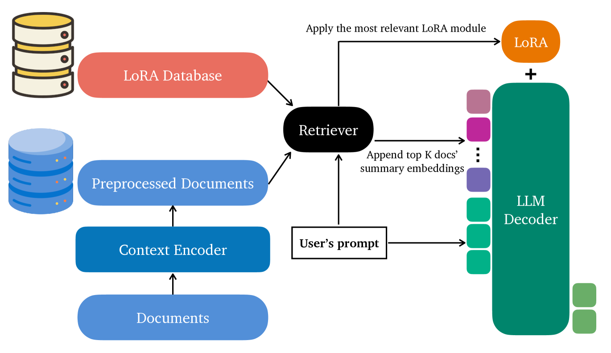
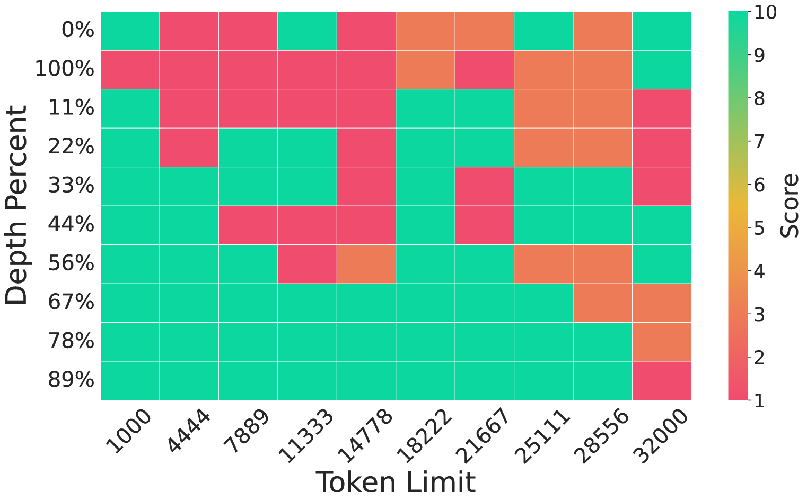
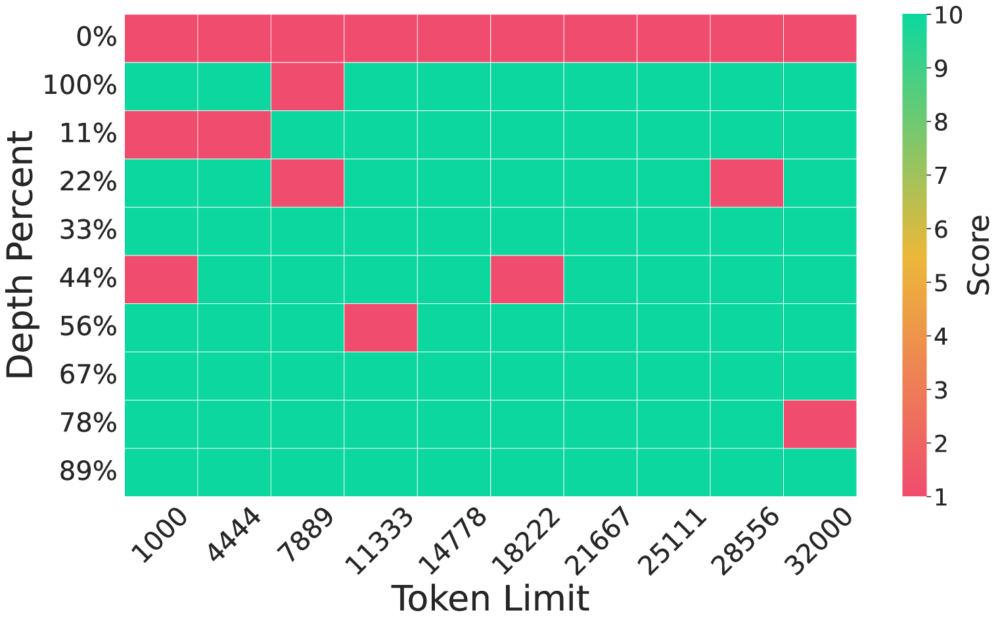
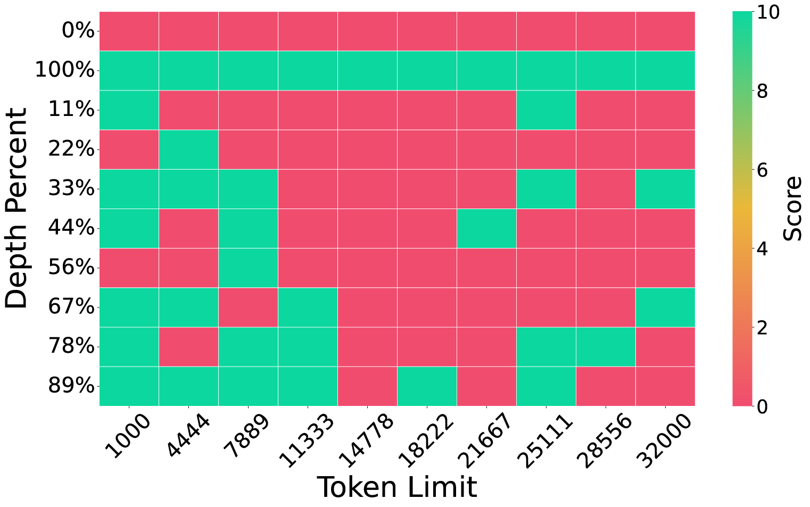
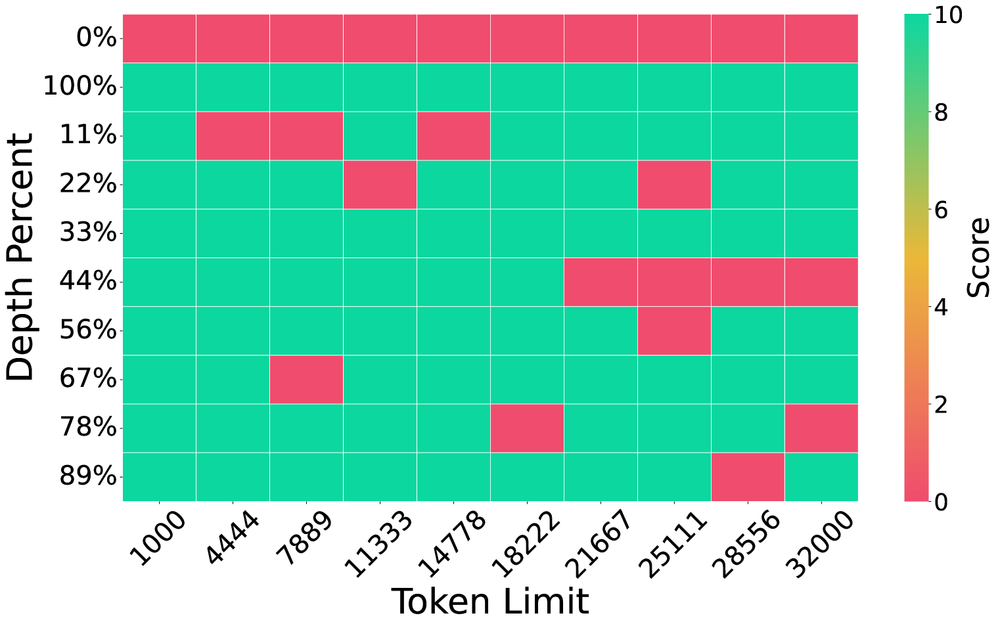
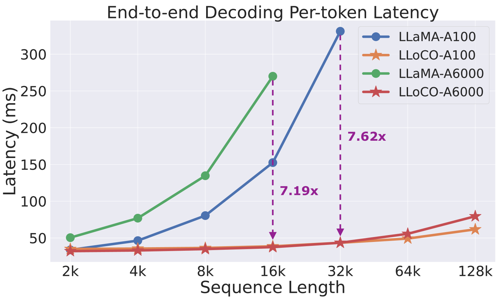
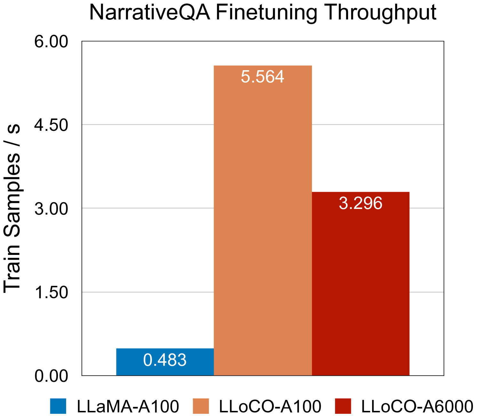

# LLoCO：探索离线长文本学习在离线模式下，长文本环境的学习与处理仍充满挑战，有待我们进一步探索和突破。

发布时间：2024年04月11日

`LLM理论` `问答系统` `文本处理`

> LLoCO: Learning Long Contexts Offline

# 摘要

> 大型语言模型（LLMs）在处理长文本时面临挑战，因为自注意力机制带来的计算和内存负担呈二次方增长，同时生成过程中的KV缓存规模巨大。为此，我们提出了一种创新的解决方案，通过离线上下文学习、压缩和针对性的参数高效微调来优化处理能力。这种方法让LLM能够构建出原始上下文的精简模型，并高效地提取关键信息，以准确回答问题。我们推出了LLoCO技术，它融合了LoRA技术进行上下文压缩、信息检索和参数高效微调。通过这种方法，我们将4k token的LLaMA2-7B模型的有效处理窗口扩展至128k tokens。在多个长文本问答数据集上的测试显示，LLoCO在推理阶段使用的令牌数量比传统上下文学习减少了30倍，性能却显著提升。LLoCO实现了高达7.62倍的加速，显著降低了长篇文档问答的成本，成为高效处理长文本的有力候选方案。相关代码已在 https://github.com/jeffreysijuntan/lloco 上公开。

> Processing long contexts remains a challenge for large language models (LLMs) due to the quadratic computational and memory overhead of the self-attention mechanism and the substantial KV cache sizes during generation. We propose a novel approach to address this problem by learning contexts offline through context compression and in-domain parameter-efficient finetuning. Our method enables an LLM to create a concise representation of the original context and efficiently retrieve relevant information to answer questions accurately. We introduce LLoCO, a technique that combines context compression, retrieval, and parameter-efficient finetuning using LoRA. Our approach extends the effective context window of a 4k token LLaMA2-7B model to handle up to 128k tokens. We evaluate our approach on several long-context question-answering datasets, demonstrating that LLoCO significantly outperforms in-context learning while using $30\times$ fewer tokens during inference. LLoCO achieves up to $7.62\times$ speed-up and substantially reduces the cost of long document question answering, making it a promising solution for efficient long context processing. Our code is publicly available at https://github.com/jeffreysijuntan/lloco.

[Arxiv](https://arxiv.org/abs/2404.07979)