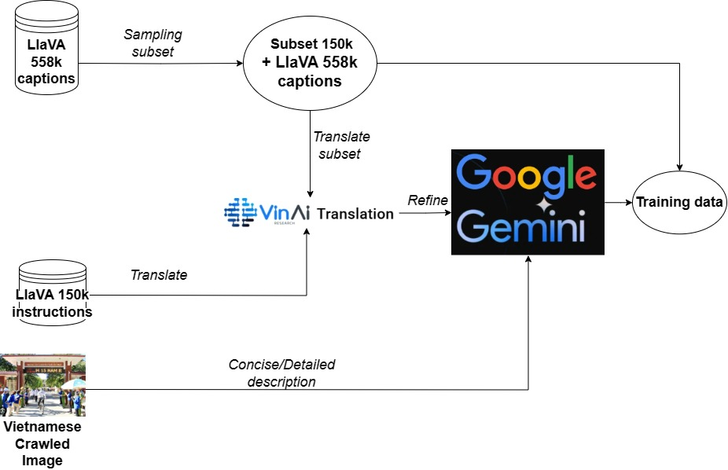

# LaVy，一款融合多模态特性的越南大型语言模型。

发布时间：2024年04月11日

`LLM应用` `越南语处理` `多模态学习`

> LaVy: Vietnamese Multimodal Large Language Model

# 摘要

> 大型语言模型（LLMs）和多模态大型语言模型（MLLMs）凭借其出色的复杂推理和语言理解能力，在全球范围内引起了轰动。然而，越南语大型语言模型的研究虽多，却受限于高质量多模态资源的匮乏，阻碍了其发展。本文中，我们首次提出LaVy——一款顶尖的越南语MLLM，并推出了LaVy-Bench基准，旨在评估MLLMs对越南视觉语言任务的理解程度。相关代码和模型权重已在GitHub上公开，地址为：https://github.com/baochi0212/LaVy。

> Large Language Models (LLMs) and Multimodal Large language models (MLLMs) have taken the world by storm with impressive abilities in complex reasoning and linguistic comprehension. Meanwhile there are plethora of works related to Vietnamese Large Language Models, the lack of high-quality resources in multimodality limits the progress of Vietnamese MLLMs. In this paper, we pioneer in address this by introducing LaVy, a state-of-the-art Vietnamese MLLM, and we also introduce LaVy-Bench benchmark designated for evaluating MLLMs's understanding on Vietnamese visual language tasks. All code and model weights are public at https://github.com/baochi0212/LaVy

[Arxiv](https://arxiv.org/abs/2404.07922)