# 在跨语言学习中，语言的不平衡现象有时反而能增强模型的泛化性能。

发布时间：2024年04月11日

`LLM理论` `语言建模` `多语言处理`

> Language Imbalance Can Boost Cross-lingual Generalisation

# 摘要

> 多语言能力是将语言建模的最新成果推广至多元语言社群的关键。为了在涵盖多种语言的同时保持高效表现，理想中的多语言模型应实现表示的统一，让一种语言中的学习成果得以跨界应用。过往研究指出，平行数据和共有词汇是实现这种统一的重要条件。本研究探索了一个出乎意料的跨语言泛化因素：语言比例失衡。在对等同克隆语言进行的实验中，我们发现训练阶段主导语言的存在，不仅提升了稀有语言的表现力，还加强了模型在不同语言间的表示对齐。此外，我们还发现，随着模型规模的扩大或训练时间的延长，这种效应愈发明显：在双语训练数据中，90/10的语言比例分配相较于均衡的50/50分配，在两种语言上均展现出更佳的性能。基于这些发现，我们设计了新的训练策略，即便不改变训练数据，也能提升所有克隆语言的表现。当我们将研究范围扩展至真实世界的语言时，虽然发现少见语言能从常见语言中获益，但语言失衡是否真正促进了跨语言泛化，这一点尚无定论。

> Multilinguality is crucial for extending recent advancements in language modelling to diverse linguistic communities. To maintain high performance while representing multiple languages, multilingual models ideally align representations, allowing what is learned in one language to generalise to others. Prior research has emphasised the importance of parallel data and shared vocabulary elements as key factors for such alignment. In this study, we investigate an unintuitive novel driver of cross-lingual generalisation: language imbalance. In controlled experiments on perfectly equivalent cloned languages, we observe that the existence of a predominant language during training boosts the performance of less frequent languages and leads to stronger alignment of model representations across languages. Furthermore, we find that this trend is amplified with scale: with large enough models or long enough training, we observe that bilingual training data with a 90/10 language split yields better performance on both languages than a balanced 50/50 split. Building on these insights, we design training schemes that can improve performance in all cloned languages, even without altering the training data. As we extend our analysis to real languages, we find that infrequent languages still benefit from frequent ones, yet whether language imbalance causes cross-lingual generalisation there is not conclusive.

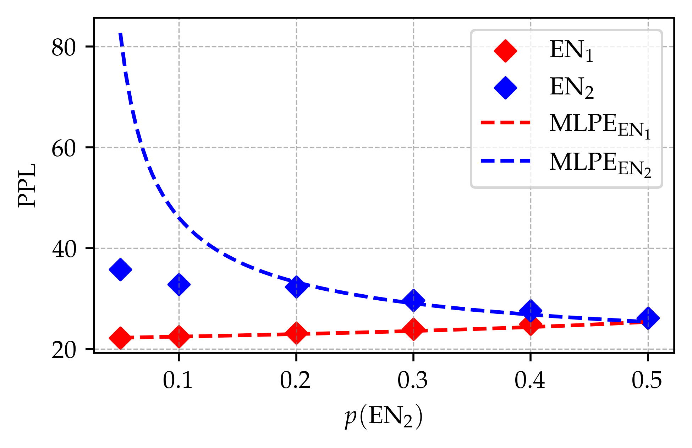

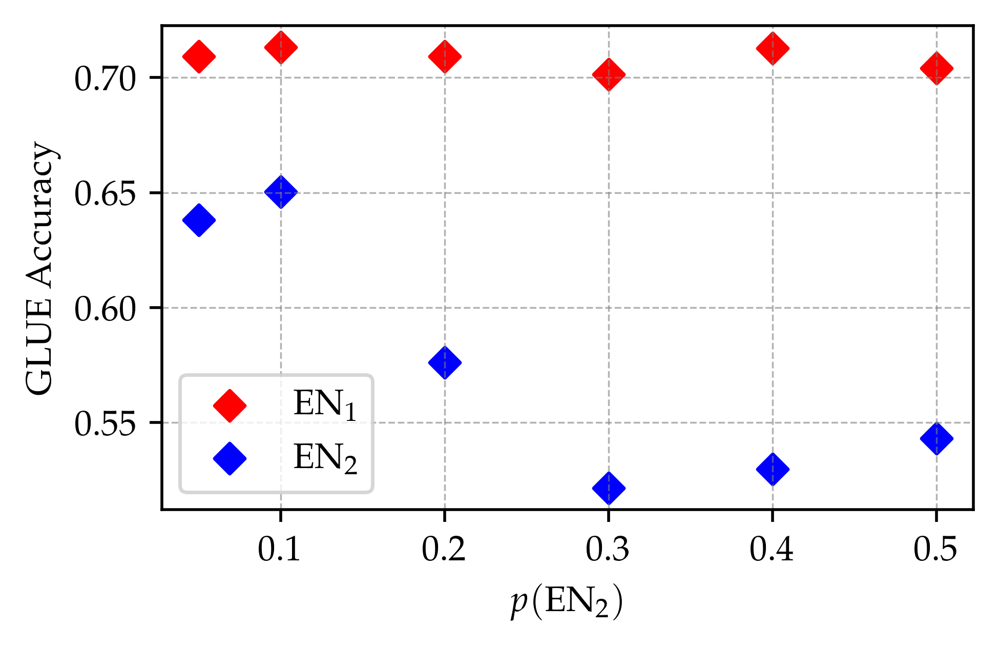

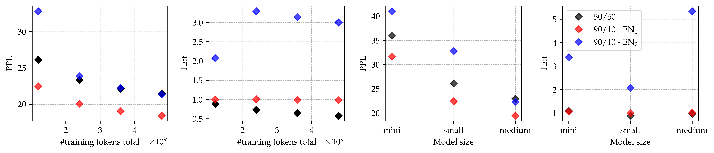

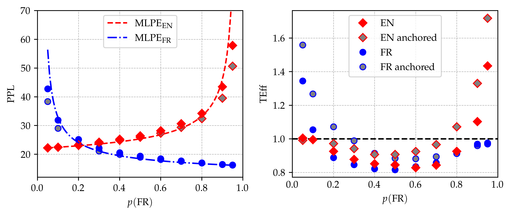

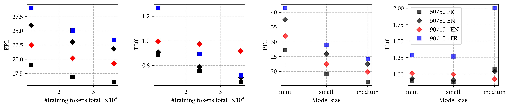

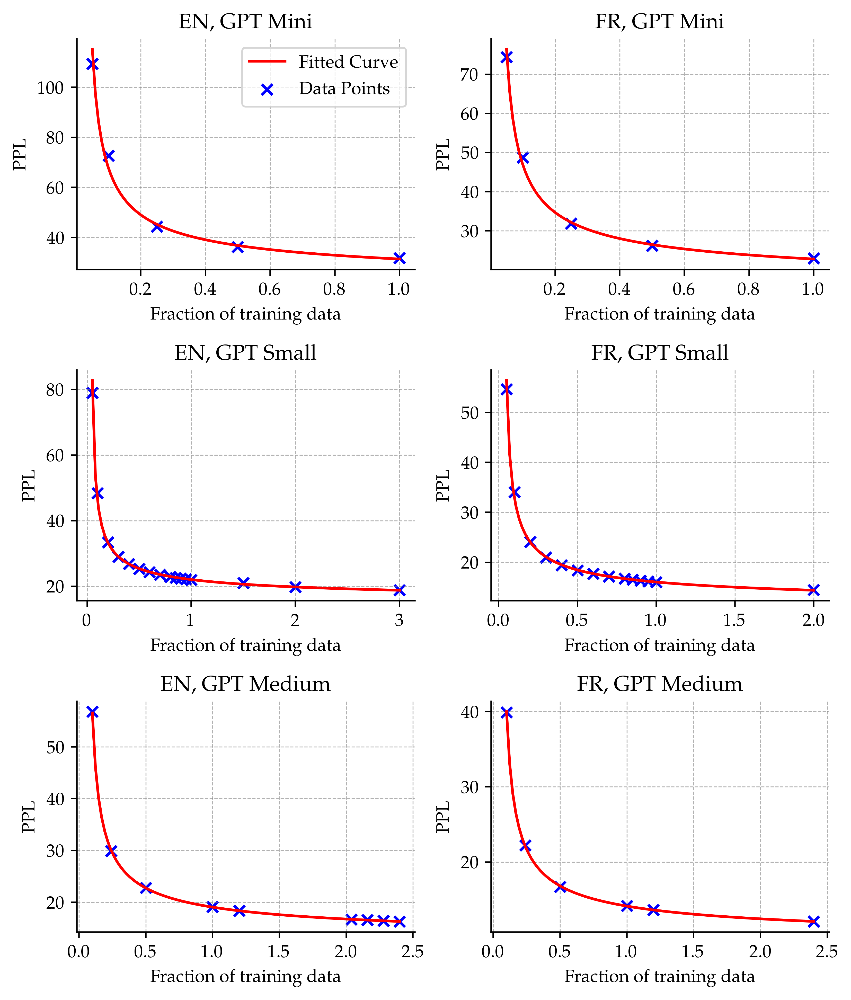

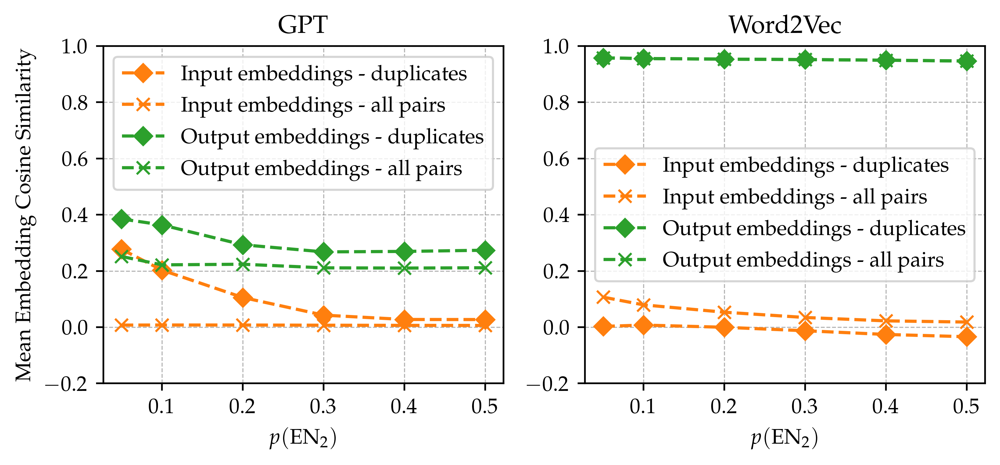

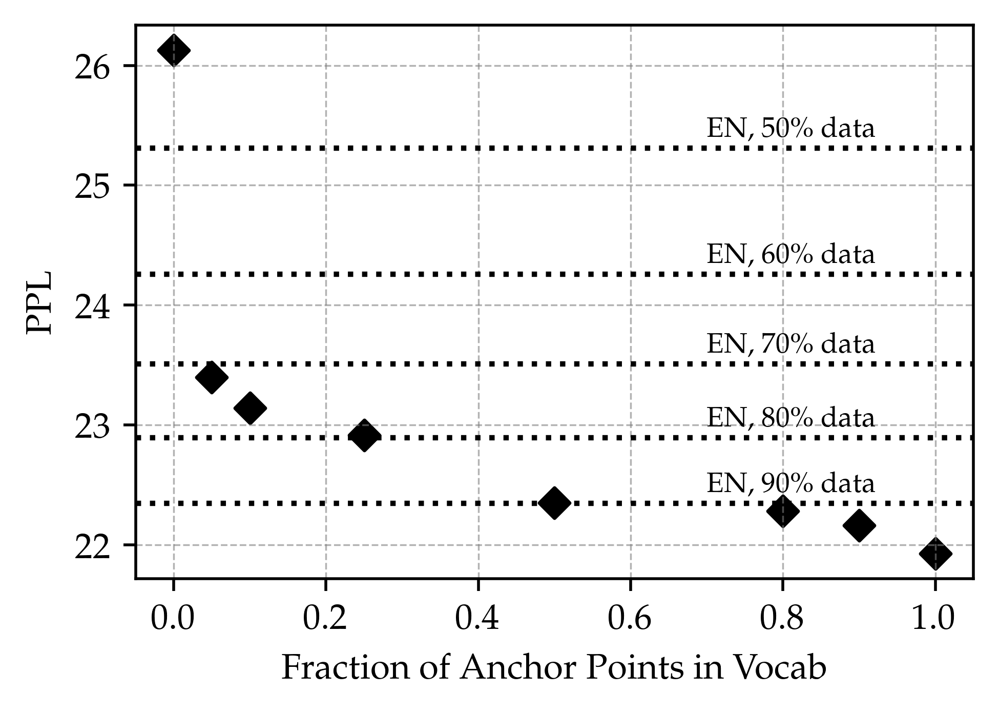

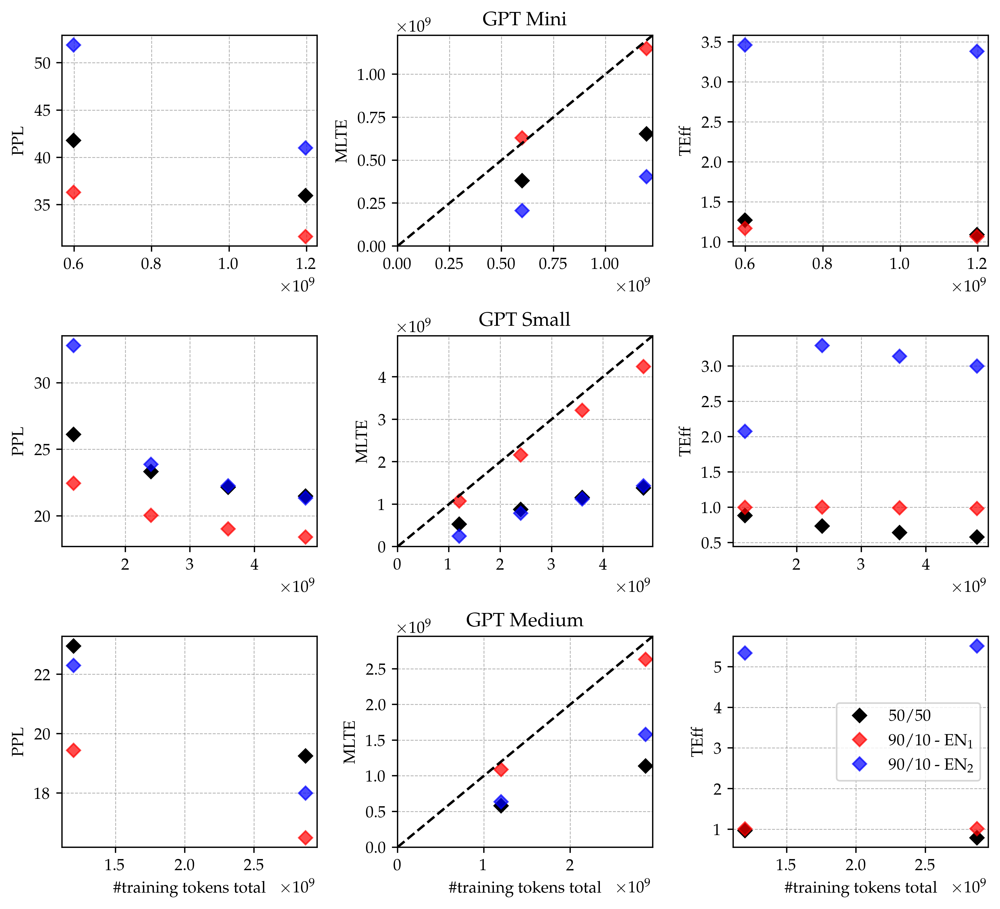

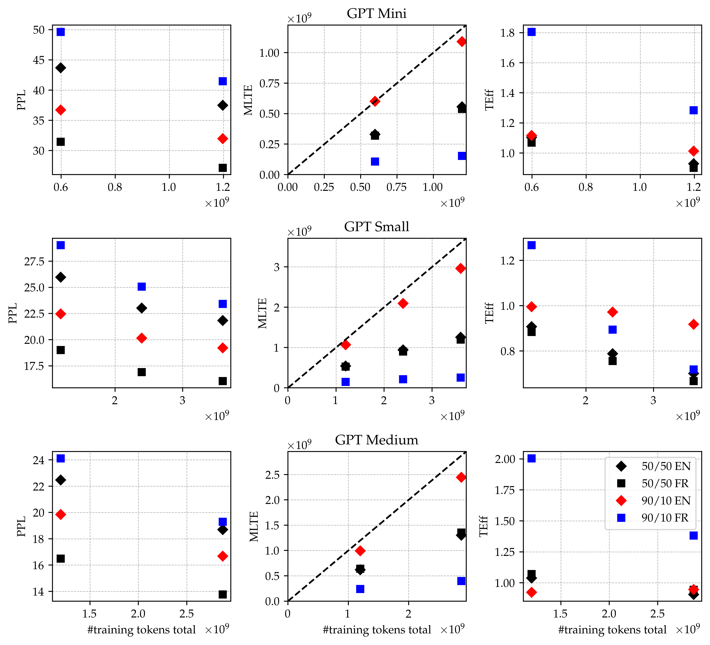

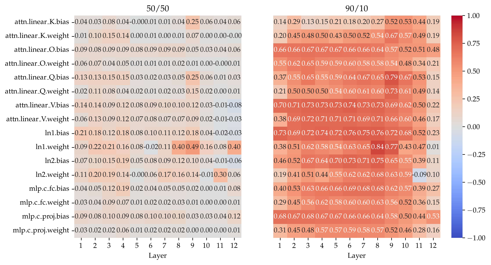

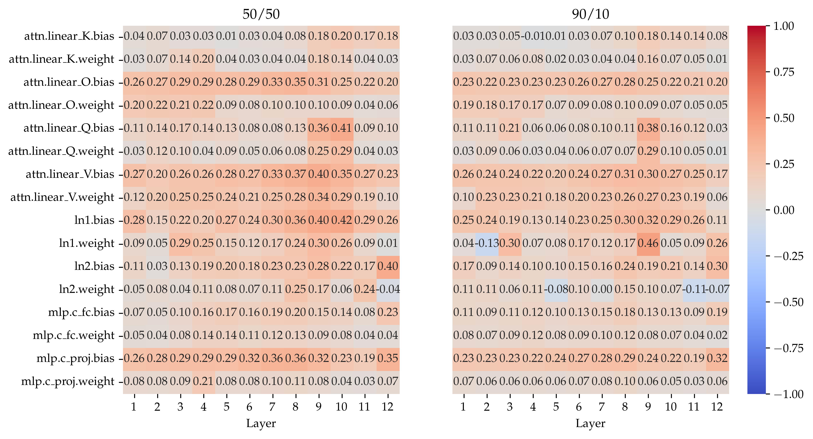

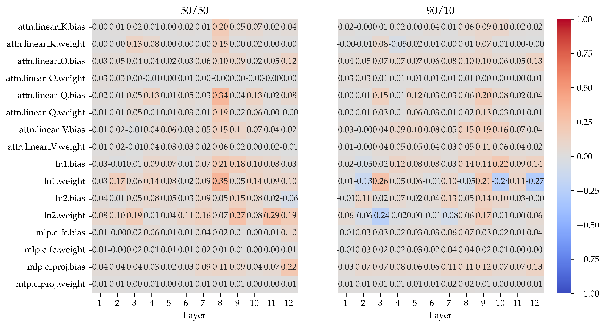

[Arxiv](https://arxiv.org/abs/2404.07982)