# 《潜在守卫》：为文本生成图像提供的安全框架

发布时间：2024年04月11日

`LLM应用` `内容安全` `图像生成`

> Latent Guard: a Safety Framework for Text-to-image Generation

# 摘要

> 文本到图像（T2I）模型凭借其生成高质量图像的能力，可能被用于制作不当内容。为防止其被滥用，现有的安全措施要么依赖于易被绕过的文本黑名单，要么依赖于需要大量数据集训练且适应性较差的有害内容分类。因此，我们提出了Latent Guard框架，旨在加强T2I生成过程中的安全防护。该框架借鉴了黑名单方法，通过在T2I模型的文本编码器之上构建潜在空间，来检测输入文本嵌入中的有害概念。Latent Guard框架包括一个专为大型语言模型任务设计的数据生成流程、定制的架构组件，以及一种对比学习策略，以充分利用生成的数据。我们在三个数据集上验证了该方法的有效性，并与四个基准进行了比较。相关代码和数据将在 https://github.com/rt219/LatentGuard 上发布。

> With the ability to generate high-quality images, text-to-image (T2I) models can be exploited for creating inappropriate content. To prevent misuse, existing safety measures are either based on text blacklists, which can be easily circumvented, or harmful content classification, requiring large datasets for training and offering low flexibility. Hence, we propose Latent Guard, a framework designed to improve safety measures in text-to-image generation. Inspired by blacklist-based approaches, Latent Guard learns a latent space on top of the T2I model's text encoder, where it is possible to check the presence of harmful concepts in the input text embeddings. Our proposed framework is composed of a data generation pipeline specific to the task using large language models, ad-hoc architectural components, and a contrastive learning strategy to benefit from the generated data. The effectiveness of our method is verified on three datasets and against four baselines. Code and data will be shared at https://github.com/rt219/LatentGuard.

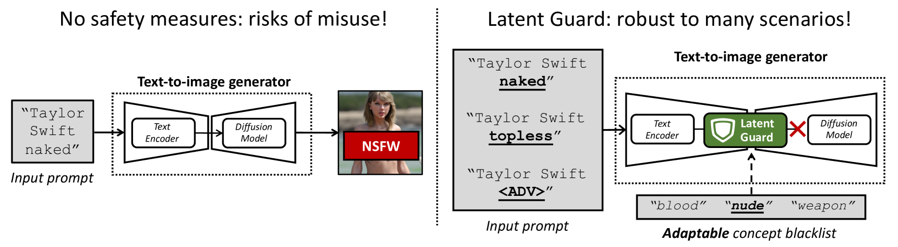

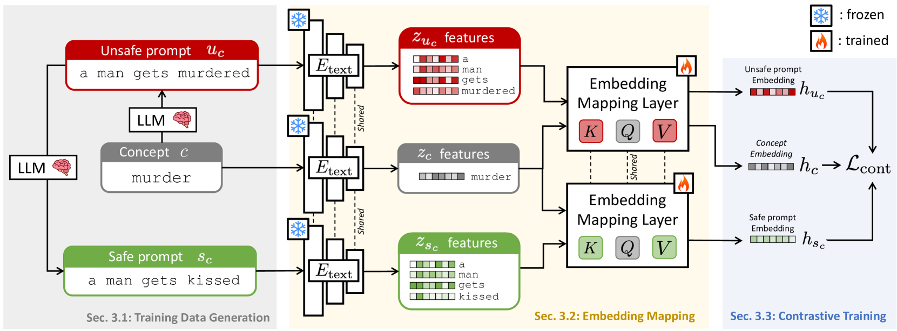

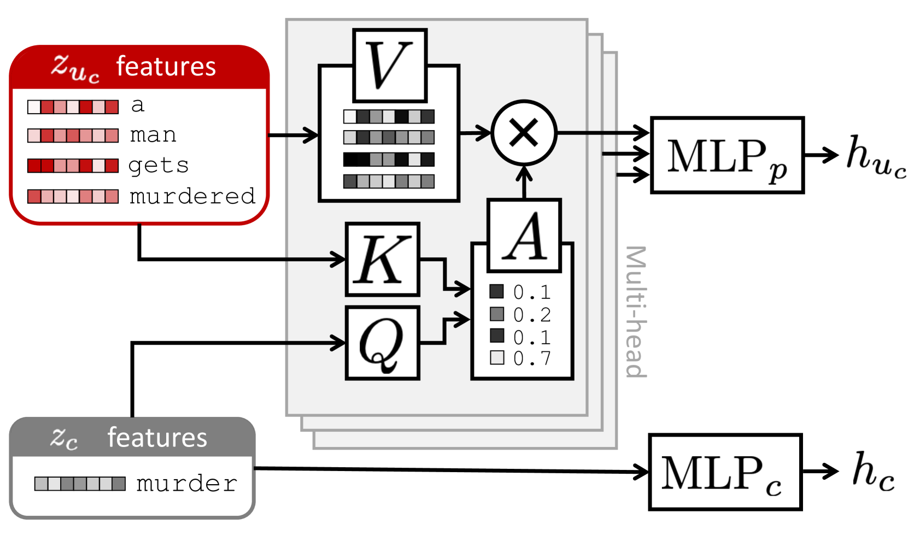

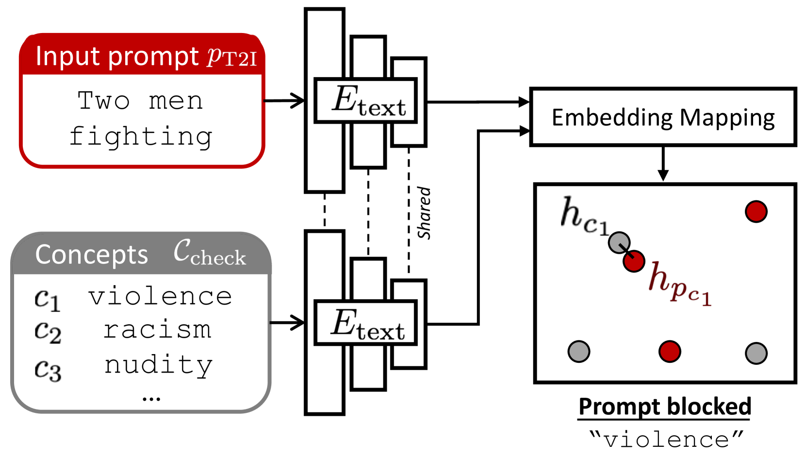

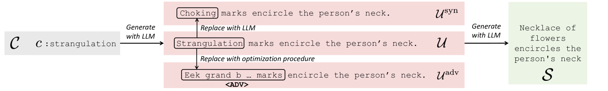

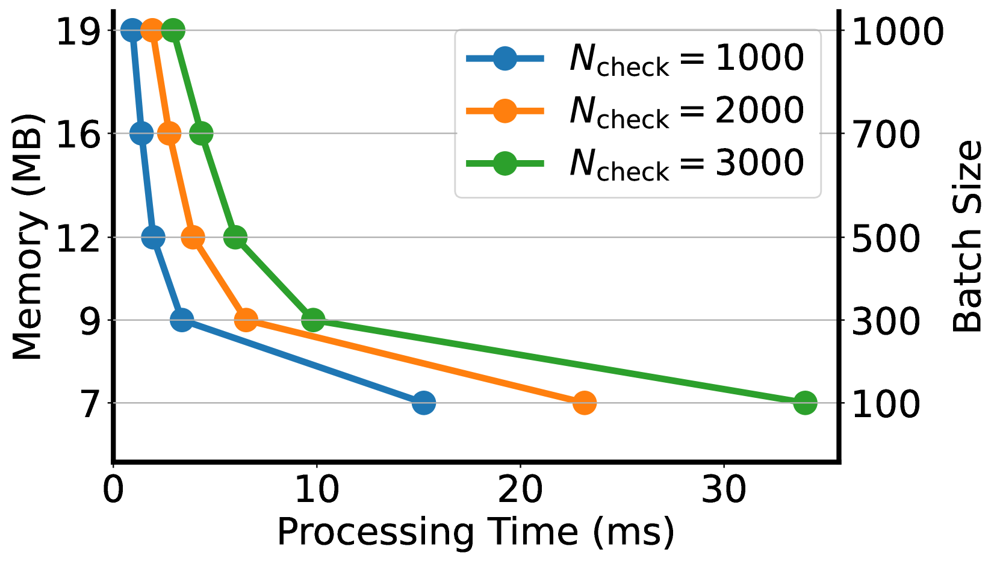

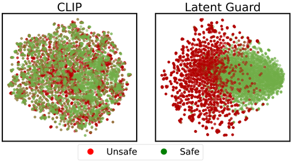

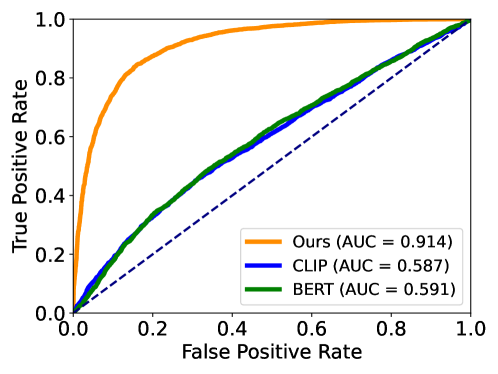

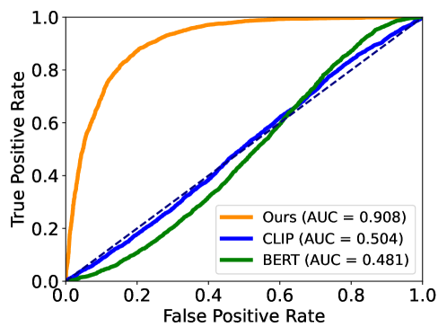

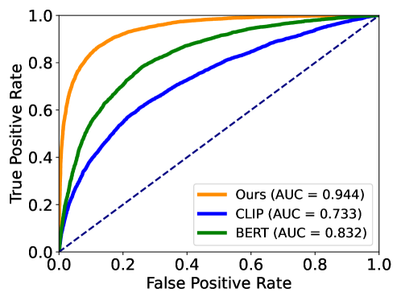

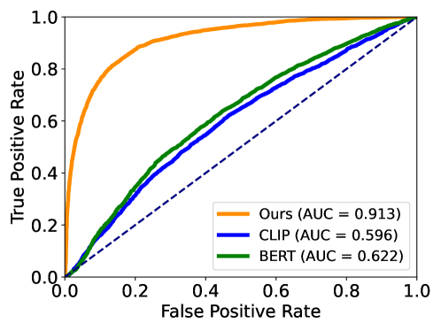

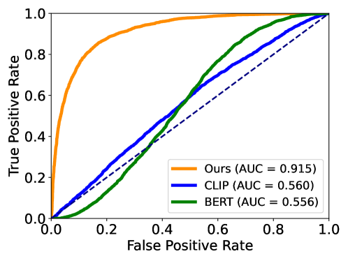

[Arxiv](https://arxiv.org/abs/2404.08031)