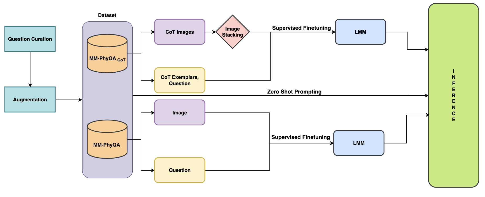
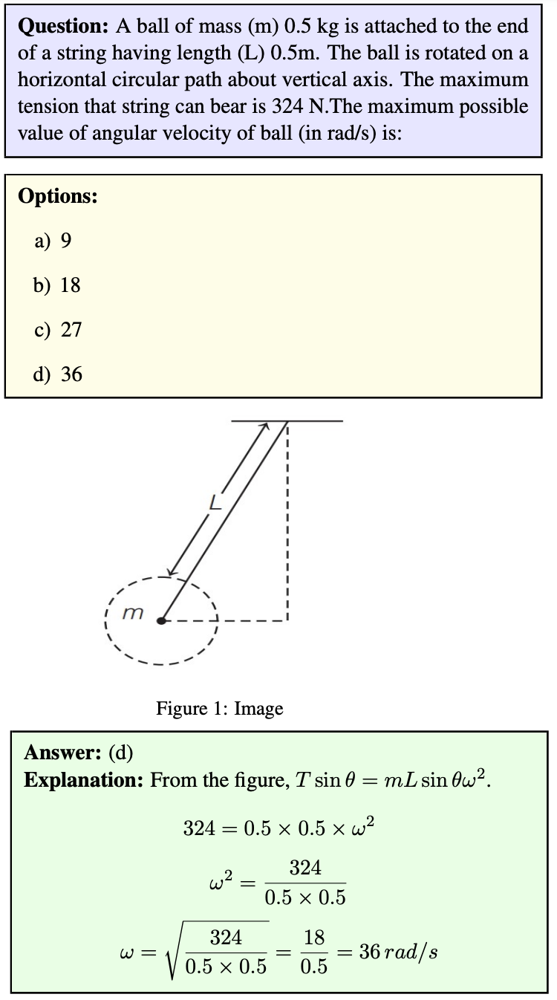
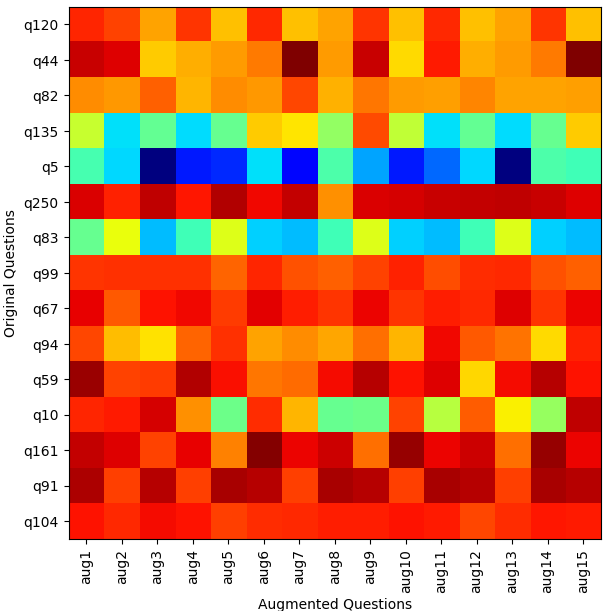
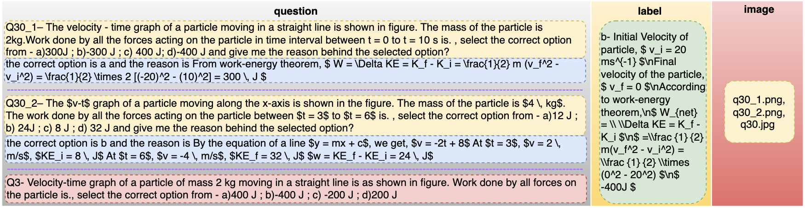
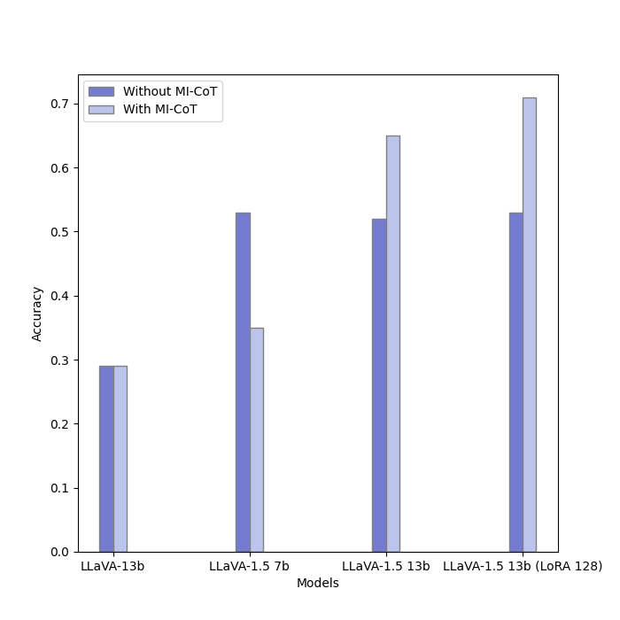
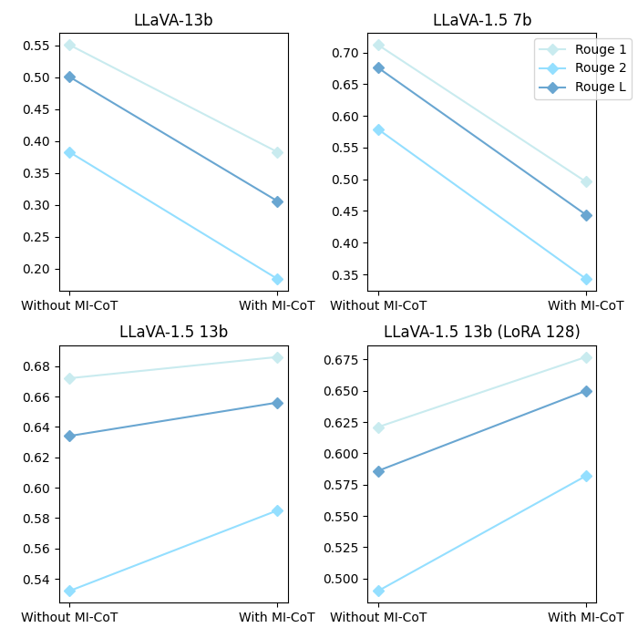
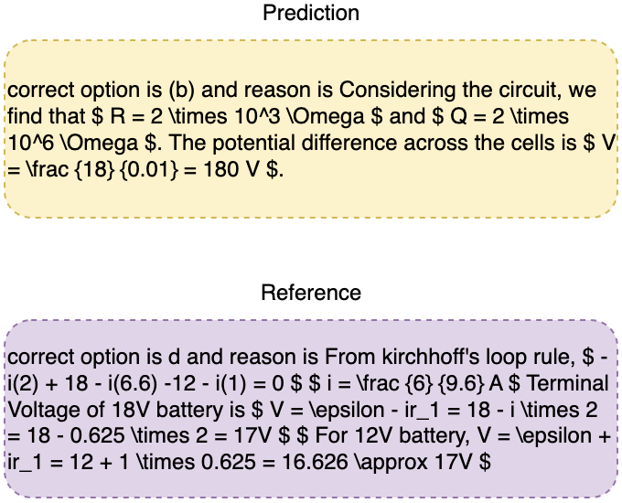
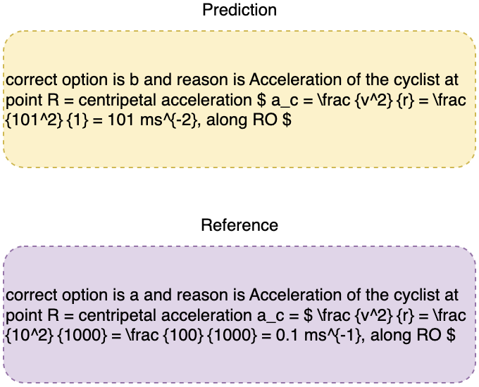
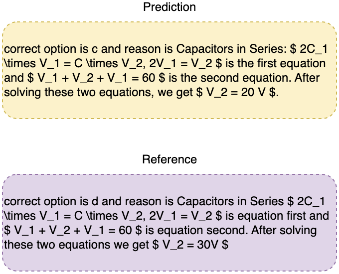

# MM-PhyQA：运用多张图片的 CoT 提示技术，实现多模态物理问答功能。

发布时间：2024年04月11日

`LLM应用`

> MM-PhyQA: Multimodal Physics Question-Answering With Multi-Image CoT Prompting

# 摘要

> 尽管大型语言模型（LLMs）在众多任务上展现出类人的表现，但在处理复杂的多步骤物理推理问题时仍显不足。为此，我们精心打造了一个新的数据集MM-PhyQA，收集了一系列高中难度的多模态物理问题。通过对比分析现有的LLMs在含多模态元素和不含多模态元素的问题上的表现，我们期望更深入地理解这些模型的潜力。对于包含图像和文本的多模态问题，我们运用了GPT-4的零次预测技术来生成答案，并对LLaVA（包括LLaVA和LLaVA-1.5）进行了微调，以适应我们的测试数据集。在纯文本输入的LLMs性能评估方面，我们对Mistral-7B和LLaMA2-7b模型的原始和微调版本进行了测试。此外，我们还展示了创新的多图像思维链（MI-CoT）提示技术，该技术在训练LLaVA-1.5 13b时表现出色，在我们的数据集测试中取得了最佳成绩，多数指标得分领先，测试集准确度高达71.65%。

> While Large Language Models (LLMs) can achieve human-level performance in various tasks, they continue to face challenges when it comes to effectively tackling multi-step physics reasoning tasks. To identify the shortcomings of existing models and facilitate further research in this area, we curated a novel dataset, MM-PhyQA, which comprises well-constructed, high schoollevel multimodal physics problems. By evaluating the performance of contemporary LLMs that are publicly available, both with and without the incorporation of multimodal elements in these problems, we aim to shed light on their capabilities. For generating answers for questions consisting of multimodal input (in this case, images and text) we employed Zero-shot prediction using GPT-4 and utilized LLaVA (LLaVA and LLaVA-1.5), the latter of which were fine-tuned on our dataset. For evaluating the performance of LLMs consisting solely of textual input, we tested the performance of the base and fine-tuned versions of the Mistral-7B and LLaMA2-7b models. We also showcased the performance of the novel Multi-Image Chain-of-Thought (MI-CoT) Prompting technique, which when used to train LLaVA-1.5 13b yielded the best results when tested on our dataset, with superior scores in most metrics and the highest accuracy of 71.65% on the test set.

[Arxiv](https://arxiv.org/abs/2404.08704)