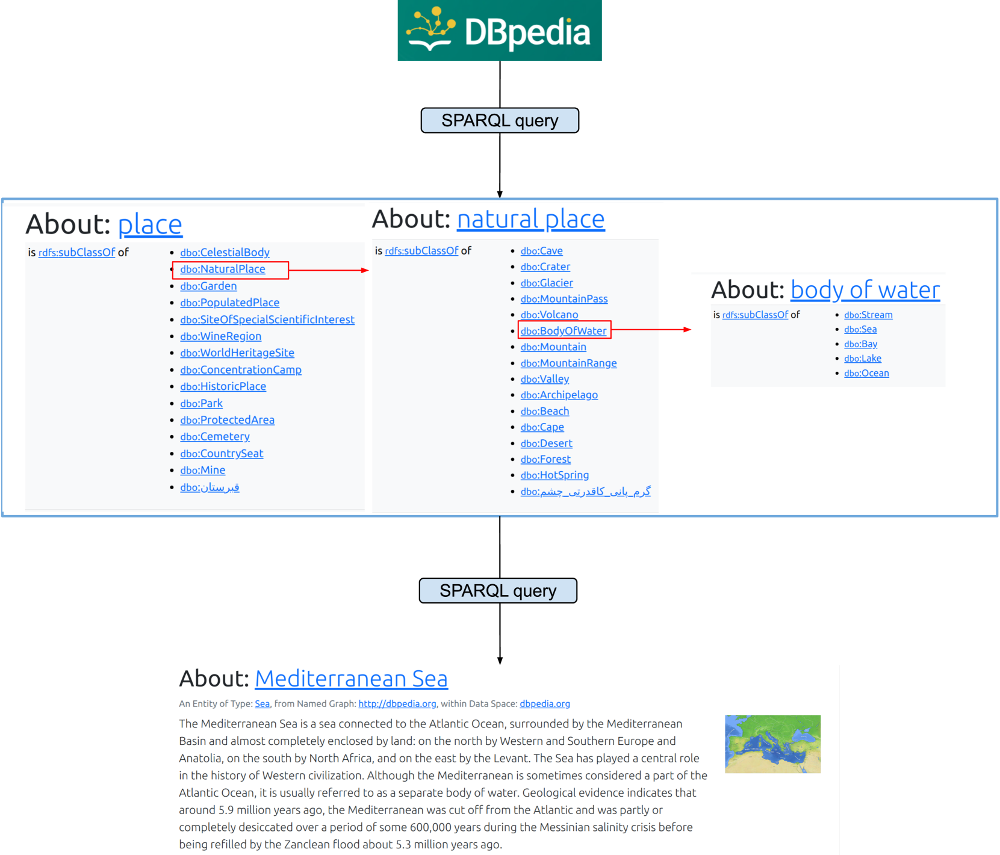
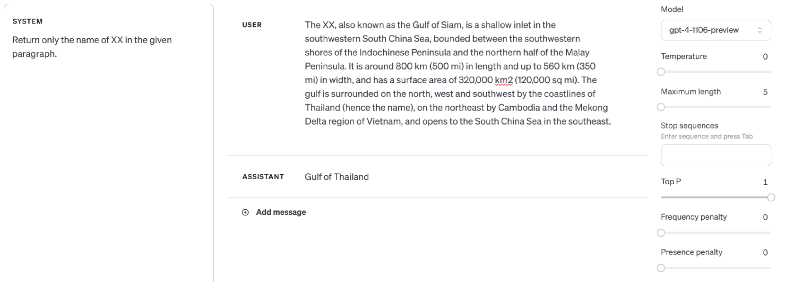
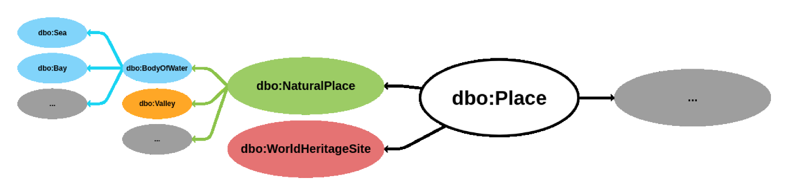

# 通过在GPT-4上开展一项自然语言地理猜测实验，我们探究了基础模型的地理多样性。

发布时间：2024年04月11日

`LLM应用` `地理信息科学` `人工智能`

> Measuring Geographic Diversity of Foundation Models with a Natural Language--based Geo-guessing Experiment on GPT-4

# 摘要

> 生成性AI基于基础模型，为我们揭示了机器在训练过程中处理的海量多模态数据所构建的世界。将这些模型视为独立的知识点库，或许能为我们用机器的视角探索世界带来新的视角。本研究采纳这一理念，选取了多模态大型语言模型中的佼佼者GPT-4，探讨其在地理多样性方面的表现，特别是地理特征的全球呈现程度。通过DBpedia摘要作为参照基准，我们的自然语言地理猜测实验发现，GPT-4在全球范围内对某些地理特征的了解尚显不足。在地方层面，我们不仅发现了这种知识的匮乏，还注意到GPT-4在对UNESCO世界遗产地进行地理猜测时，存在地区间的差异，这些遗产地对本地及全球居民均有重要意义。而且随着地理范围的扩大，这些地区间差异似乎有所缩小。无论是在全球还是地方层面评估地理猜测能力，我们发现GPT-4的单模态和多模态版本之间存在性能差异。我们期望这项研究能够激发GIScience领域就地理多样性作为一个伦理原则展开讨论，以应对全球性的社技挑战。

> Generative AI based on foundation models provides a first glimpse into the world represented by machines trained on vast amounts of multimodal data ingested by these models during training. If we consider the resulting models as knowledge bases in their own right, this may open up new avenues for understanding places through the lens of machines. In this work, we adopt this thinking and select GPT-4, a state-of-the-art representative in the family of multimodal large language models, to study its geographic diversity regarding how well geographic features are represented. Using DBpedia abstracts as a ground-truth corpus for probing, our natural language--based geo-guessing experiment shows that GPT-4 may currently encode insufficient knowledge about several geographic feature types on a global level. On a local level, we observe not only this insufficiency but also inter-regional disparities in GPT-4's geo-guessing performance on UNESCO World Heritage Sites that carry significance to both local and global populations, and the inter-regional disparities may become smaller as the geographic scale increases. Morever, whether assessing the geo-guessing performance on a global or local level, we find inter-model disparities in GPT-4's geo-guessing performance when comparing its unimodal and multimodal variants. We hope this work can initiate a discussion on geographic diversity as an ethical principle within the GIScience community in the face of global socio-technical challenges.

[Arxiv](https://arxiv.org/abs/2404.07612)