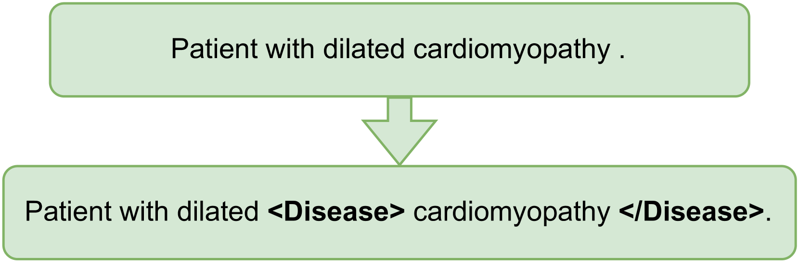

# Medical mT5：一款面向医学领域的开源多语言文本到文本转换的大型语言模型。

发布时间：2024年04月11日

`LLM应用` `多语言处理`

> Medical mT5: An Open-Source Multilingual Text-to-Text LLM for The Medical Domain

# 摘要

> 在自然语言理解和生成的领域中，医疗应用的语言技术研究正受到广泛关注。为此，众多大型语言模型（LLMs）已被调整应用于医疗领域，充当人机互动的桥梁。尽管这些模型在自动化医疗文本测试中展现出了竞争力，但它们的训练和评估往往只针对单一语言，尤其是英语。文本到文本模型尤其如此，因为它们通常需要大量的特定领域数据，而这些数据对许多语言来说难以获取。本文力求弥补这一缺陷，我们汇集了据我们所知最大的四语种医疗领域多语言语料库，包括英语、法语、意大利语和西班牙语。利用这个新语料库，我们训练出了Medical mT5——首个面向医疗领域的开源多语言文本到文本模型。我们还推出了两个新的多语言评估基准，以推动该领域的多语言研究。全面的评估显示，Medical mT5在西班牙语、法语和意大利语的评估中超越了编码器和其他同规模文本到文本模型，同时在英语领域与最先进的LLMs不相上下。

> Research on language technology for the development of medical applications is currently a hot topic in Natural Language Understanding and Generation. Thus, a number of large language models (LLMs) have recently been adapted to the medical domain, so that they can be used as a tool for mediating in human-AI interaction. While these LLMs display competitive performance on automated medical texts benchmarks, they have been pre-trained and evaluated with a focus on a single language (English mostly). This is particularly true of text-to-text models, which typically require large amounts of domain-specific pre-training data, often not easily accessible for many languages. In this paper, we address these shortcomings by compiling, to the best of our knowledge, the largest multilingual corpus for the medical domain in four languages, namely English, French, Italian and Spanish. This new corpus has been used to train Medical mT5, the first open-source text-to-text multilingual model for the medical domain. Additionally, we present two new evaluation benchmarks for all four languages with the aim of facilitating multilingual research in this domain. A comprehensive evaluation shows that Medical mT5 outperforms both encoders and similarly sized text-to-text models for the Spanish, French, and Italian benchmarks, while being competitive with current state-of-the-art LLMs in English.

[Arxiv](https://arxiv.org/abs/2404.07613)