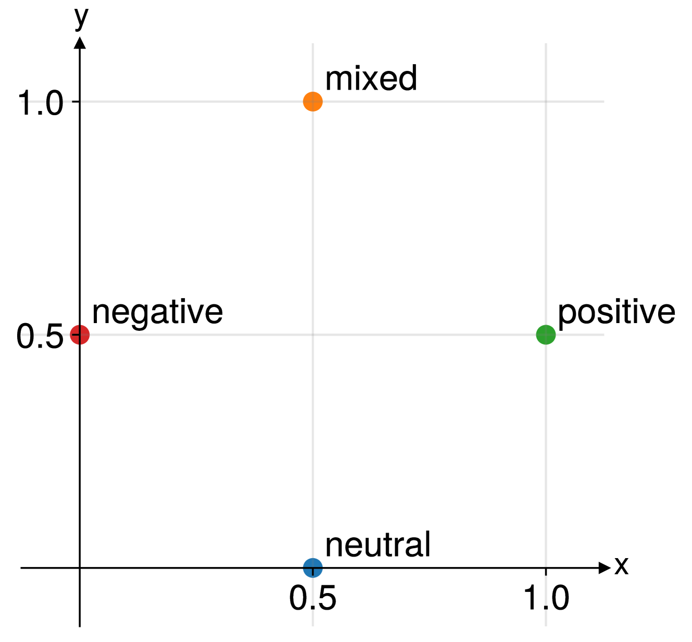
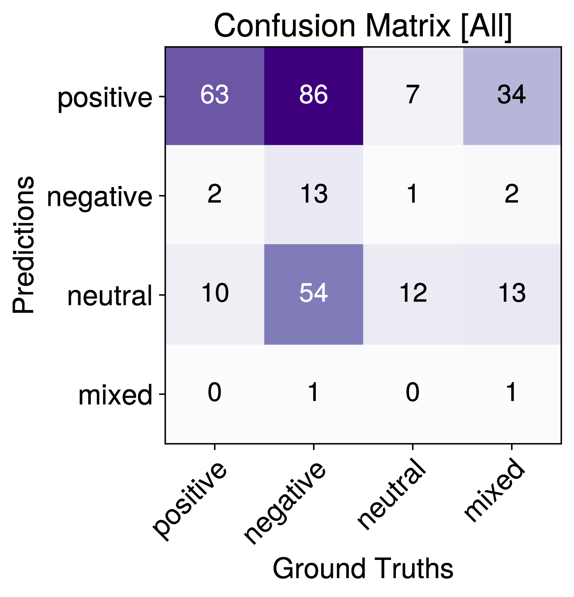
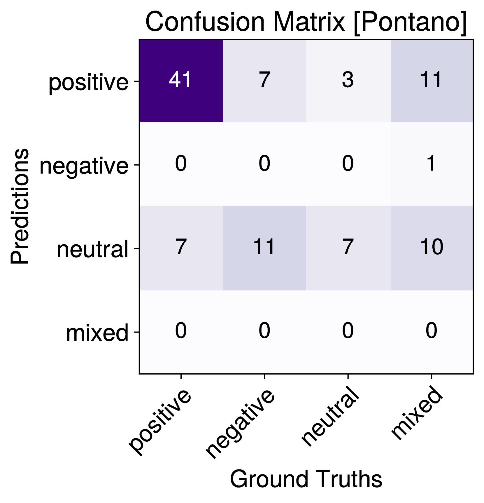

# 在 2024 年的 EvaLatin 会议上，Nostra Domina 通过采用数据增强技术，有效提升了拉丁语极性检测的准确性。

发布时间：2024年04月11日

`LLM应用` `情感分析` `文本挖掘`

> Nostra Domina at EvaLatin 2024: Improving Latin Polarity Detection through Data Augmentation

# 摘要

> 本文介绍了Nostra Domina团队参与EvaLatin 2024情感倾向识别任务的成果。面对拉丁语资源匮乏和诗歌等修辞体裁情感表达复杂的挑战，我们通过自动化的情感标注技术扩充了现有数据。基于$k$-均值算法，我们提出了两种数据增强方法，并利用多种拉丁语大型语言模型（LLMs）构建神经网络，更精准地捕捉文本背后的情感内涵。我们的最佳策略在该任务的测试集中获得了仅次于最高分的宏观平均Macro-$F_1$得分。

> This paper describes submissions from the team Nostra Domina to the EvaLatin 2024 shared task of emotion polarity detection. Given the low-resource environment of Latin and the complexity of sentiment in rhetorical genres like poetry, we augmented the available data through automatic polarity annotation. We present two methods for doing so on the basis of the $k$-means algorithm, and we employ a variety of Latin large language models (LLMs) in a neural architecture to better capture the underlying contextual sentiment representations. Our best approach achieved the second highest macro-averaged Macro-$F_1$ score on the shared task's test set.

[Arxiv](https://arxiv.org/abs/2404.07792)