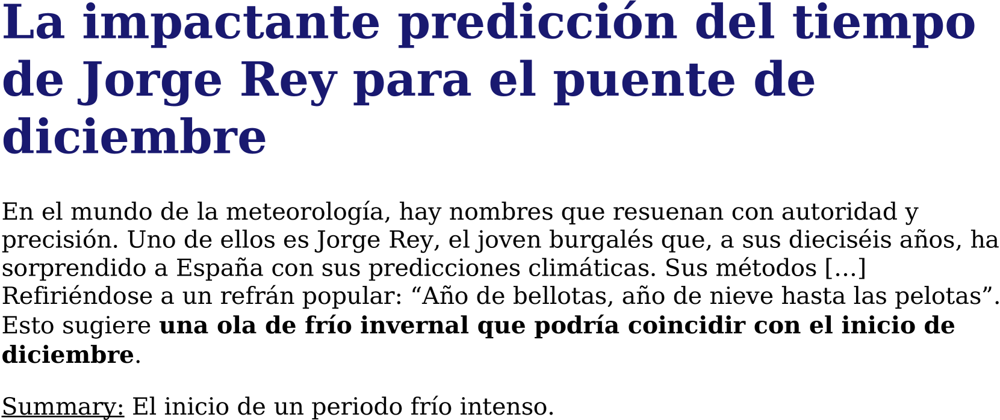
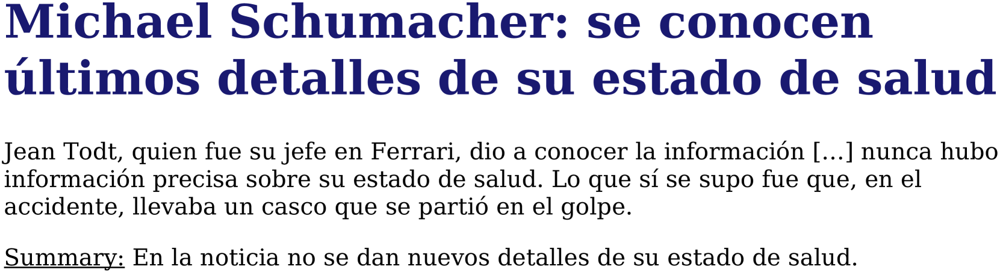
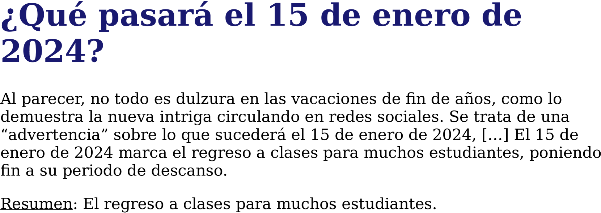
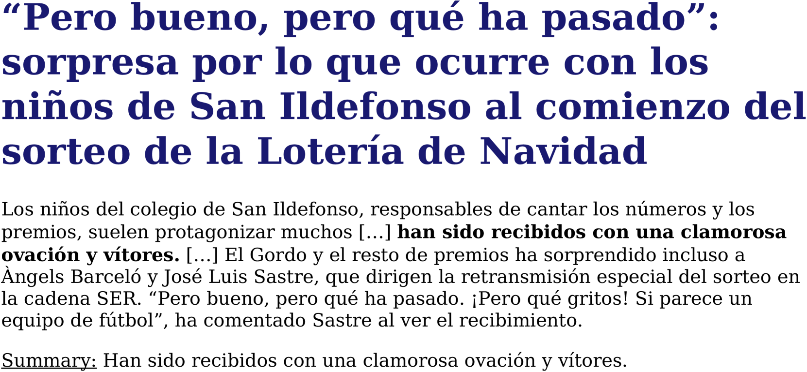
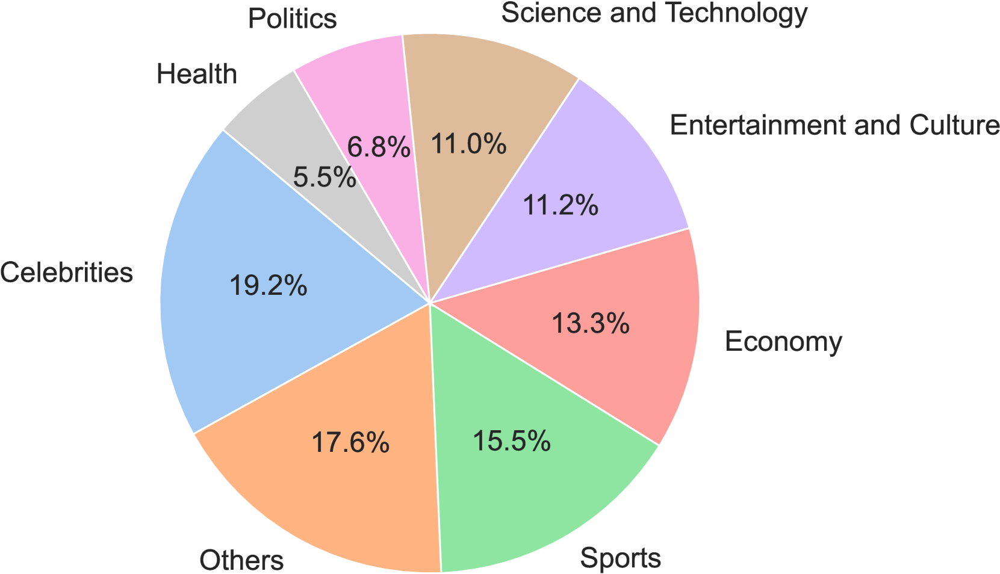
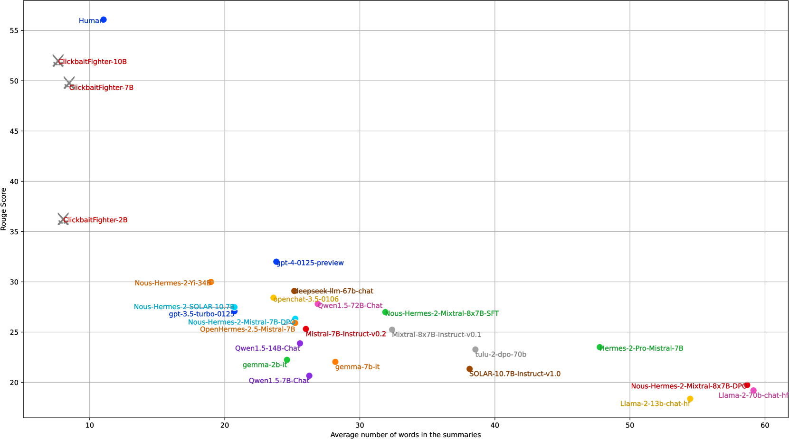
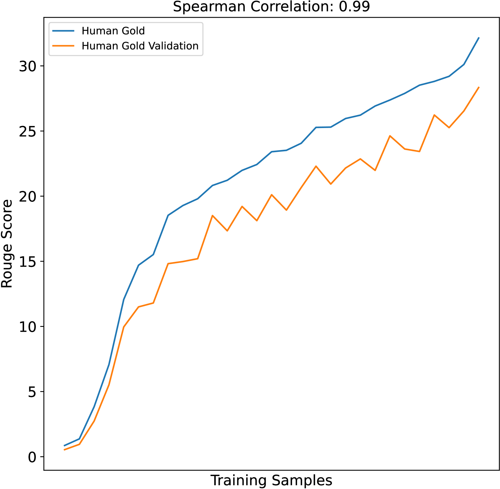
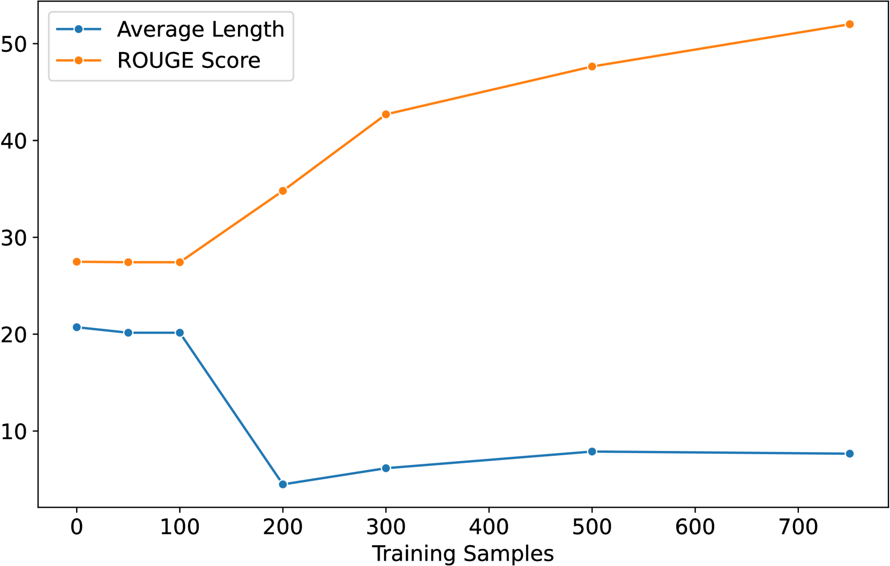
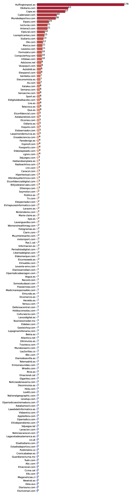
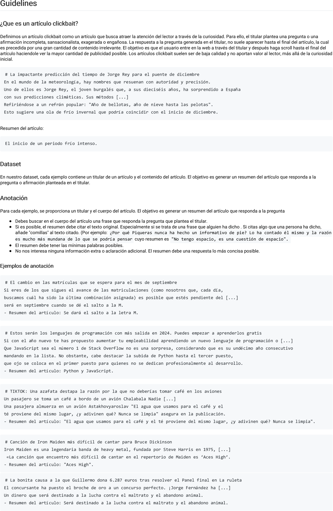

# NoticIA：西班牙语点击诱饵文章的摘要数据集

发布时间：2024年04月11日

`LLM应用` `摘要生成`

> NoticIA: A Clickbait Article Summarization Dataset in Spanish

# 摘要

> 我们推出了NoticIA数据集，它由850篇配有醒目点击诱饵标题的西班牙新闻文章组成，每篇都附有人类撰写的精炼单句摘要。这项挑战考验了模型深度理解文本和生成摘要的能力，要求模型整合多元信息，满足点击诱饵标题激发的用户信息寻求。我们对多款顶尖大型语言模型的西班牙语理解能力进行了评测，并利用该数据集训练出ClickbaitFighter模型，其表现近乎人类水平。

> We present NoticIA, a dataset consisting of 850 Spanish news articles featuring prominent clickbait headlines, each paired with high-quality, single-sentence generative summarizations written by humans. This task demands advanced text understanding and summarization abilities, challenging the models' capacity to infer and connect diverse pieces of information to meet the user's informational needs generated by the clickbait headline. We evaluate the Spanish text comprehension capabilities of a wide range of state-of-the-art large language models. Additionally, we use the dataset to train ClickbaitFighter, a task-specific model that achieves near-human performance in this task.

[Arxiv](https://arxiv.org/abs/2404.07611)