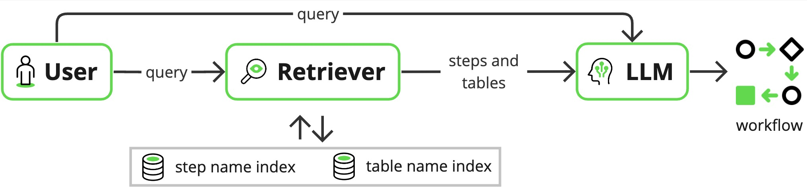
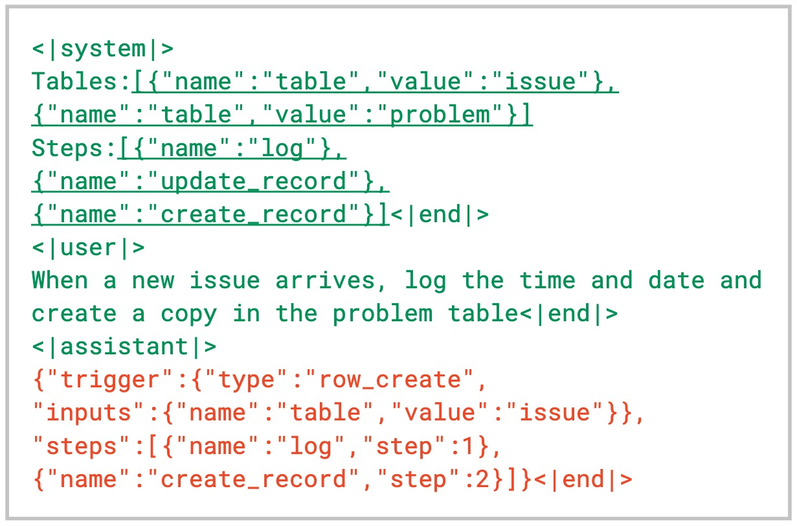
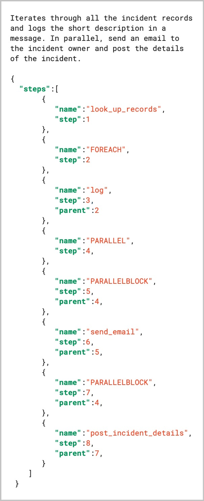
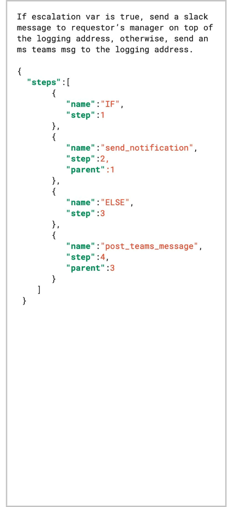
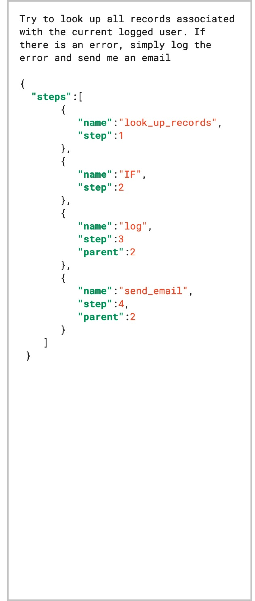

# 利用检索增强生成技术，有效降低结构化输出中的幻觉问题。

发布时间：2024年04月11日

`分类：RAG` `企业应用` `人工智能`

> Reducing hallucination in structured outputs via Retrieval-Augmented Generation

# 摘要

> 生成性AI（GenAI）普遍存在的一大挑战是其易产生幻觉的特性。尽管大型语言模型（LLM）已经风靡全球，但如果不减少幻觉现象，GenAI在实际应用中可能会遭遇用户接受度的难题。在开发一款根据自然语言需求生成工作流程的企业级应用时，我们构建了一个系统，该系统采用检索增强生成（RAG）技术显著提升了所生成工作流程的结构化输出质量。得益于RAG的运用，我们的系统显著降低了输出中的幻觉现象，增强了LLM在非专业领域的泛化能力。此外，我们还发现，采用一个小型但训练精良的检索器编码器，可以有效减少所需LLM的规模，从而降低了部署基于LLM系统所需的资源。

> A common and fundamental limitation of Generative AI (GenAI) is its propensity to hallucinate. While large language models (LLM) have taken the world by storm, without eliminating or at least reducing hallucinations, real-world GenAI systems may face challenges in user adoption. In the process of deploying an enterprise application that produces workflows based on natural language requirements, we devised a system leveraging Retrieval Augmented Generation (RAG) to greatly improve the quality of the structured output that represents such workflows. Thanks to our implementation of RAG, our proposed system significantly reduces hallucinations in the output and improves the generalization of our LLM in out-of-domain settings. In addition, we show that using a small, well-trained retriever encoder can reduce the size of the accompanying LLM, thereby making deployments of LLM-based systems less resource-intensive.

[Arxiv](https://arxiv.org/abs/2404.08189)