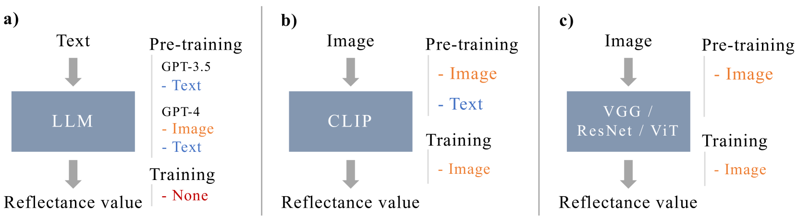
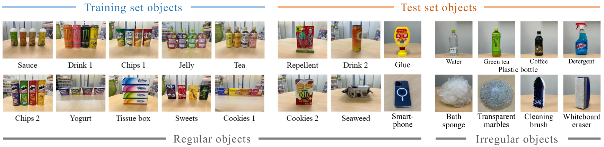
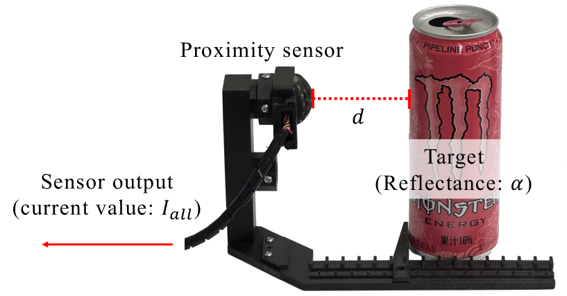
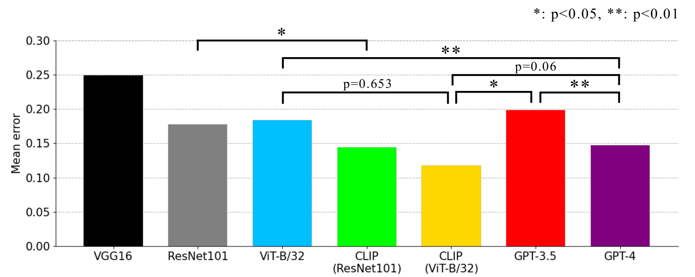
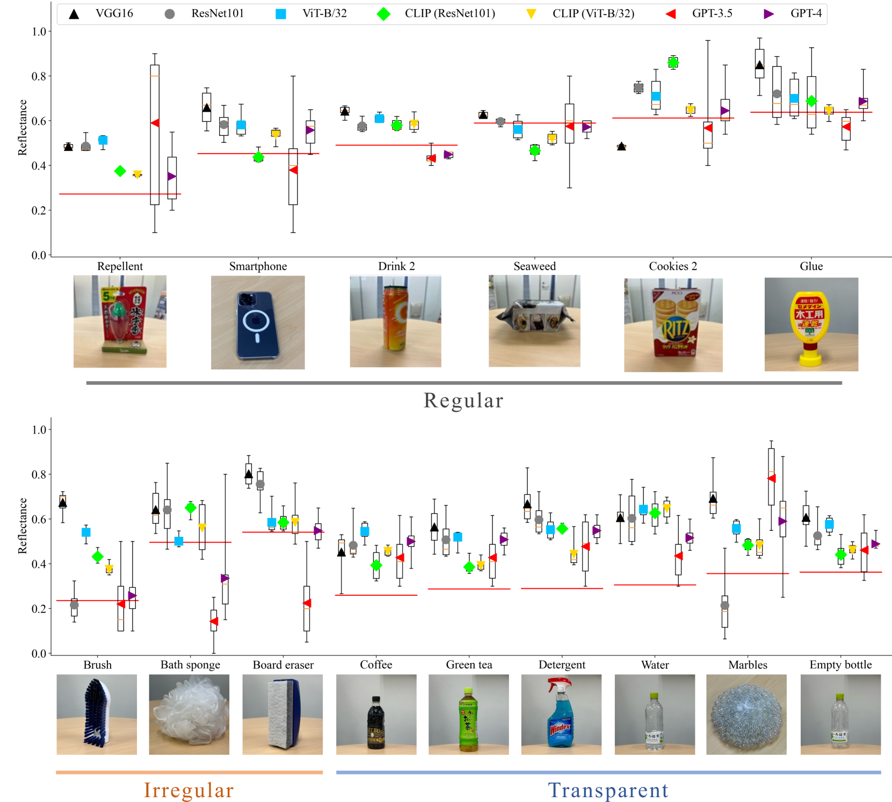
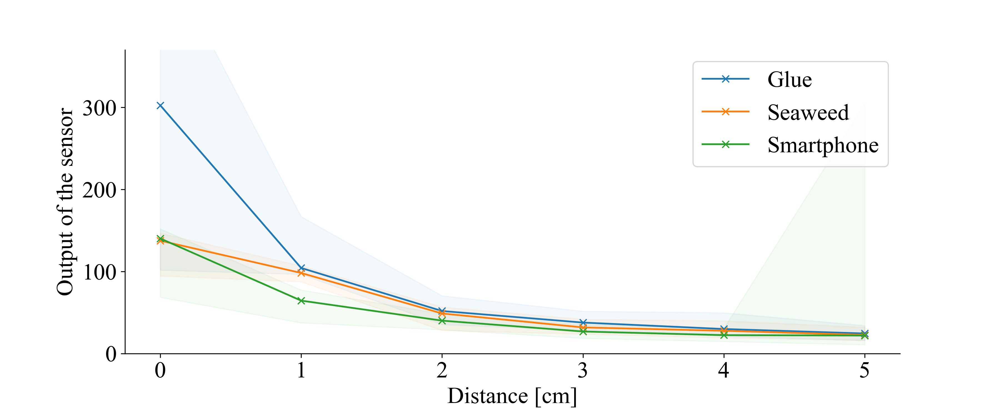
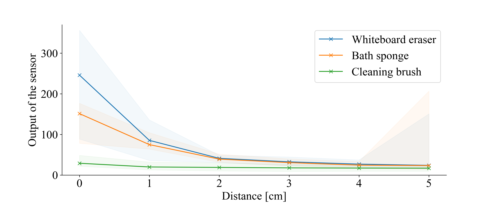
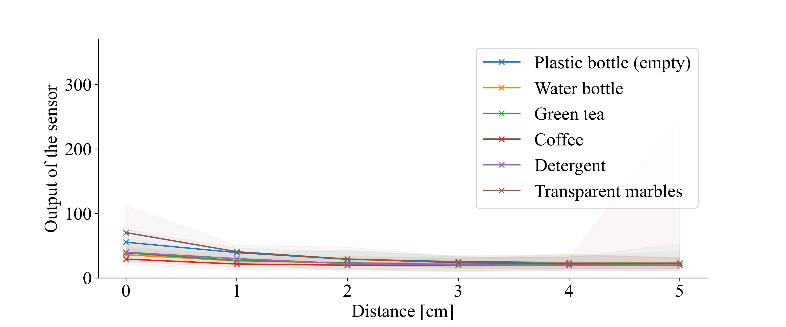
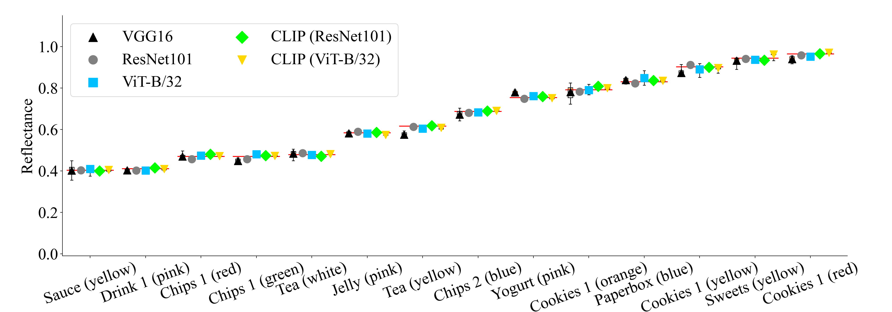

# 视觉-语言模型用于邻近感知的反射率估算：在机器人学领域，运用分布式语义学来实现低层次认知。

发布时间：2024年04月11日

`LLM应用` `机器人` `传感器`

> Reflectance Estimation for Proximity Sensing by Vision-Language Models: Utilizing Distributional Semantics for Low-Level Cognition in Robotics

# 摘要

> 大型语言模型（LLMs）和视觉-语言模型（VLMs）在机器人高级认知任务中的应用日益增多，但在低层次认知任务，如传感器信息解读方面，它们的潜力尚未充分挖掘。在机器人抓取任务中，准确估计物体的反射率是关键，因为这直接影响到接近传感器的测量精度。本研究探讨了LLMs是否能够仅通过物体名称来预测其反射率，利用分布式语义中蕴含的人类知识，以及VLMs在处理图像信息时，语言的内在结构是否能够提升其反射率估计的准确性。研究证实，GPT-3.5和GPT-4等LLMs能够仅通过文本信息预测物体反射率，而CLIP等VLMs则能增强其从图像中泛化反射率估计的能力。实验结果显示，GPT-4仅凭文本输入就能以14.7%的平均误差准确预测物体反射率，表现优于仅依赖图像的ResNet模型。CLIP更是以11.8%的低误差率领先，GPT-3.5也以19.9%的成绩紧随其后，优于ResNet的17.8%。这一发现揭示了LLMs和VLMs中的语言分布式特性增强了它们的泛化能力，而VLMs所掌握的知识得益于语言结构的隐含优势。

> Large language models (LLMs) and vision-language models (VLMs) have been increasingly used in robotics for high-level cognition, but their use for low-level cognition, such as interpreting sensor information, remains underexplored. In robotic grasping, estimating the reflectance of objects is crucial for successful grasping, as it significantly impacts the distance measured by proximity sensors. We investigate whether LLMs can estimate reflectance from object names alone, leveraging the embedded human knowledge in distributional semantics, and if the latent structure of language in VLMs positively affects image-based reflectance estimation. In this paper, we verify that 1) LLMs such as GPT-3.5 and GPT-4 can estimate an object's reflectance using only text as input; and 2) VLMs such as CLIP can increase their generalization capabilities in reflectance estimation from images. Our experiments show that GPT-4 can estimate an object's reflectance using only text input with a mean error of 14.7%, lower than the image-only ResNet. Moreover, CLIP achieved the lowest mean error of 11.8%, while GPT-3.5 obtained a competitive 19.9% compared to ResNet's 17.8%. These results suggest that the distributional semantics in LLMs and VLMs increases their generalization capabilities, and the knowledge acquired by VLMs benefits from the latent structure of language.

[Arxiv](https://arxiv.org/abs/2404.07717)