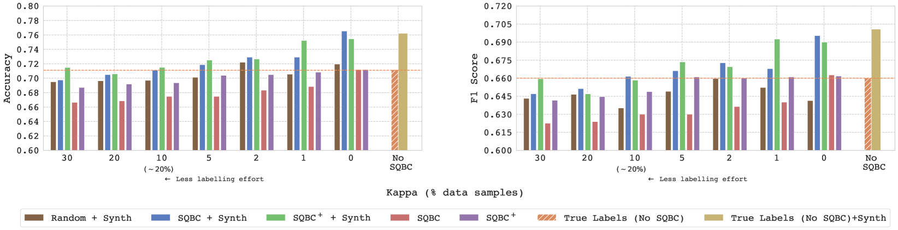
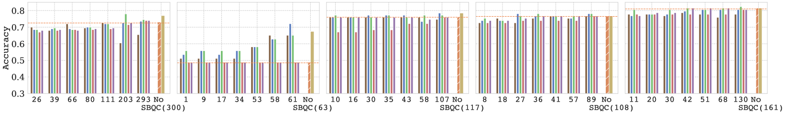
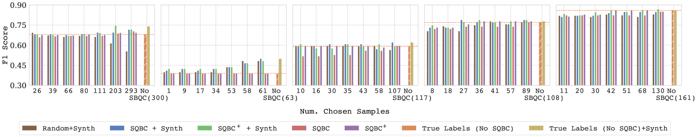

# SQBC：运用由大型语言模型生成的合成数据，主动学习以识别在线政治讨论中的立场。

发布时间：2024年04月11日

`Agent` `在线政治讨论` `立场检测`

> SQBC: Active Learning using LLM-Generated Synthetic Data for Stance Detection in Online Political Discussions

# 摘要

> 立场检测在在线政治讨论的分析与支持中扮演着关键角色。传统方法多依赖于微调变换器模型，但这类模型往往需要大量标注数据，现实中这类数据难以获取。本研究提出了两种创新策略，利用大型语言模型生成的合成数据来提升立场检测代理的效果：一是证明向小型微调数据集注入合成数据能够显著提高模型的立场检测能力；二是引入了一种名为SQBC的新型主动学习策略，该策略受“委员会查询”方法启发，通过合成数据筛选出最具信息价值的未标注样本，以供人工标注。广泛的实验验证了这两种方法均能有效提升立场检测的表现。值得一提的是，我们还发现，针对主动筛选样本进行的微调，其效果甚至能超越直接使用全部数据集。

> Stance detection is an important task for many applications that analyse or support online political discussions. Common approaches include fine-tuning transformer based models. However, these models require a large amount of labelled data, which might not be available. In this work, we present two different ways to leverage LLM-generated synthetic data to train and improve stance detection agents for online political discussions: first, we show that augmenting a small fine-tuning dataset with synthetic data can improve the performance of the stance detection model. Second, we propose a new active learning method called SQBC based on the "Query-by-Comittee" approach. The key idea is to use LLM-generated synthetic data as an oracle to identify the most informative unlabelled samples, that are selected for manual labelling. Comprehensive experiments show that both ideas can improve the stance detection performance. Curiously, we observed that fine-tuning on actively selected samples can exceed the performance of using the full dataset.

[Arxiv](https://arxiv.org/abs/2404.08078)