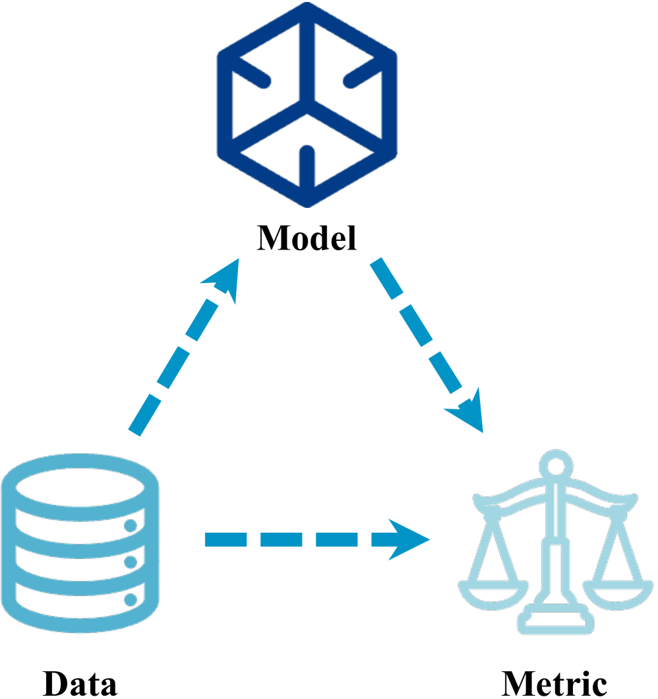
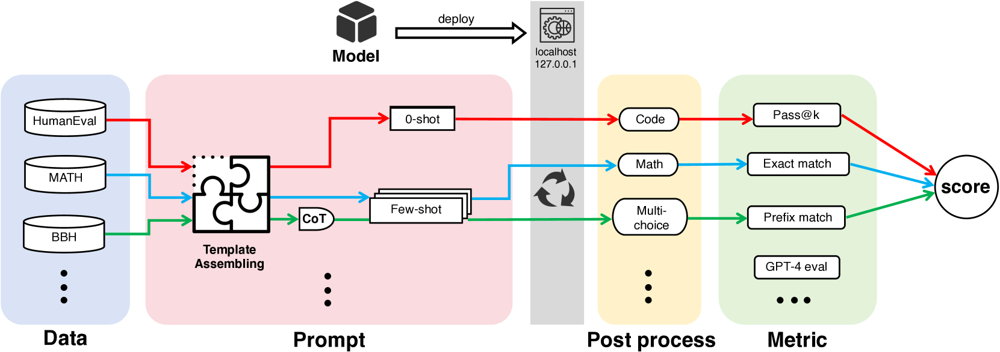
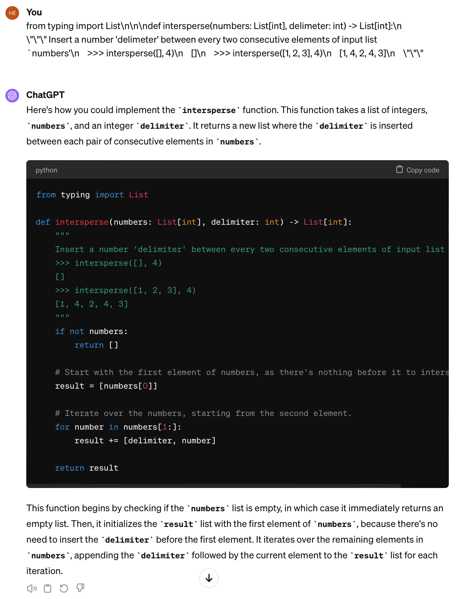

# UltraEval：为大型语言模型（LLMs）提供了一个轻巧、灵活且全面的评估平台。

发布时间：2024年04月11日

`LLM理论` `语言模型评估` `评估框架`

> UltraEval: A Lightweight Platform for Flexible and Comprehensive Evaluation for LLMs

# 摘要

> 评估对提升大型语言模型（LLMs）的性能至关重要，它能帮助我们精确把握模型的能力并指导其优化。随着LLMs的迅猛发展，我们急需一个轻巧、易于操作的评估框架，以便快速进行评估。然而，鉴于众多实施细节的考量，打造一个全面的评估平台并非易事。现有的评估平台往往过于复杂，模块化程度低，难以与研究人员的工作流程无缝对接。本文推出了UltraEval，这是一个用户友好的评估框架，它以轻量、全面、模块化和高效著称。我们筛选并重新构建了模型评估的三大核心要素（模型、数据和评价指标）。这种组合的灵活性使得在同一个评估流程中可以自由搭配不同的模型、任务、提示和评价指标。此外，UltraEval得益于其统一的HTTP服务，能够支持多种模型，同时提供强大的推理加速能力。目前，UltraEval已经向研究界公开发布。

> Evaluation is pivotal for honing Large Language Models (LLMs), pinpointing their capabilities and guiding enhancements. The rapid development of LLMs calls for a lightweight and easy-to-use framework for swift evaluation deployment. However, due to the various implementation details to consider, developing a comprehensive evaluation platform is never easy. Existing platforms are often complex and poorly modularized, hindering seamless incorporation into researcher's workflows. This paper introduces UltraEval, a user-friendly evaluation framework characterized by lightweight, comprehensiveness, modularity, and efficiency. We identify and reimplement three core components of model evaluation (models, data, and metrics). The resulting composability allows for the free combination of different models, tasks, prompts, and metrics within a unified evaluation workflow. Additionally, UltraEval supports diverse models owing to a unified HTTP service and provides sufficient inference acceleration. UltraEval is now available for researchers publicly~\footnote{Website is at \url{https://github.com/OpenBMB/UltraEval}}.

[Arxiv](https://arxiv.org/abs/2404.07584)