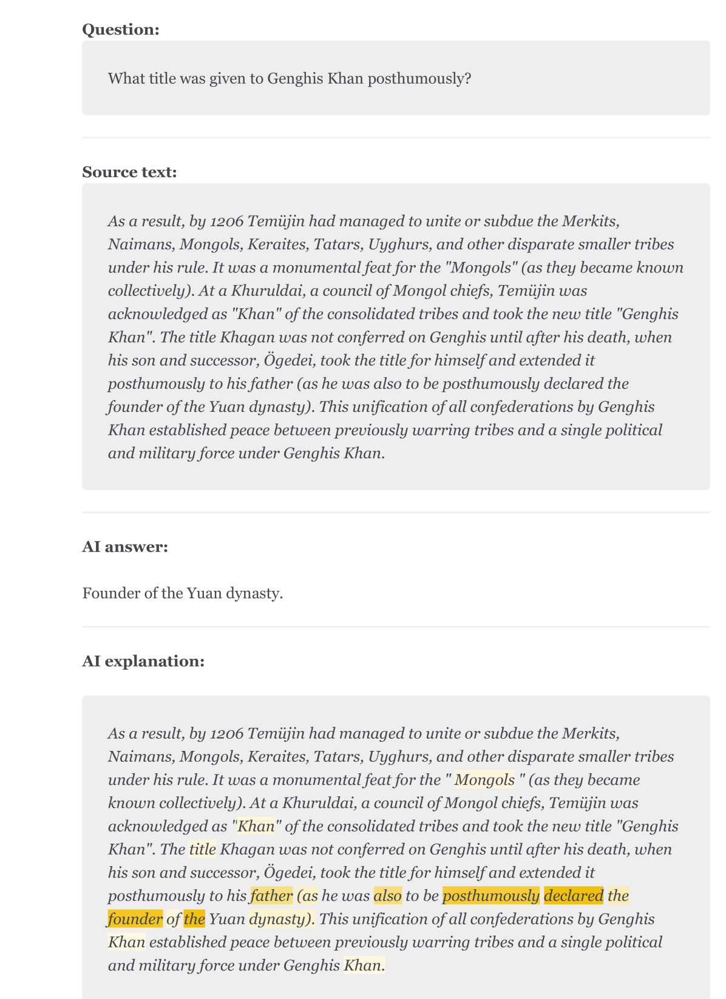
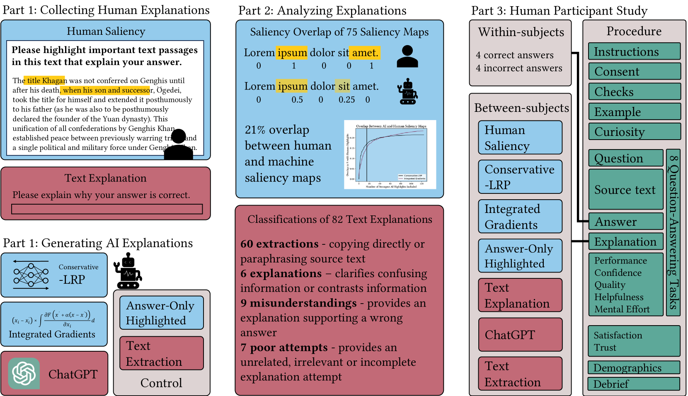
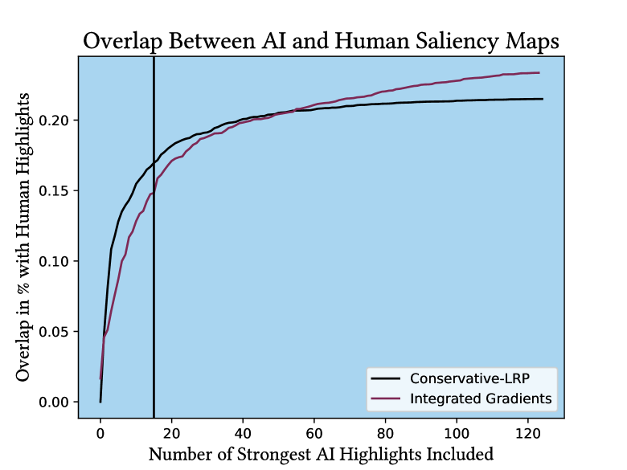
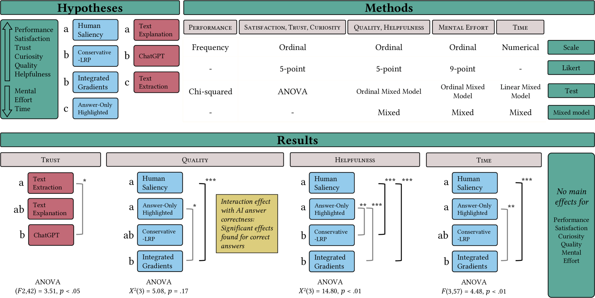
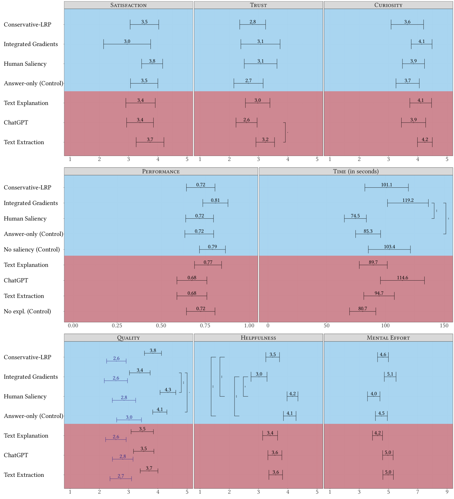

# 探究AI误差之谜：研究人类与机器解释在大型语言模型中的有效性。

发布时间：2024年04月11日

`RAG` `可解释AI` `人机交互`

> Unraveling the Dilemma of AI Errors: Exploring the Effectiveness of Human and Machine Explanations for Large Language Models

# 摘要

> 随着深度学习技术的飞速发展，可解释AI领域涌现出众多方法，如显著性图等，以期更好地理解AI模型。然而，面对AI的错误输出，这些方法的有效性却受到人类参与者研究的质疑。本研究通过收集并分析了156个问答任务中的人类文本和显著性解释（N=40），并与集成梯度、保守LRP和ChatGPT等先进XAI解释方法在136名人类参与者中进行了比较。研究发现，人们更倾向于认为人类的显著性图在阐释AI回答方面更为有效，但这种效果却与对AI模型及其解释的信任度成反比。这揭示了一个悖论：有益的解释在支持错误的AI预测时，反而可能导致整体任务表现的下滑。

> The field of eXplainable artificial intelligence (XAI) has produced a plethora of methods (e.g., saliency-maps) to gain insight into artificial intelligence (AI) models, and has exploded with the rise of deep learning (DL). However, human-participant studies question the efficacy of these methods, particularly when the AI output is wrong. In this study, we collected and analyzed 156 human-generated text and saliency-based explanations collected in a question-answering task (N=40) and compared them empirically to state-of-the-art XAI explanations (integrated gradients, conservative LRP, and ChatGPT) in a human-participant study (N=136). Our findings show that participants found human saliency maps to be more helpful in explaining AI answers than machine saliency maps, but performance negatively correlated with trust in the AI model and explanations. This finding hints at the dilemma of AI errors in explanation, where helpful explanations can lead to lower task performance when they support wrong AI predictions.

[Arxiv](https://arxiv.org/abs/2404.07725)