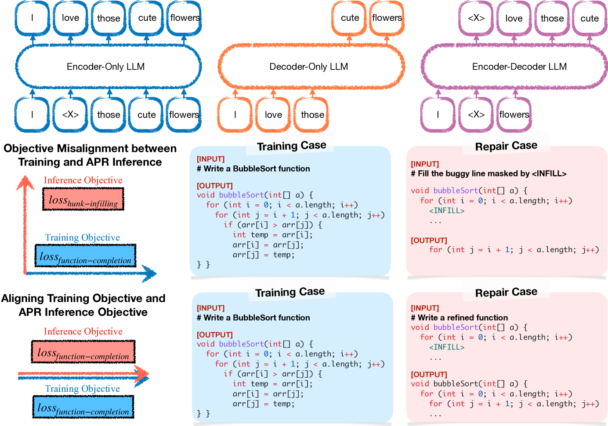
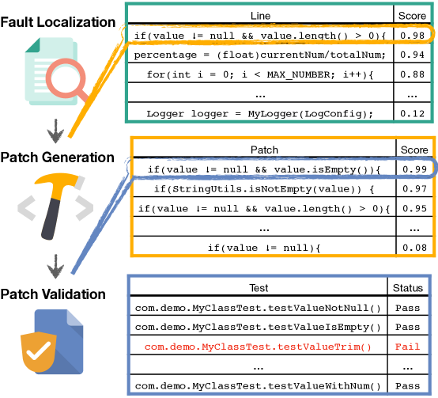
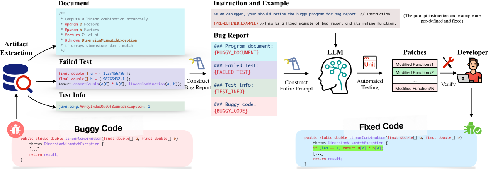
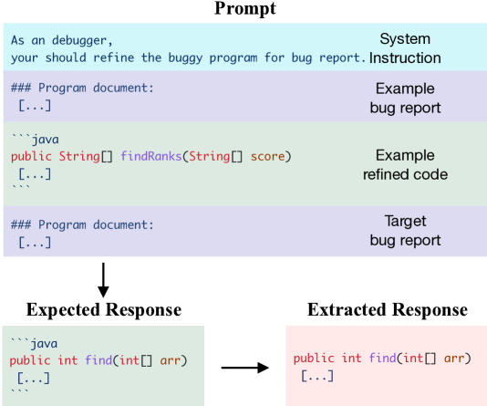
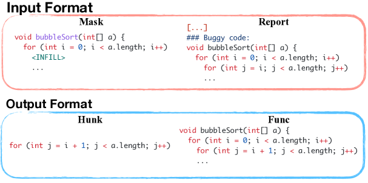
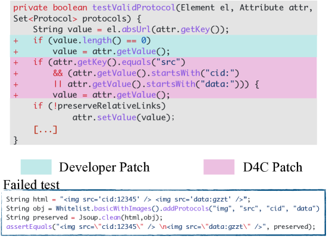
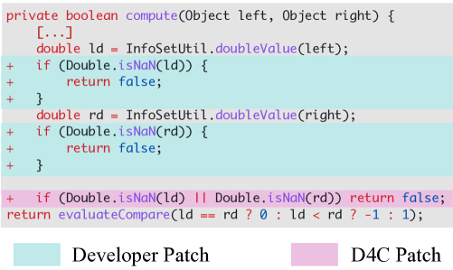

# 在无需特征标注的情况下，对大型语言模型进行优化以实现程序修复

发布时间：2024年04月12日

`LLM应用` `程序修复` `自动程序修复`

> Aligning LLMs for FL-free Program Repair

# 摘要

> 大型语言模型（LLM）在自动程序修复（APR）领域已取得显著成效。但当前LLM的下一个标记预测训练目标与填充式方法的掩码跨度预测目标不匹配，这限制了LLM在程序修复中充分利用预训练知识的能力。此外，尽管某些LLM能够直接使用相关输入（如测试用例）定位并修复错误，现有方法却将这些视为独立任务，要求LLM仅在固定位置生成补丁，限制了其探索潜在修复方案的能力。本文提出了一种新的LLM适配程序修复方法。我们发现，通过调整LLM的输出以符合其训练目标，并允许其在不进行错误定位的情况下完善整个程序，能显著提升其APR性能。基于这一发现，我们设计了D4C框架，一种简洁的APR提示方法。D4C在Defects4J数据集中成功修复了180个错误，每个补丁仅经过10次采样。这一成果不仅比现有最佳方法提高了10%的修复率，还大幅减少了90%的补丁采样次数。我们的研究显示，目标对齐对于发挥LLM预训练能力至关重要，且直接调试比传统的定位修复流程更适合基于LLM的APR方法。因此，我们认为本文为利用LLM进行APR提供了全新的视角。

> Large language models (LLMs) have achieved decent results on automated program repair (APR). However, the next token prediction training objective of decoder-only LLMs (e.g., GPT-4) is misaligned with the masked span prediction objective of current infilling-style methods, which impedes LLMs from fully leveraging pre-trained knowledge for program repair. In addition, while some LLMs are capable of locating and repairing bugs end-to-end when using the related artifacts (e.g., test cases) as input, existing methods regard them as separate tasks and ask LLMs to generate patches at fixed locations. This restriction hinders LLMs from exploring potential patches beyond the given locations.
  In this paper, we investigate a new approach to adapt LLMs to program repair. Our core insight is that LLM's APR capability can be greatly improved by simply aligning the output to their training objective and allowing them to refine the whole program without first performing fault localization. Based on this insight, we designed D4C, a straightforward prompting framework for APR. D4C can repair 180 bugs correctly in Defects4J, with each patch being sampled only 10 times. This surpasses the SOTA APR methods with perfect fault localization by 10% and reduces the patch sampling number by 90%. Our findings reveal that (1) objective alignment is crucial for fully exploiting LLM's pre-trained capability, and (2) replacing the traditional localize-then-repair workflow with direct debugging is more effective for LLM-based APR methods. Thus, we believe this paper introduces a new mindset for harnessing LLMs in APR.

[Arxiv](https://arxiv.org/abs/2404.08877)