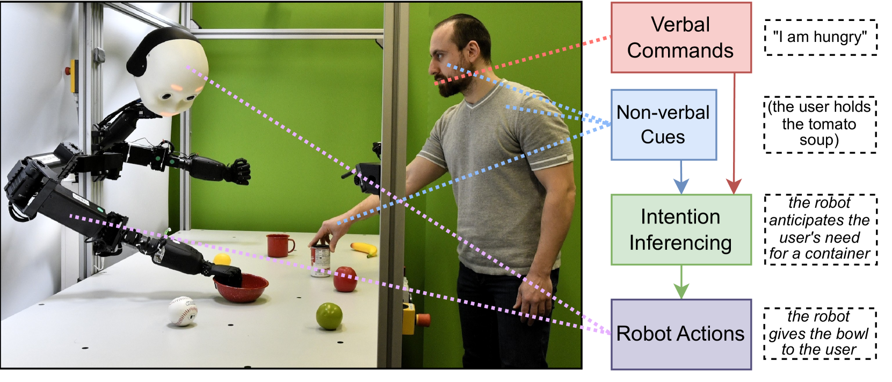
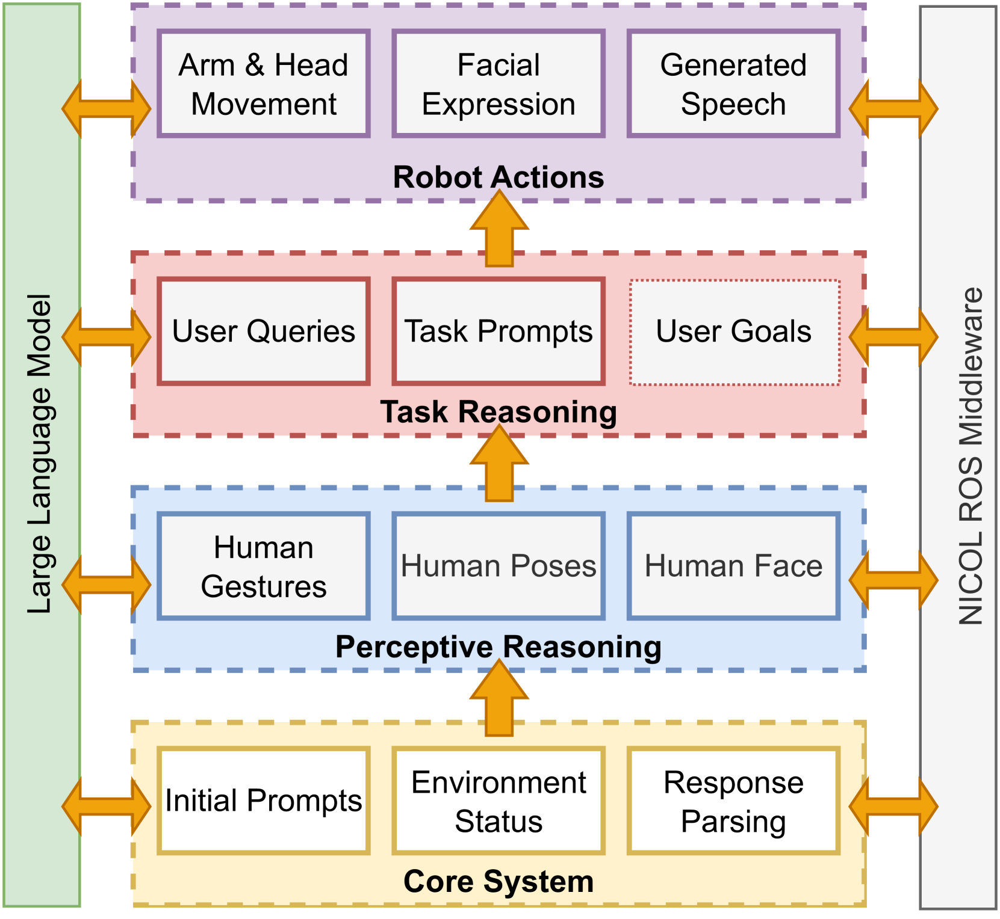
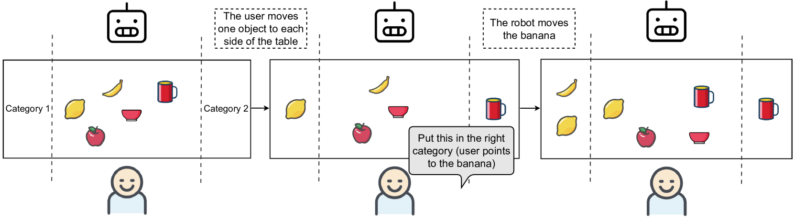
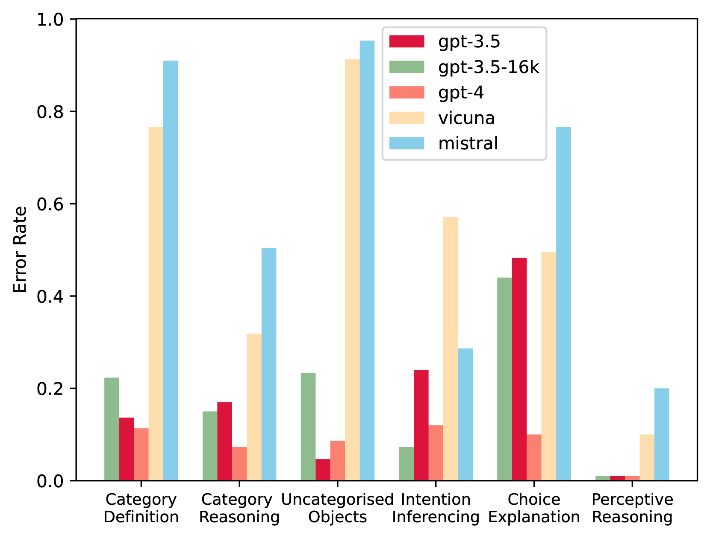

# 在对象分类任务中，利用大型语言模型进行多模态意图预测的苹果与橙子之比较。

发布时间：2024年04月12日

`Agent` `人机交互` `机器人技术`

> Comparing Apples to Oranges: LLM-powered Multimodal Intention Prediction in an Object Categorization Task

# 摘要

> 基于意图的机器人互动系统让机器人能够洞察并解读人类行为，从而实现与人的自然互动和行为适应。本研究探讨了大型语言模型在物理机器人协作分类任务中推断人意图的应用。我们提出了一种解读非言语信号如手势、姿态和表情的层级方法，并将其与环境状态和通过ASR系统捕获的言语线索相结合。评估结果表明，大型语言模型能够解读非言语线索，并结合其对上下文的理解和现实世界知识，助力人机交互中的意图预测。

> Intention-based Human-Robot Interaction (HRI) systems allow robots to perceive and interpret user actions to proactively interact with humans and adapt to their behavior. Therefore, intention prediction is pivotal in creating a natural interactive collaboration between humans and robots. In this paper, we examine the use of Large Language Models (LLMs) for inferring human intention during a collaborative object categorization task with a physical robot. We introduce a hierarchical approach for interpreting user non-verbal cues, like hand gestures, body poses, and facial expressions and combining them with environment states and user verbal cues captured using an existing Automatic Speech Recognition (ASR) system. Our evaluation demonstrates the potential of LLMs to interpret non-verbal cues and to combine them with their context-understanding capabilities and real-world knowledge to support intention prediction during human-robot interaction.

[Arxiv](https://arxiv.org/abs/2404.08424)