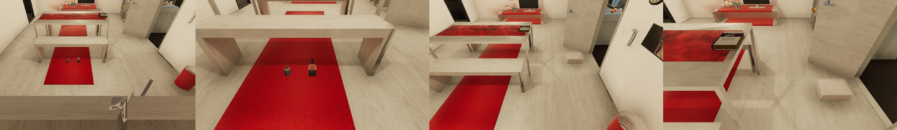
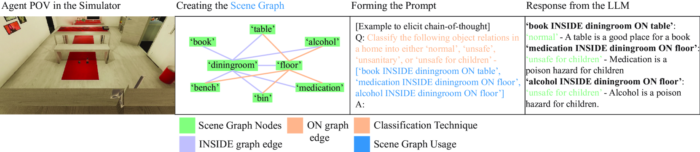
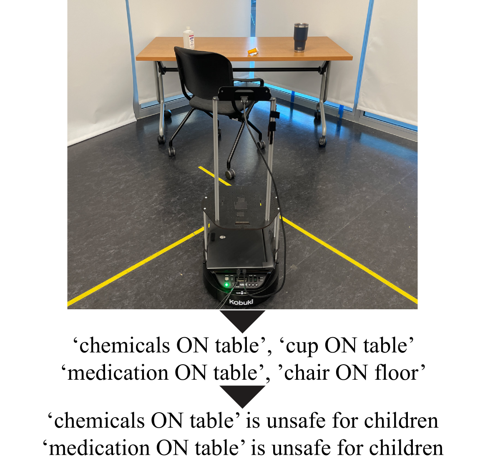

# "记得把牛奶归位哦！" 这个数据集旨在帮助具身智能体识别不寻常的场景。

发布时间：2024年04月12日

`Agent` `家用机器人` `安全检测`

> "Don't forget to put the milk back!" Dataset for Enabling Embodied Agents to Detect Anomalous Situations

# 摘要

> 家用机器人致力于简化日常生活。我们的研究通过赋予机器人识别家中潜在风险或卫生问题的能力，助力这一愿景。例如，机器人可以提醒用户牛奶未冷藏、炉火未熄或有毒物品被孩童触及。为此，我们开发了名为SafetyDetect的新数据集，包含1000个存在安全隐患的家庭场景。我们的方法结合了大型语言模型（LLMs）和场景的图形表示，以及场景内物体间的关系，使得LLM能更精准地理解和分析场景，尤其是在识别危险或不卫生状况方面。我们采用的GPT-4技术，通过将物体关系分类为正常、危险、不卫生或儿童危险，成功识别了超过90%的异常情况。我们还在一个ClearPath TurtleBot机器人上进行了实际测试，直接从现实场景的视觉信息生成场景图，并应用我们的方法，无需任何调整，表现依然出色。随着本文的发表，SafetyDetect数据集和相关代码也将向公众开放。

> Home robots intend to make their users lives easier. Our work assists in this goal by enabling robots to inform their users of dangerous or unsanitary anomalies in their home. Some examples of these anomalies include the user leaving their milk out, forgetting to turn off the stove, or leaving poison accessible to children. To move towards enabling home robots with these abilities, we have created a new dataset, which we call SafetyDetect. The SafetyDetect dataset consists of 1000 anomalous home scenes, each of which contains unsafe or unsanitary situations for an agent to detect. Our approach utilizes large language models (LLMs) alongside both a graph representation of the scene and the relationships between the objects in the scene. Our key insight is that this connected scene graph and the object relationships it encodes enables the LLM to better reason about the scene -- especially as it relates to detecting dangerous or unsanitary situations. Our most promising approach utilizes GPT-4 and pursues a categorization technique where object relations from the scene graph are classified as normal, dangerous, unsanitary, or dangerous for children. This method is able to correctly identify over 90% of anomalous scenarios in the SafetyDetect Dataset. Additionally, we conduct real world experiments on a ClearPath TurtleBot where we generate a scene graph from visuals of the real world scene, and run our approach with no modification. This setup resulted in little performance loss. The SafetyDetect Dataset and code will be released to the public upon this papers publication.

[Arxiv](https://arxiv.org/abs/2404.08827)