# 通过代理模型预测序列长度，实现大型语言模型（LLM）的高效互动服务。

发布时间：2024年04月12日

`LLM应用` `人工智能` `交互应用`

> Efficient Interactive LLM Serving with Proxy Model-based Sequence Length Prediction

# 摘要

> 大型语言模型（LLM）正引领着人工智能交互应用的新潮流，覆盖众多行业。但它们的自回归特性使得处理推理请求变得复杂，因为执行时间难以预测。目前LLM服务系统多采用先来先服务（FCFS）的调度方式，却常受队首阻塞问题之苦。为了应对LLM的不确定性并提升服务效率，我们设计了一种投机最短作业优先（SSJF）调度策略，该策略通过一个轻量级代理模型来预估LLM的输出序列长度。我们开源的SSJF实现无需调整内存管理或批处理策略。在现实世界的数据集和生产环境下的测试表明，SSJF能将平均任务完成时间缩短30.5%至39.6%，并将处理能力提升2.2至3.6倍，这一效果在不同批处理场景下均得到验证。

> Large language models (LLMs) have been driving a new wave of interactive AI applications across numerous domains. However, efficiently serving LLM inference requests is challenging due to their unpredictable execution times originating from the autoregressive nature of generative models. Existing LLM serving systems exploit first-come-first-serve (FCFS) scheduling, suffering from head-of-line blocking issues. To address the non-deterministic nature of LLMs and enable efficient interactive LLM serving, we present a speculative shortest-job-first (SSJF) scheduler that uses a light proxy model to predict LLM output sequence lengths. Our open-source SSJF implementation does not require changes to memory management or batching strategies. Evaluations on real-world datasets and production workload traces show that SSJF reduces average job completion times by 30.5-39.6% and increases throughput by 2.2-3.6x compared to FCFS schedulers, across no batching, dynamic batching, and continuous batching settings.

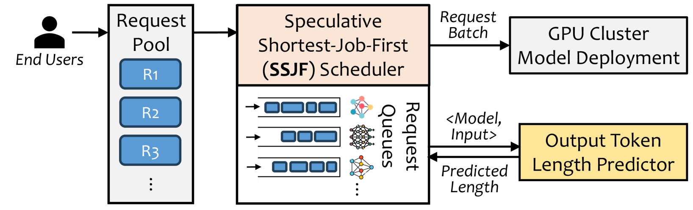

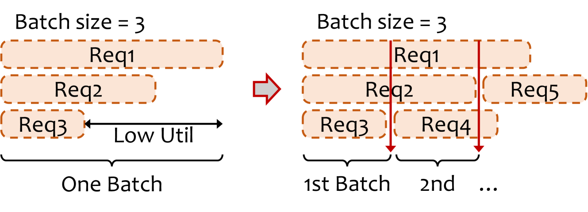

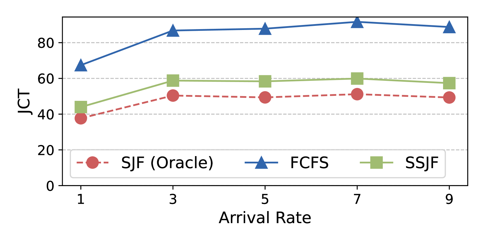

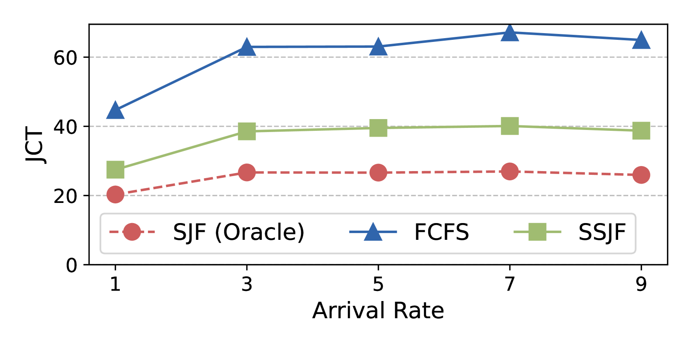

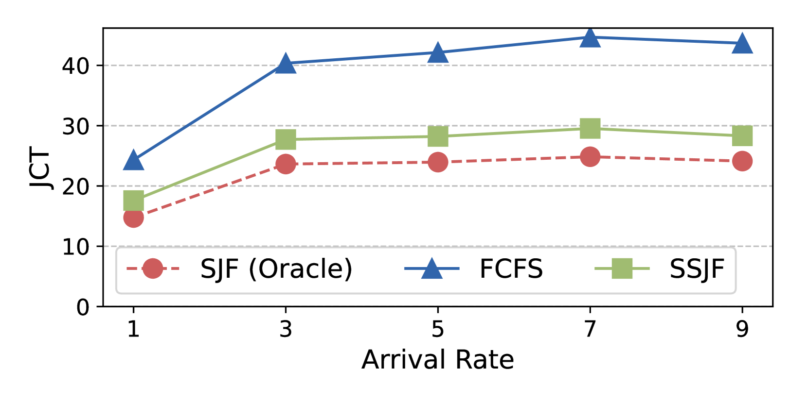

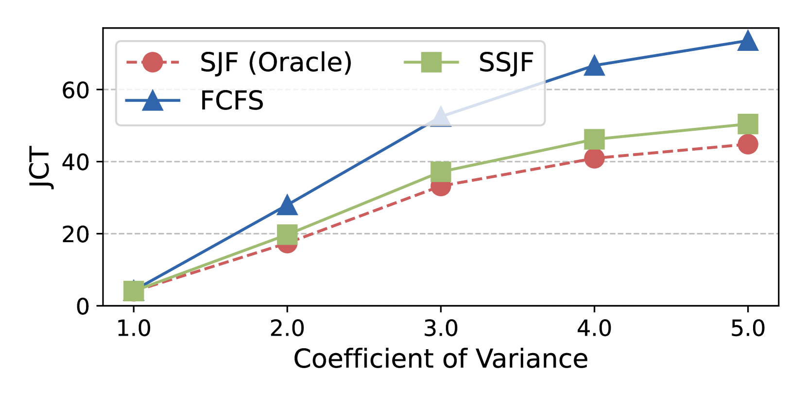

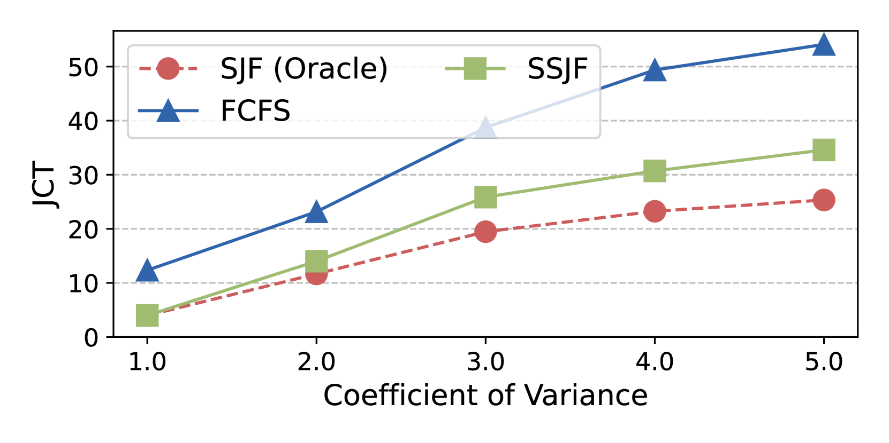

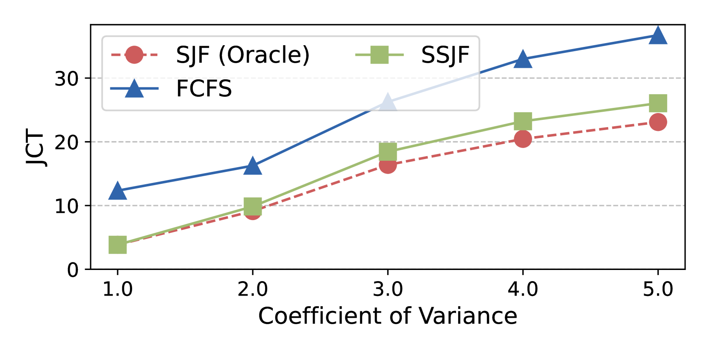

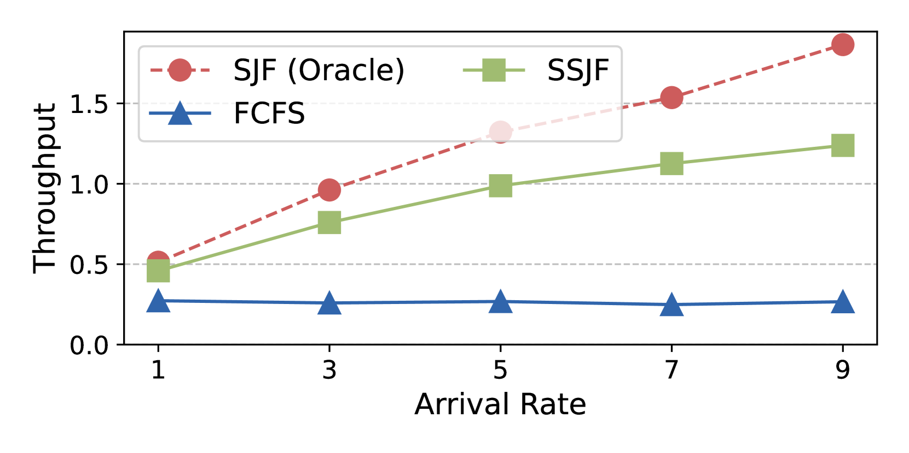

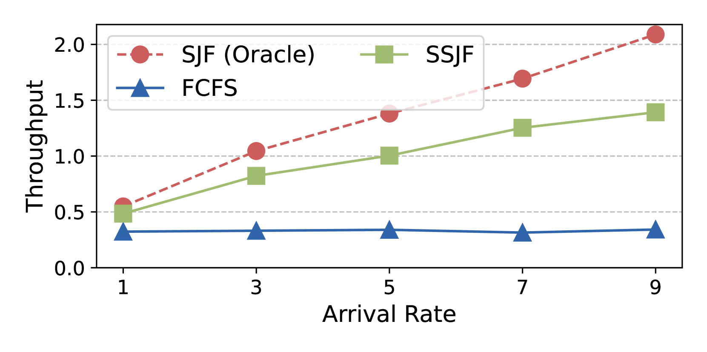

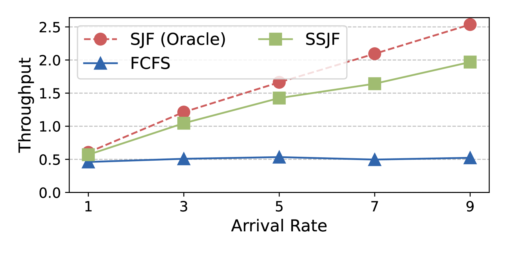

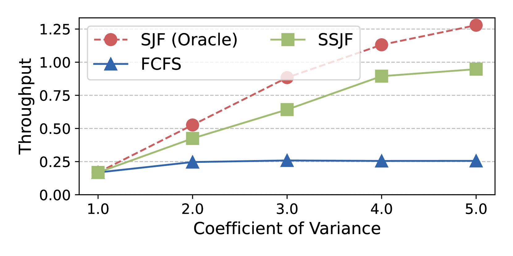

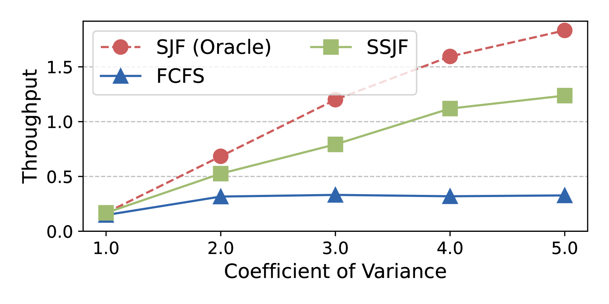

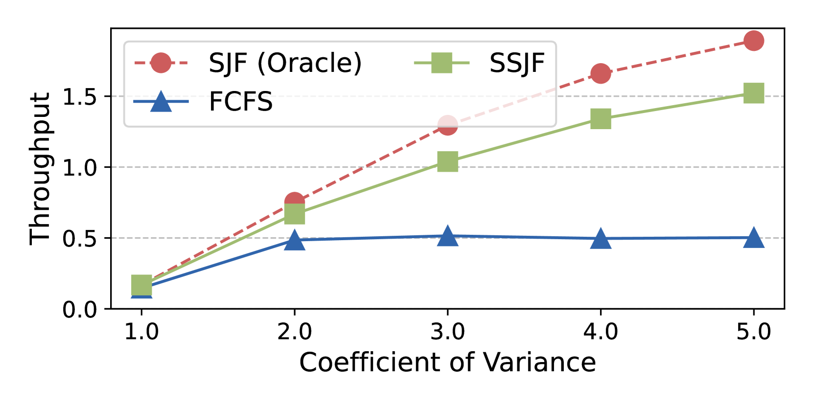

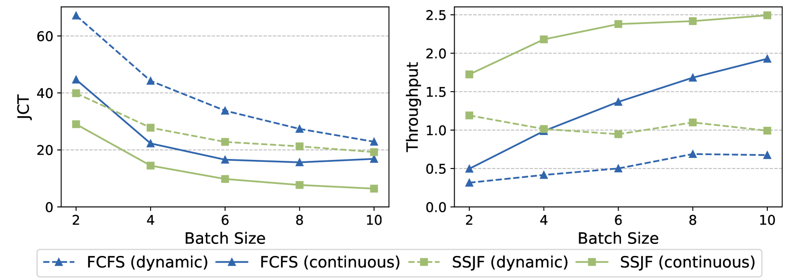

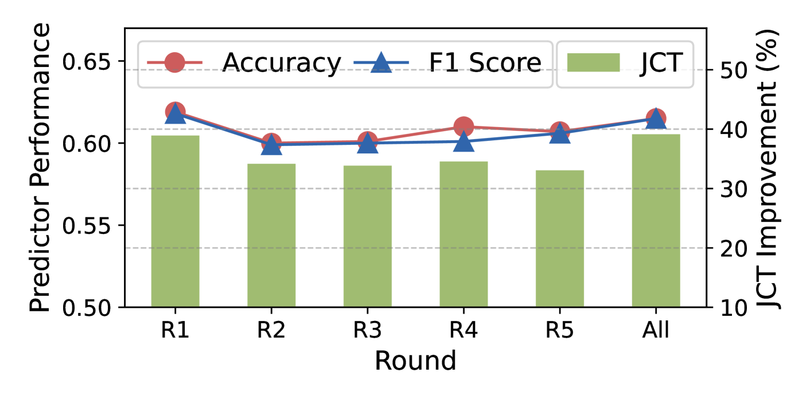

[Arxiv](https://arxiv.org/abs/2404.08509)