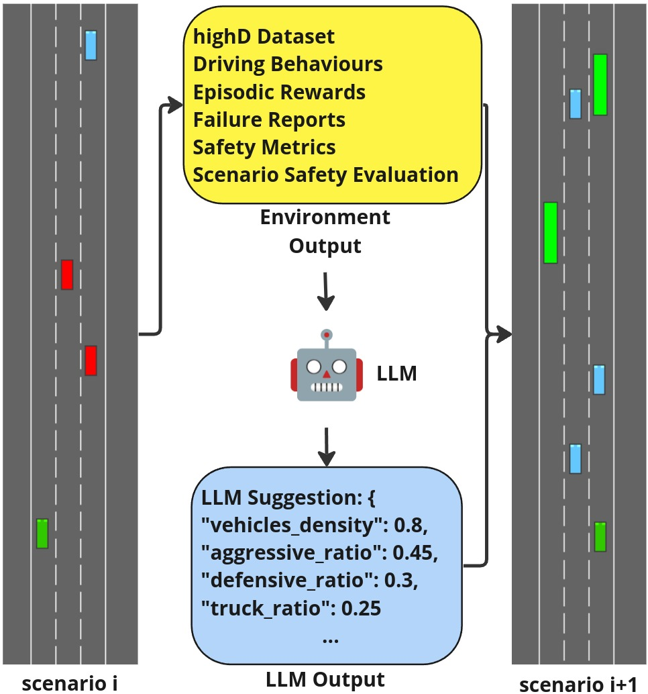
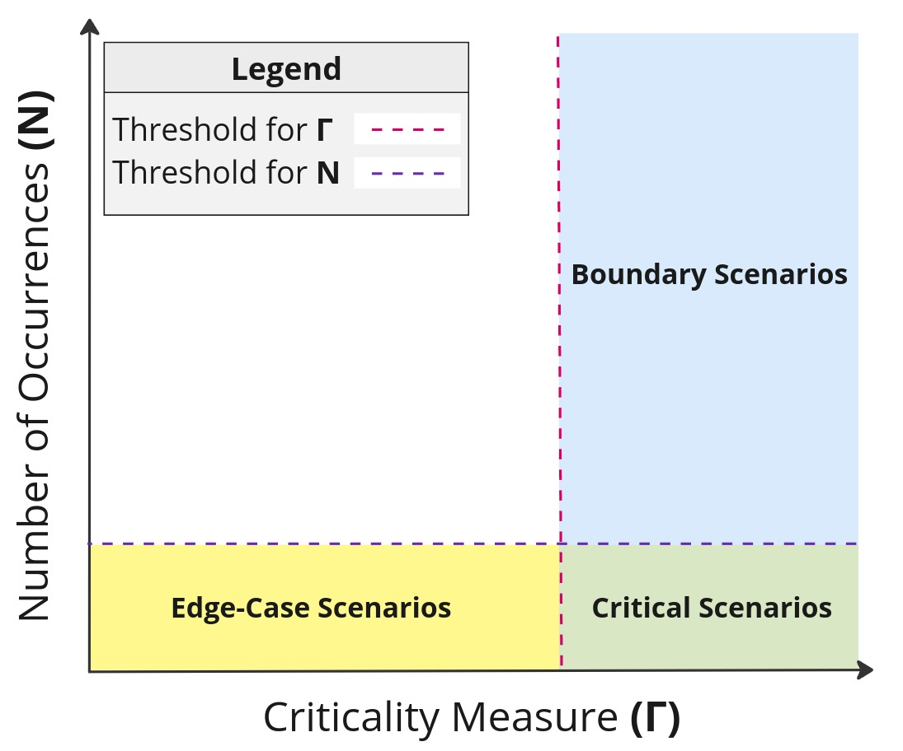
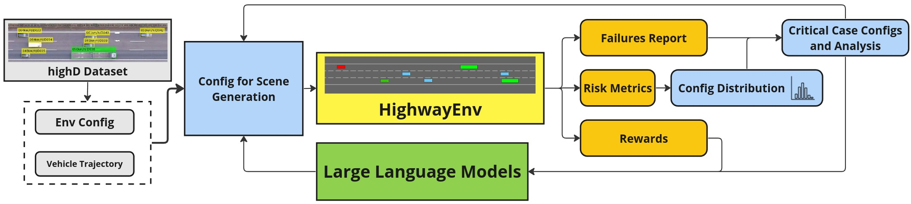
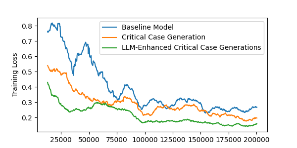
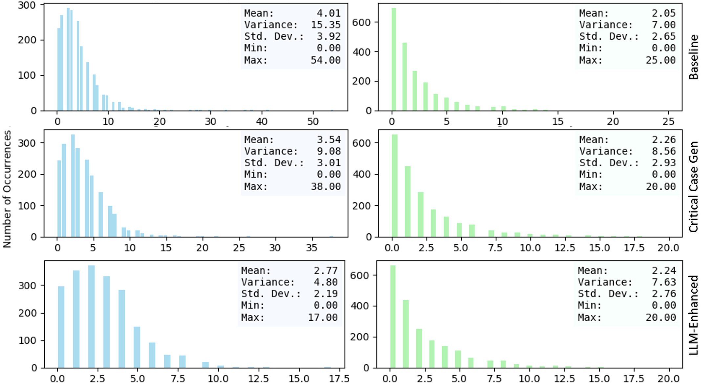

# 结合语言模型和关键情景生成技术，提升自动驾驶车辆的训练效果

发布时间：2024年04月12日

`Agent` `自动驾驶`

> Enhancing Autonomous Vehicle Training with Language Model Integration and Critical Scenario Generation

# 摘要

> 本文提出了CRITICAL框架，这是一个创新的闭环系统，专为自动驾驶汽车（AV）的训练与测试而设计。CRITICAL能够创造丰富多样的驾驶场景，尤其关注那些能够针对强化学习（RL）智能体在学习与性能上的特定短板进行有效训练的关键驾驶情境。该框架融合了真实交通动态、驾驶行为分析、替代安全措施，以及一个可选的大型语言模型（LLM）组件，以此生成多样化场景。实践证明，通过在数据生成和训练流程间建立一个闭环反馈机制，不仅能够加速学习过程，还能提升系统的整体性能和安全防护能力。我们的评估利用近端策略优化（PPO）算法和HighwayEnv模拟环境进行，结果显示，结合关键案例生成和LLM分析后，系统性能得到了显著提升，这突显了CRITICAL在增强AV系统鲁棒性、简化关键场景生成方面的潜力。这不仅有助于推动AV智能体的快速发展，拓宽RL训练的应用范围，也有助于提高AV安全验证的效率。

> This paper introduces CRITICAL, a novel closed-loop framework for autonomous vehicle (AV) training and testing. CRITICAL stands out for its ability to generate diverse scenarios, focusing on critical driving situations that target specific learning and performance gaps identified in the Reinforcement Learning (RL) agent. The framework achieves this by integrating real-world traffic dynamics, driving behavior analysis, surrogate safety measures, and an optional Large Language Model (LLM) component. It is proven that the establishment of a closed feedback loop between the data generation pipeline and the training process can enhance the learning rate during training, elevate overall system performance, and augment safety resilience. Our evaluations, conducted using the Proximal Policy Optimization (PPO) and the HighwayEnv simulation environment, demonstrate noticeable performance improvements with the integration of critical case generation and LLM analysis, indicating CRITICAL's potential to improve the robustness of AV systems and streamline the generation of critical scenarios. This ultimately serves to hasten the development of AV agents, expand the general scope of RL training, and ameliorate validation efforts for AV safety.

[Arxiv](https://arxiv.org/abs/2404.08570)